# Visualización de Datos


## Introducción

Una de las formas más útiles de visualizar la información es mediante gráficos
(aunque si son pocos datos es preferible una tabla). De hecho, el primer
paso antes de analizar los datos debe ser hacer un gráfico de los valores que
tienen. Un gráfico de dispersión si es bidimensional o un histograma si solo 
tiene una dimensión.

Aunque hay varios sistemas gráficos (`base`, `lattice`, `ggobi`, `plotly`)
vamos a usar `ggplot2` por su facilidad de uso y potencia para hacer gráficos
complejos a partir de componentes simples.

Este paquete sigue una idea que se llama gramática de gráficos propuesta por
Wilkinson en donde los gráficos pueden dividirse en cuatro partes:

 - Los **datos** y como se **mapea** (**`aes`**) esos datos a las 
 diferentes atributos estéticos. Es decir que columna corresponde al eje
 x, al eje y, forma, color, etc.
 - Las formas geométricas (**`geom`**) que representan como se ven los datos.
 Como puntos, líneas, barras de error, etc.
 - Transformaciones estadísticas de los datos (**`stats`**) resumen los datos
 de forma útil. Por ejemplo, para agregar la media por grupo o una línea
 de regresión sin haberlos calculado antes.
 - Escalas a las que se mapean los datos (**`scale`**). Estas pueden ser 
 escalas de color, forma, etc.
 - Un sistema de coordenadas (**`coord`**), que describe como se proyectan
 estos datos. Por defecto se usa el sistema cartesiano. Pero hay otros 
 disponibles como el polar.
 - Un sistema paneles (**`facet`**) que describe como dividir los datos en
 distintos paneles.
 
 Adicionalmente a la gramática, se agrega un sistema de temas que permite 
 modificar la totalidad de elementos que hacen al gráfico como fuentes, 
 líneas de ejes, etc.

## El conjunto de datos `mpg`

En los datos que vienen con el paquete `ggplot2` está `mpg`. Contiene los 
datos de rendimiento, cilindrada y otros más de algunos modelos de autos.
Los datos están una estructura rectangular llamada *data frame*, cada columna
es una variable y cada fila una observación recolectadas por la Agencia de
Protección ambiental de EE.UU.


```r
library(tidyverse)
mpg
```

```
## # A tibble: 234 x 11
##    manufacturer model    displ  year   cyl trans   drv     cty   hwy fl   
##    <chr>        <chr>    <dbl> <int> <int> <chr>   <chr> <int> <int> <chr>
##  1 audi         a4        1.80  1999     4 auto(l… f        18    29 p    
##  2 audi         a4        1.80  1999     4 manual… f        21    29 p    
##  3 audi         a4        2.00  2008     4 manual… f        20    31 p    
##  4 audi         a4        2.00  2008     4 auto(a… f        21    30 p    
##  5 audi         a4        2.80  1999     6 auto(l… f        16    26 p    
##  6 audi         a4        2.80  1999     6 manual… f        18    26 p    
##  7 audi         a4        3.10  2008     6 auto(a… f        18    27 p    
##  8 audi         a4 quat…  1.80  1999     4 manual… 4        18    26 p    
##  9 audi         a4 quat…  1.80  1999     4 auto(l… 4        16    25 p    
## 10 audi         a4 quat…  2.00  2008     4 manual… 4        20    28 p    
## # ... with 224 more rows, and 1 more variable: class <chr>
```

## Gráficos con ggplot

Podemos hacer un gráfico de la siguiente forma:
 

```r
library(ggplot2)
ggplot(data = mpg) +
 geom_point(mapping = aes(x = displ, y = hwy))
```


Prueben escribiendo el código en la consola.


En el gráfico vemos que hay una tendencia a disminuir el rendimiento a medida
que aumenta la cilindrada.


En la llamada de Hay distintas partes. La llamada a `ggplot` donde especificamos
el nombre de los datos que vamos a usar. Es la que inicializa el gráfico. 
Pero aquí no especifica nada de como graficarlo. Sin embargo, es necesario empezar siempre por esta función y luego ir agregando capas. 
Luego agregamos una capa de puntos. Ambos están unidos por un `+`. Cada vez
que deseemos agregar una capa, lo haremos con ese símbolo `+`.
Por otro lado, especificamos el mapeo de las columnas de los datos a las ordenadas
y abscisas dentro del argumento `mapping`. Hemos graficado el tamaño del motor (en litros),
`displ` en las ordenadas y el rendimiento en millas por galón en las abscisas.
Siempre que quereamos mapear una columna a alguna parte del gráfico lo hemos de
hacer dentro la función `aes()`, de *aestetics* que significa ésteticas en inglés. 


## Mapeando 

En el gráfico anterior vemos que hay unos puntos que no siguen la tendencia 
general. Aquí están resaltados con rojo.

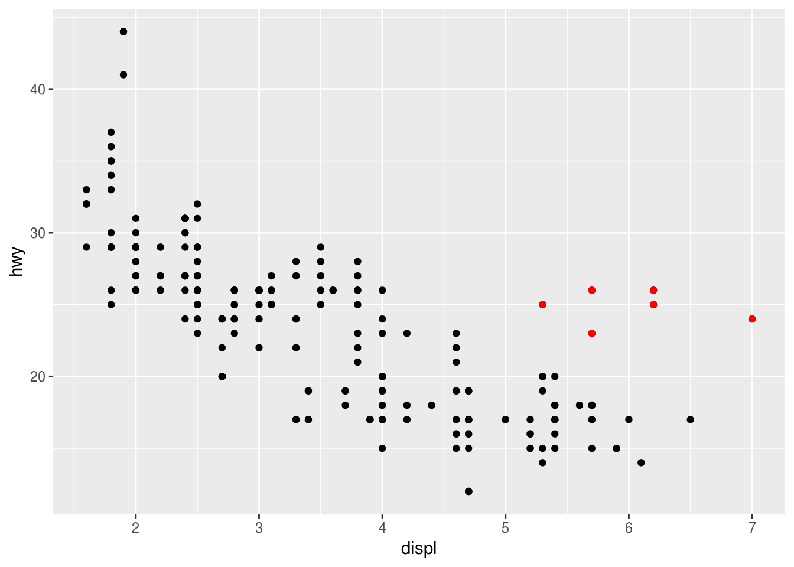


Para saber más el porque de estos puntos podríamos agregar más información
al gráfico como por ejemplo el tipo de auto. Una opción es agregar colores.


```r
ggplot(data = mpg) +
 geom_point(mapping = aes(x = displ, y = hwy, color = class))
```


Ahora podemos ver, que en general los autos con cilindrada grande son camionetas
(*pickup*) o suv. Y que los
que tienen cilindrada grande pero rendimiento mayor son autos deportivos.

Agregamos el color mapeando `class` a la éstetica de color. `ggplot` le asigna
automáticamente un color a cada nivel de `class`. Y también genera la leyenda
apropiada. 

También podemos mapear el tamaño del punto a `class`. En este caso recibiremos
un `warning` porque no tiene mucho sentido mapear el tamaño con una variable
discreta desordenada. Es decir, que no hay una correspondencia entre el tamaño
del punto y la clase.


```r
ggplot(data = mpg) +
 geom_point(mapping = aes(x = displ, y = hwy, size = class))
```

```
## Warning: Using size for a discrete variable is not advised.
```


También podriamos mapear la clase a la transparencia de los puntos (`alpha`) o
a la forma (`shape`)


```r
# Izquierda
ggplot(data = mpg) + 
  geom_point(mapping = aes(x = displ, y = hwy, alpha = class))

# Derecha
ggplot(data = mpg) + 
  geom_point(mapping = aes(x = displ, y = hwy, shape = class))
```


Si reproducen el código en sus computadoras verán que que ambos dan advertencias.
Así como no tienen mucho sentido mapear el tamaño a algo sin orden intríseco,
tampoco lo tiene mapear la transparencia. Por otro lado, noten que en el gráfico
de la derecha ¡faltan los puntos de *suv*! Esto es porque ggplot solo asigna 
automaticamente hasta 6 símbolos diferentes para los puntos. Si queremos más
hay que hacerlo de forma manual. 

En general, uno mapea una variable a alguna característica del gráfico 
asociandola dentro de `aes()`. `ggplot` se encarga de los detalles de pasar esa
asociación a las distintas capas, de generar los niveles apropiados y de hacer
la leyenda. De hecho, podemos ver que *x* e *y* también son características del
gráfico pero en vez de mostrar una leyenda genera las marcas en los ejes.

También es posible configurar alguna estética a un valor específico. Como por 
ejemplo hacer que todos los puntos sean rojos


```r
ggplot(data = mpg) + 
  geom_point(mapping = aes(x = displ, y = hwy), color = "red")
```

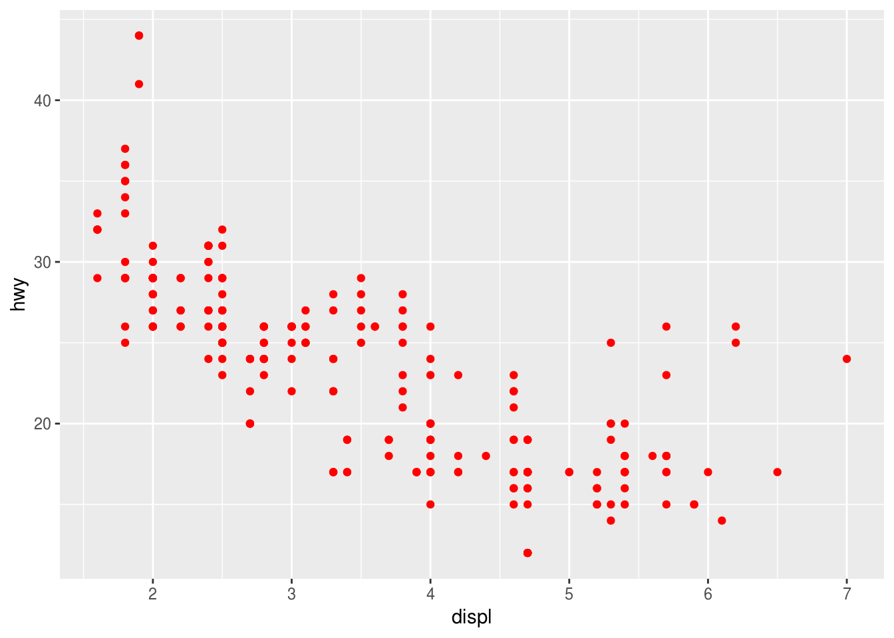

Acá el color no muestra ninguna información extra. También es posible cambiar
el:

- el color por el nombre que tenga sentido o en hexadecimal.
- el tamaño de los puntos en mm.
- la forma del punto según los valores que se muestran acá abajo


<div class="figure">

<p class="caption">(\#fig:puntos)Valores númericos y la forma asociada a cada uno. En R hay 25 formas diferentes. Algunas parecen repetirse pero no es así. Por ejemplo, las formas 0, 15 y 22 son todos cuadrados. Pero las formas del 0-15 tienen el color definido por el borde, usan `color` para cambiar el color. Del 15 a 18 son formas rellenas que usan `fill` para cambiar el color del relleno. Y de la forma 21 a 23 son formas con relleno y borde que usan ambas `fill` y `color`.</p>
</div>

Valores númericos y la forma asociada a cada uno. En R hay 25 formas diferentes.
Algunas parecen repetirse pero no es así. Por ejemplo, las formas 0, 15 y 22 son
todos cuadrados. Pero las formas del 0-15 tienen el color definido por el borde,
usan `color` para cambiar el color. Del 15 a 18 son formas rellenas que usan
`fill` para cambiar el color del relleno. Y de la forma 21 a 23 son formas con
relleno y borde que usan ambas `fill` y `color`.


## Formas geometricas

¿En que se parecen los gráficos de abajo?

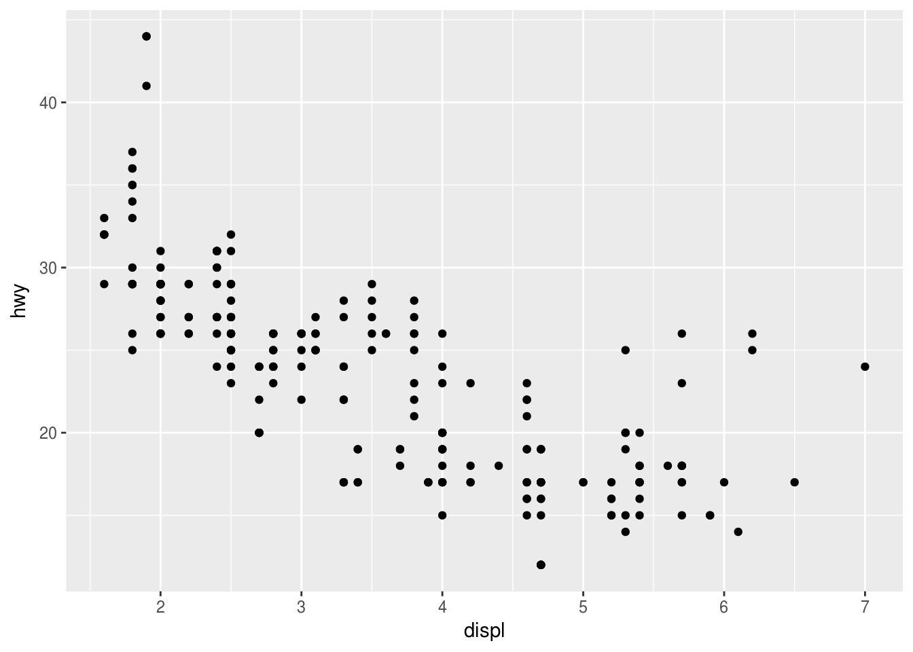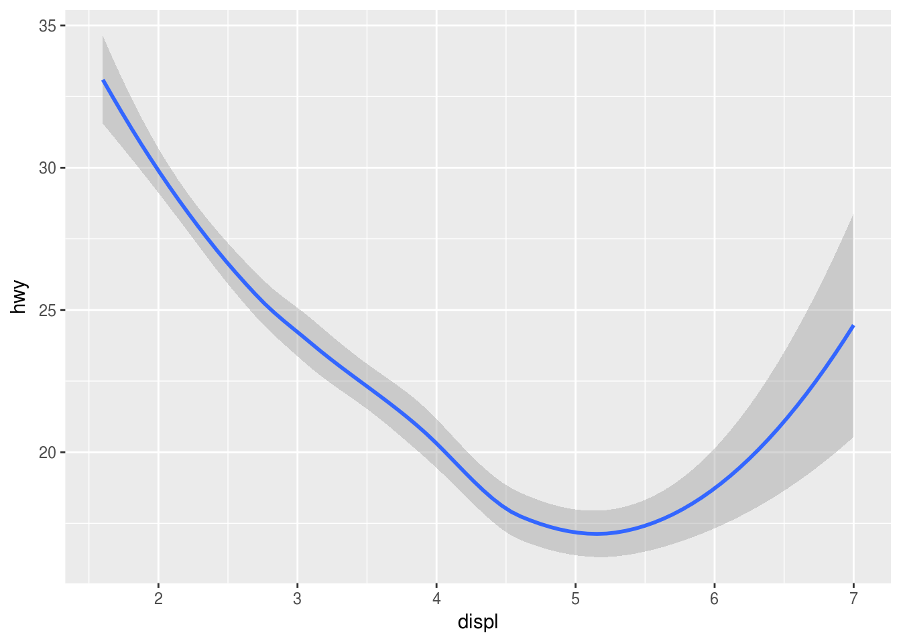


Ambos tienen las mismas variables, pero están representados por distintas formas.
En el idioma de ggplot cada forma es un **geom**. Y cada geom es una forma
geométrica de representar los datos. Hay muchos **geom** (más de 30 en el
paquete y muchos más en extensiones) y todos empiezan con **`geom_`**), por
ejemplo:


Table: (\#tab:Graficos-Comunes)Gráficos comunes con ggplot

Gráfico           geom              
----------------  ------------------
Barras            geom_col geom_bar 
Puntos            geom_point        
Cajas y Barras    geom_boxplot      
Histograma        geom_histogram    
Lineas            geom_line         
Barras de Error   geom_errorbar     

Pueden ver más en la ayuda de ggplot en R (usando la pestaña de ayuda o 
usando `help(nombre_de_función)` en la consola) o en la documentación online
que tiene la ventaja de tener graficados los ejemplos http://ggplot2.tidyverse.org/reference/ .

Para hacer los gráficos de arriba usamos:


```r
# Izquierda
ggplot(data = mpg) + 
  geom_point(mapping = aes(x = displ, y = hwy))

# Derecha
ggplot(data = mpg) + 
  geom_smooth(mapping = aes(x = displ, y = hwy))
```

Todos los *geoms* van luego de `ggplot` y se unen con un `+`. En ggplot cada forma geométrica es una capa y pueden combinarse varias en un mismo gráfico.


Además, todos los `geoms` tienen un argumento `mapping` para la estética. Claro
que no todos aceptan los mismas argumentos. No tienen sentido ponerle relleno
a una línea o cambiar el tipo de línea a un punto. Pero si se puede cambiar el
tipo de línea de `geom_smooth:


```r
ggplot(data = mpg) + 
  geom_smooth(mapping = aes(x = displ, y = hwy, linetype = drv))
```


Acá `geom_smooth` separa tres líneas según el valor de `drv`, que es la tracción.
Una línea lisa para las que son 4x4 (4), rayas cortas para tracción delantera  (f)
y rayas largas para tracción trasera (r).

Podemos ver más claramente porque tiene esta forma geom_smooth graficando los
puntos de cada grupo:

<div class="figure">
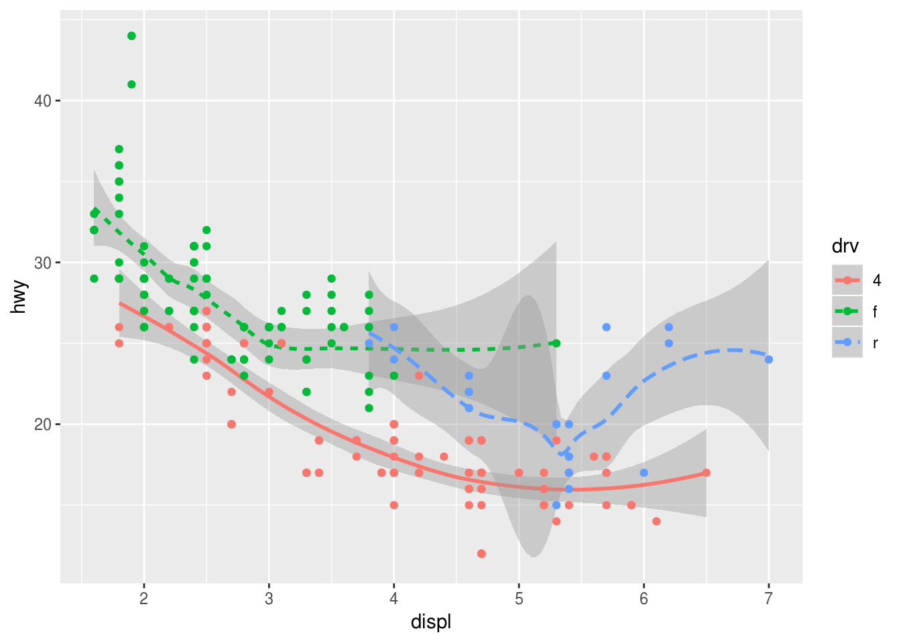
<p class="caption">(\#fig:dos-geoms-2)Varios geoms pueden usarse en un mismo gráfico.</p>
</div>

Muchos  `geoms` que resumen la información de varios datos con una sola forma
tienen un argumento de éstetica llamado `group` que agrupa la observaciones que
son iguales en una variable.


```r
ggplot(data = mpg) +
  geom_smooth(mapping = aes(x = displ, y = hwy))
              
ggplot(data = mpg) +
  geom_smooth(mapping = aes(x = displ, y = hwy, group = drv))
    
ggplot(data = mpg) +
  geom_smooth(
    mapping = aes(x = displ, y = hwy, color = drv),
    show.legend = FALSE
  )
```

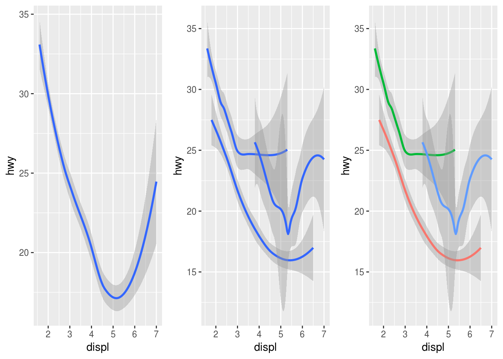


Arriba vimos que podiamos usar dos geoms en un mismo
gráfico (y podríamos agregar más si quisieramos). Pero al hacerlo hemos duplicado
el `mapping` en los dos `geoms`:


```r
ggplot(data = mpg) + 
  geom_smooth(mapping = aes(x = displ, y = hwy, linetype = drv, color = drv)) +
  geom_point(mapping = aes(x = displ, y = hwy, color = drv))
```

Podemos evitarlo si ponemos el `mapping` dentro de la llamada de ggplot:


```r
ggplot(data = mpg, mapping=  aes(x = displ, y = hwy, linetype = drv, color = drv)) + 
  geom_smooth() +
  geom_point()
```


Esto funciona porque las capas heredan
el `mapping` de `ggplot`. Por eso, va a funcionar en todas las capas que pongamos,
de forma *global*.
A veces, esto introduce ciertos errores cuando usamos varias fuentes de datos y
las variables no están en presentes en todos los conjuntos. Es posible cambiar
el `mapping` de una capa específica y va a ser utilizada *solo* en esa capa; es 
decir, de forma de forma *local*.


```r
ggplot(data = mpg, mapping=  aes(x = displ, y = hwy)) + 
  geom_smooth() +
  geom_point(mapping = aes(color = class))
```


O también podemos definir otro conjunto de datos para el `geom`:


```r
ggplot(data = mpg, mapping = aes(x = displ, y = hwy)) + 
  geom_point(mapping = aes(color = class)) + 
  geom_smooth(data = filter(mpg, class == "subcompact"), se = FALSE)
```

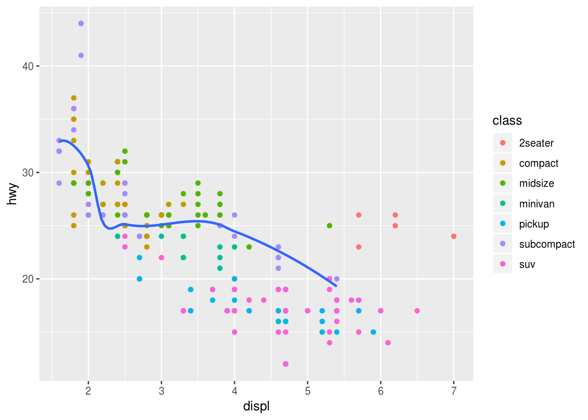

Todavía no vieron `filter`, pero ya lo verán más adelante.


## Transformaciones Estadísticas

Pensemos en los gráficos de barras. En `ggplot2` se hacen con `geom_bar`. A
primera vista los gráficos de barras parecen simples. En este caso estamos
graficando datos de diamantes, del conjunto de datos `diamonds` que contiene
cerca 54000 datos. En el gráfico vemos que hay muchos más diamantes de cortes
buenos que regulares.


```r
ggplot(data = diamonds) +
  geom_bar(mapping = aes(x = cut))
```


En el eje *x* está puesto el corte, y en el eje *y* está puesto la cuenta 
(frecuencia) de cada uno. Pero si vemos el conjunto de datos veremos que esta
última ¡no está! Entonces ¿De dónde salió? Algunos *geoms* grafican los datos
puros pero otros aplican transformaciones estadísticas a los datos y 
crean nuevas variables:

+ Los gráficos de barras, histograms y polígonos de frecuencia cuentan y juntan
los datos.
+ `geom_smooth` usa modelos para mostrar las tendencias de los datos.
+ `geom_boxplot` crea un sumario de estadísticos robustos para mostrar los 
datos.

El algoritmo usado para calcular las nuevas variables se llama `stat`. Abajo
vemos como funciona `stat_count`

Empieza con los datos

```
## # A tibble: 6 x 10
##   carat cut       color clarity depth table price     x     y     z
##   <dbl> <ord>     <ord> <ord>   <dbl> <dbl> <int> <dbl> <dbl> <dbl>
## 1 0.230 Ideal     E     SI2      61.5   55.   326  3.95  3.98  2.43
## 2 0.210 Premium   E     SI1      59.8   61.   326  3.89  3.84  2.31
## 3 0.230 Good      E     VS1      56.9   65.   327  4.05  4.07  2.31
## 4 0.290 Premium   I     VS2      62.4   58.   334  4.20  4.23  2.63
## 5 0.310 Good      J     SI2      63.3   58.   335  4.34  4.35  2.75
## 6 0.240 Very Good J     VVS2     62.8   57.   336  3.94  3.96  2.48
```

`geom_bar` calcula las nuevas variables usando el `stat` `count` que devuelve
un nuevo data.frame

```
## # A tibble: 5 x 3
##   cut       count  prop
##   <ord>     <int> <dbl>
## 1 Fair       1610    1.
## 2 Good       4906    1.
## 3 Very Good 12082    1.
## 4 Premium   13791    1.
## 5 Ideal     21551    1.
```

`geom_bar` luego usa esos datos para graficar:

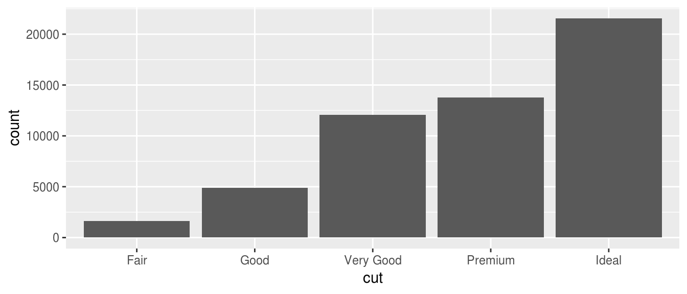

Podés saber que `stat` usa cada `geom` usando la ayuda. Por ejemplo, `?geom_bar`
usa por defecto `stat_count` y `stat_count` usa por defecto `geom_bar` para 
mostrar sus resultados y ambos están descriptos en la misma página de ayuda.
Podemos ver que es calculado en la sección *Computed Variables*. 

Es posible intercambiar `geom` por su `stat`. Por ejemplo:


```r
ggplot(data = diamonds) +
  stat_count(mapping = aes(x = cut))
```

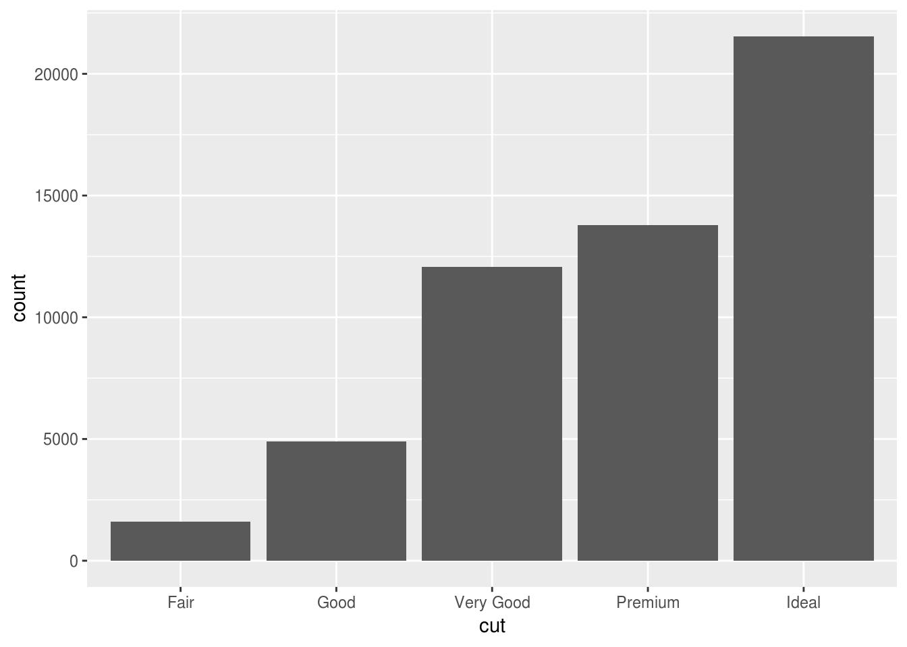

Esto funciona porque cada *stat* tiene un *geom* por defecto y cada *geom* 
tiene un *stat*. Lo que significa que podes usar cada *geom* sin preocuparte
por las transformaciones subyacentes.

Hay veces que querrás cambiar los valores por defecto:

1. Cuando tengas las variables precomputadas y desees graficarlas. En el 
código de abajo cambio el *stat* de `geom_bar` por `stat_identity` (identidad). Esto 
me permite graficar la altura de la variable *y* a algún valor del conjunto de
datos. 


```r
demo <- tribble(
  ~cut,         ~freq,
  "Fair",       1610,
  "Good",       4906,
  "Very Good",  12082,
  "Premium",    13791,
  "Ideal",      21551
)

ggplot(data = demo) +
  geom_bar(mapping = aes(x = cut, y = freq), stat = "identity")
```


No te preocupes si no entiendes que hace `tribble` o `<-`. Todavía no lo hemos
visto pero quizá puedas entender que hacen por su contexto

2. Muchos *stats* computan varias variables y quizás quieras mostrar otra. Abajo,
en lugar de graficar la frecuencia o cuenta, grafico la proporción o frecuencia
relativa.


```r
ggplot(data = diamonds) +
  geom_bar(mapping = aes(x = cut, y = ..prop.., group = 1))
```

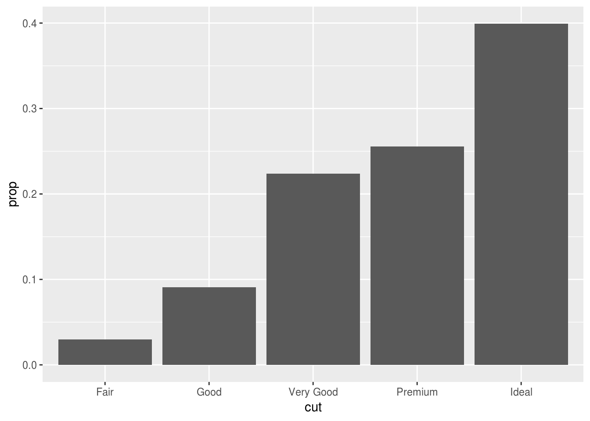

3. Quizás quieras llamar la atención sobre ciertos medidas de resumen que has
calculado. Puedes hacer esto con `stat_summary`.


```r
ggplot(data = diamonds) +
  stat_summary(
    mapping = aes(x = cut, y = depth),
    fun.y = median,
    fun.ymax = max,
    fun.ymin = min
    
  )
```

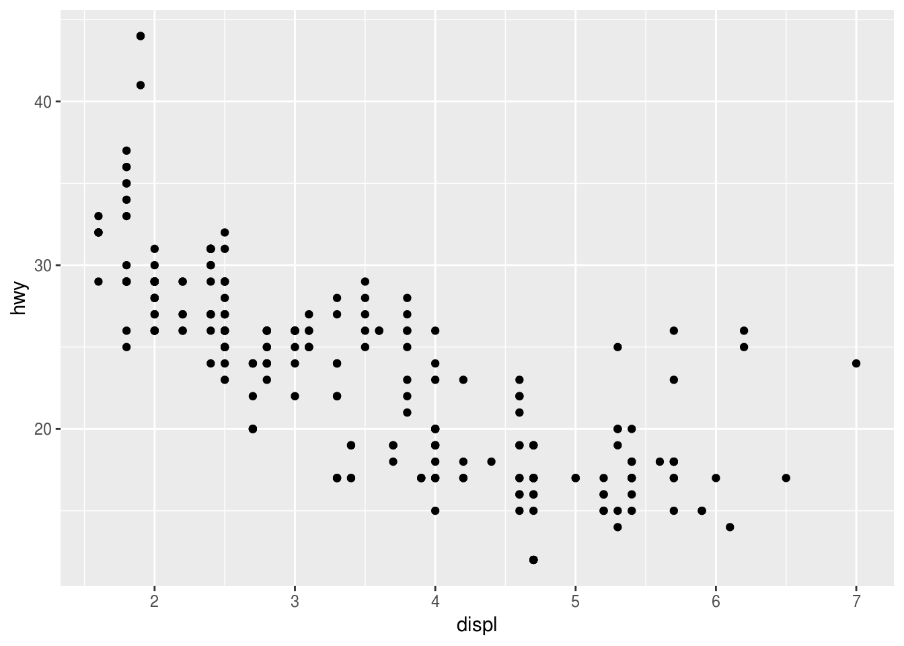


## Ajuste de Posiciones

El gráfico anterior revela algo interesante de los gráficos de barras. Tienen
relleno (*fill*) y tienen color.


```r
ggplot(data = diamonds) + 
  geom_bar(mapping = aes(x = cut, fill = clarity))
```

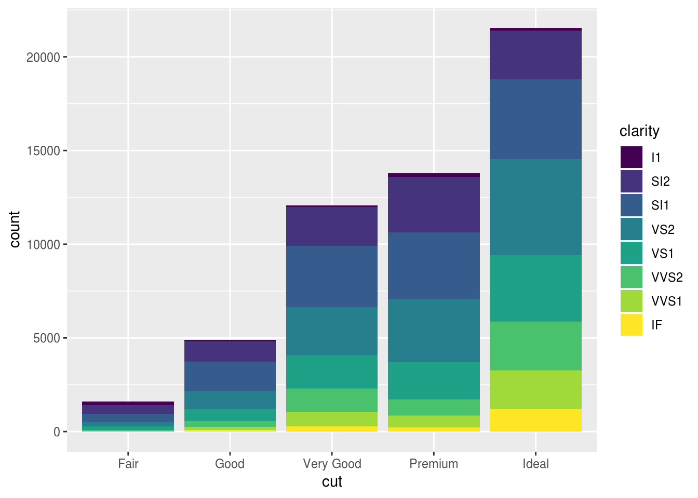

```r
ggplot(data = diamonds) + 
  geom_bar(mapping = aes(x = cut, color = clarity))
```


Es más claro trabajar con el relleno porque es más visible
en el gráfico. Pero vemos que las distintas barras están apiladas, lo que
dificulta la comparación. Se debe a que la posición de barras es apilada
(`stack`) por defecto. Podemos cambiarla modificando el argumento `position`
de `geom_bar()`. Entre las otras posiciones que podemos elegir están identidad
(`identity`), esquivar (`dodge`) y relleno (`fill`) .

+ Identidad hace que las barras (o otro *geoms*) caigan unas encimas de
otras. No es muy útil porque las barras se superponen y hace muy difícil la
interpretación. Se puede mejorar agregando transparencia y usando color y no
relleno, pero es complicado de interpetar si la barras se superponen o están
apiladas.


```r
ggplot(data = diamonds) + 
   geom_bar(mapping = aes(x = cut, color = clarity), position = "identity")
```

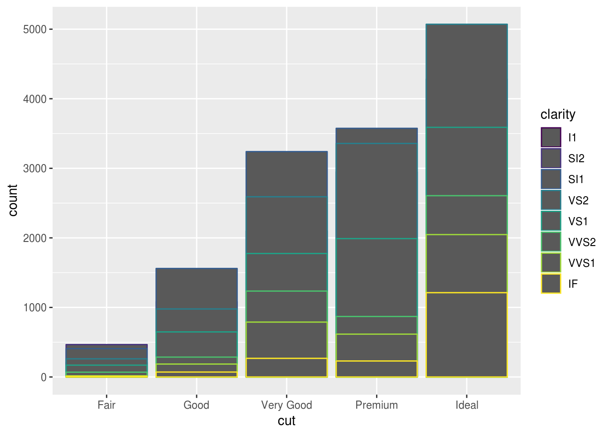

+ Esquivar es quizás la más útil junto con relleno. Hace que las barras estén
una al lado de la otra. Lo que hace que sea sencillo comparar la altura de estas.


```r
ggplot(data = diamonds) + 
   geom_bar(mapping = aes(x = cut, fill = clarity), position = "dodge")
```

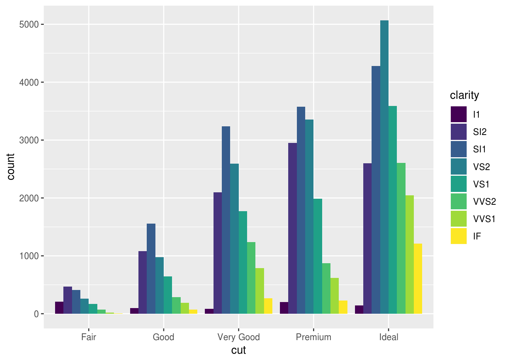

+ Recién vimos que que con esquivar podemos poner las barras una al lado de otra.
 Pero, más allá de comparar la cantidad de diamantes en cada uno, ya que la 
 cantidad es muy diferente en cada corte resulta más útil comparar las 
 proporciones de cada una de las claridades. Relleno funciona de forma
 similar al apilado, pero estadariza cada columna a longitud uno. Entonces se
 ve las proporciones o frecuencias relativas de cada uno de los niveles de
 `clarity`.
 

```r
ggplot(data = diamonds) + 
   geom_bar(mapping = aes(x = cut, fill = clarity), position = "fill")
```

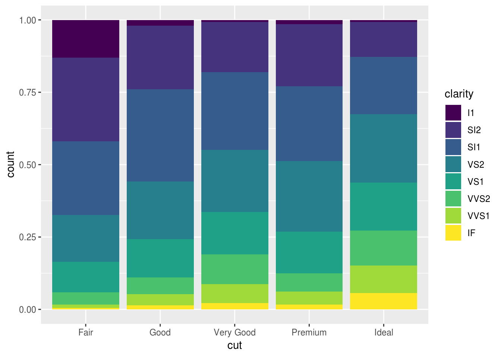
 
Hay otros ajustes de posiciones que no son útiles para los gráficos de barras
pero son muy útiles para los gráficos de puntos. En el gráfico de dispersión
entre `displ` y `hwy` hay menos puntos que el total 
31 vs 234. Muchos
puntos se superponen, por eso vemos menos. Podemos evitarlo añadiendo un poco
de movimiento aleatorio a cada punto.


```r
ggplot(data = mpg) +
  geom_point(mapping = aes(x = displ, y = hwy), position = "jitter")
```

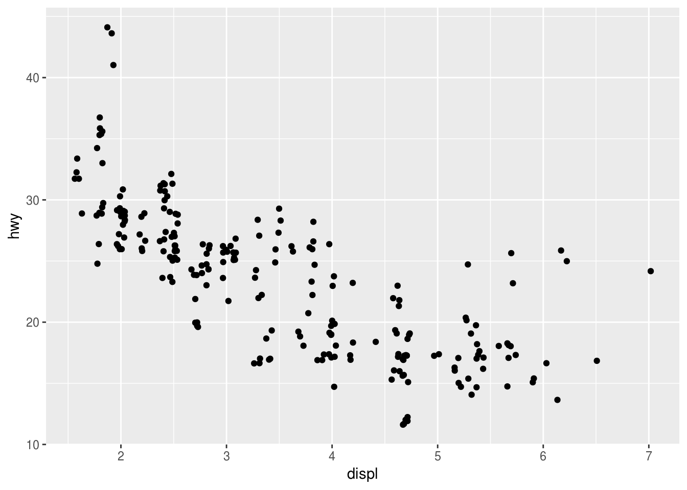

Si bien el gráfico no va a ser exacto, muestra más información que en el caso
donde se superponen los puntos.

Podes obtener más información el ayuda de cada uno: `?position_dodge`,
`?position_identity`, `?position_fill`, `?position_stack`, `?position_jitter`


## Sistemas de Coordenadas

Hasta ahora estuvimos graficando en un sistema de coordenadas cartesianas. Pero
es posible cambiarlo, por ejemplo intercambiando el eje x e y.


```r
ggplot(data = mpg, mapping = aes(x = class, y = hwy)) + 
  geom_boxplot()
ggplot(data = mpg, mapping = aes(x = class, y = hwy)) + 
  geom_boxplot() +
  coord_flip()
```

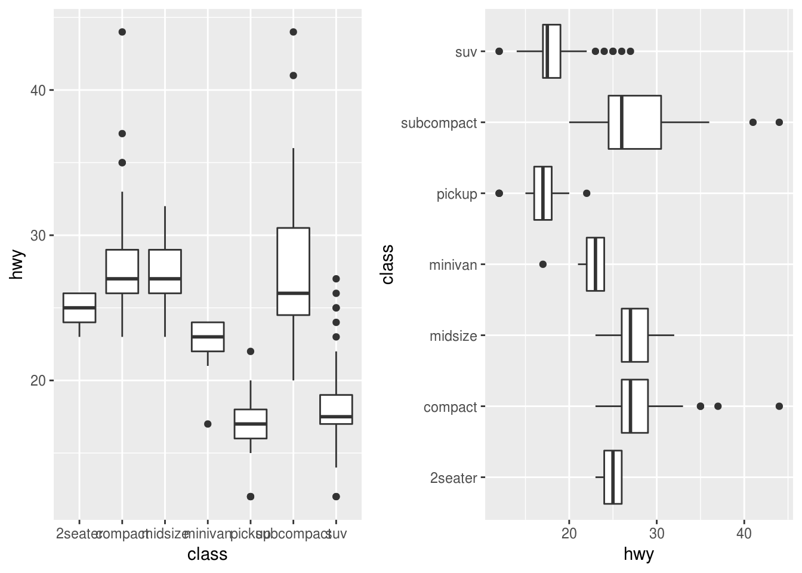

En el primer caso las etiquetas del eje x se superponen, pero en el segundo 
es fácil verlas. No es la única forma de solucionar este problema. También es
posible cambiar el ángulo de las etiquetas para que no se superpongan.

Otras veces es mejor reemplazar las coordenadas cartesianas por coordenadas
geográficas.


```r
arg <- map_data("world", region = "Argentina")

ggplot(data = arg, mapping = aes(x = long, y = lat, group = group)) +
  geom_polygon(fill = "white", color = "black")

ggplot(data = arg, mapping = aes(x = long, y = lat, group = group)) +
  geom_polygon(fill = "white", color = "black")
  coord_quickmap()
```


  

```
## 
## Attaching package: 'maps'
```

```
## The following object is masked from 'package:purrr':
## 
##     map
```

```
## <ggproto object: Class CoordQuickmap, CoordCartesian, Coord, gg>
##     aspect: function
##     default: FALSE
##     distance: function
##     expand: TRUE
##     is_linear: function
##     labels: function
##     limits: list
##     modify_scales: function
##     range: function
##     render_axis_h: function
##     render_axis_v: function
##     render_bg: function
##     render_fg: function
##     setup_data: function
##     setup_layout: function
##     setup_panel_params: function
##     setup_params: function
##     transform: function
##     super:  <ggproto object: Class CoordQuickmap, CoordCartesian, Coord, gg>
```

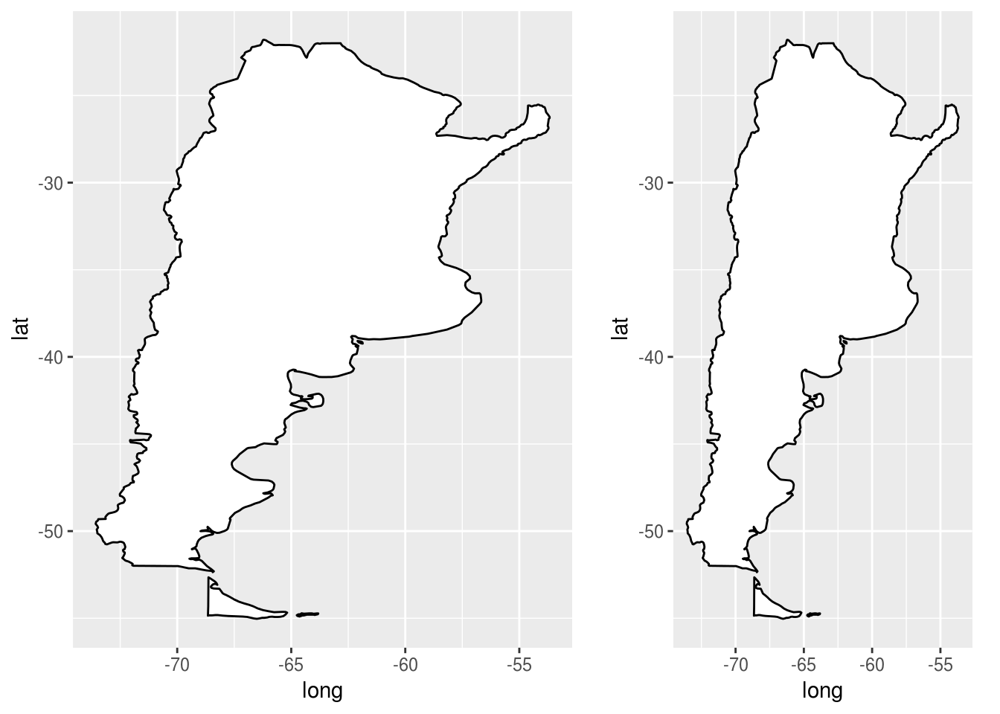
  
Esto evita que el mapa se deforme, ya que los grados de longitud no miden lo 
mismo en todas las latitudes. Si van a hacer muchos mapas les recomiendo que
vean la extesión `ggmap` que tiene muchas utilidades para hacer mejores mapas.

También existen la coordenadas polares. Un gráfico de torta, que les recomiendo
que no lo usen por los problemas de percepción que tiene, es un gráfico de
barras apiladas en coordernadas polares.


```r
cxc <- ggplot(mtcars, aes(x = factor(cyl))) +
  geom_bar(width = 1, colour = "black")
cxc + coord_polar()
```


## Personalizando el gráfico


Hay varias maneras de personalizar los gráficos. Por un lado, las estéticas
pueden ser personalizadas cambiando las distintas `scales` (escalas). Para
cambiar el eje x se usa `scale_x_*` donde * es el tipo de dato que tiene el 
eje: si es númerico se usa  `continuous` y si es categórico se usa `discrete`.
Se pueden cambiar muchas cosas: el título del eje (`name`), el lugar de las
marcas (`breaks`), las etiquetas de las marcas (`labels`), y muchas más opciones.


```r
ggplot(data = mpg) +
  geom_point(mapping = aes(x = displ, y = hwy))+
  scale_x_continuous(name = "Cilindrada (l)", breaks = 1:7, 
                     labels = c("uno", "dos", "tres", "cuatro", "cinco", 
                                "seis", "siete"))
```

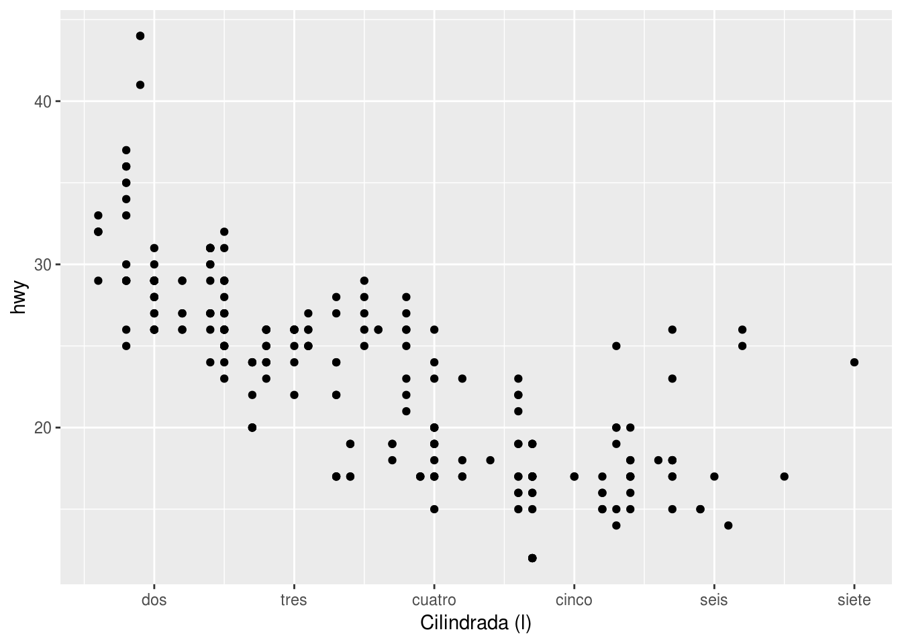

Un atajo para modificar los nombres de los ejes es usar la función `labs()`,
pero solo se pueden modificar los nombres de los ejes y nada más.


```r
ggplot(data = mpg) +
  geom_point(mapping = aes(x = displ, y = hwy))+
  labs(x = "Cilindrada (l)", y = "Millas por galón en Autopista")
```

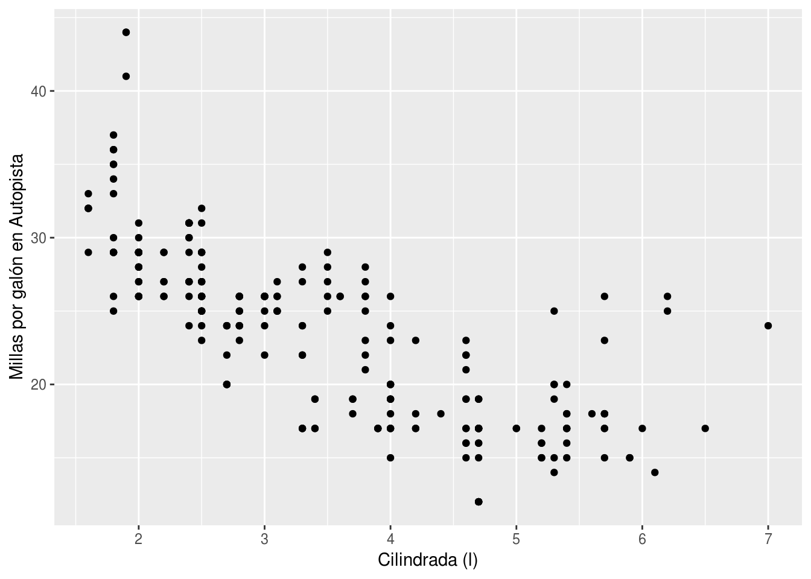

También se puede modificar los colores que se asignan. 


```r
ggplot(data = mpg) +
  geom_point(mapping = aes(x = displ, y = hwy, colour = class))+ 
  scale_color_brewer("Clase")

ggplot(data = mpg) +
  geom_point(mapping = aes(x = displ, y = hwy, colour = class))+ 
  scale_color_brewer("Clase", palette = "RdYlBu")

ggplot(data = mpg) +
  geom_point(mapping = aes(x = displ, y = hwy, colour = class))+ 
  scale_color_viridis_d("Clase")
```


Hay muchas más opciones disponibles, ya que como dice el dicho: "Para gustos,
los colores". Si quieren conocerlas te recomiendo que lean la ayuda de cada
una o visiten el sitio de ggplot2.

Vemos que hay patrón común con las escalas, todas empiezan por `scale`, luego
sigue por lo que se quiere modificar: el eje, `x` o `y`; el color, `color`;
relleno, `fill`; la forma, `shape`; el tipo de línea `linetype`, etc. Cada uno
de las estéticas tiene su escale. Luego, salvo alguna excepción, siguen por el 
tipo de dato o en el caso de los colores por el método de creación del color.
Vale la pena agregar que cada escale tiene su versión manual para un control
total de la apariencia.

Por otro lado están los elementos del gráfico que modifican la apariencia 
general del gráfico. El tipo y tamaño de letra, el color del fondo, el grosor
de la líneas de los ejes, la dirección de marcas, la dirección del texto, y
¡todo lo demás!. Todo esto está unido a lo que es el tema (`theme`) del gráfico.
Se pueden guardar las modificaciones para usarla facilmente y ya vienen algunas
opciones en `ggplot` y hay más en el paquete `ggthemes` y otros.


```r
ggplot(data = mpg) +
  geom_point(mapping = aes(x = displ, y = hwy, colour = class)) +
  theme_classic()
```

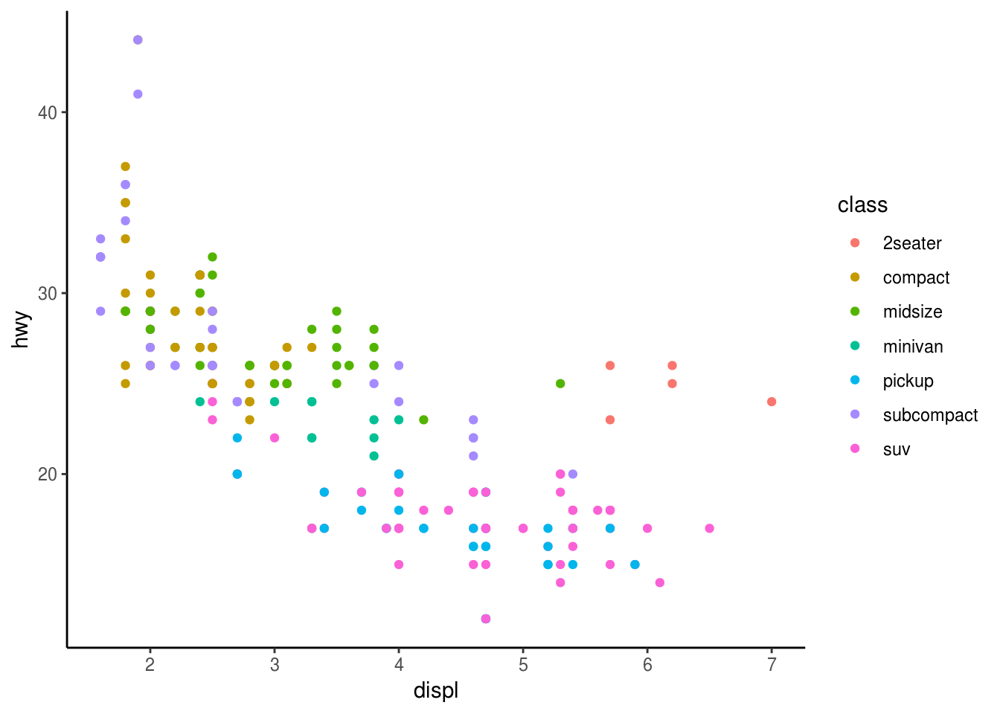

Para modificar algún elemento en particular usamos la función `theme()` al final
del gráfico. Dentro de la llamada a `theme` modificamos el argumento que queremos
cambiar usando la función `element_*()`.


```r
ggplot(data = mpg) +
  geom_bar(mapping = aes(x = class, fill = fl)) +
  theme(axis.text.x = element_text(angle = 45, hjust = 1, vjust = 1))
```

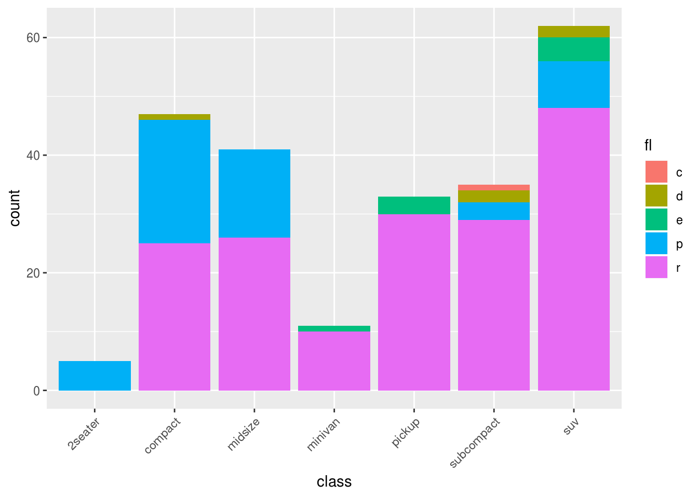

Sí, es bastante complicado. Pero por suerte se puede guardar y reutilizar.


```r
x_45 <- theme(axis.text.x = element_text(angle = 45, hjust = 1, vjust = 1))

ggplot(data = mpg) +
  geom_bar(mapping = aes(x = class, fill = fl)) +
  x_45
```


También es posible cambiar la posición de la leyenda o eliminarla completamente.


```r
ggplot(data = mpg) +
  geom_bar(mapping = aes(x = class, fill = fl)) +
  theme(legend.position = "bottom")

ggplot(data = mpg) +
  geom_bar(mapping = aes(x = class, fill = fl)) +
  theme(legend.position = "none")
```


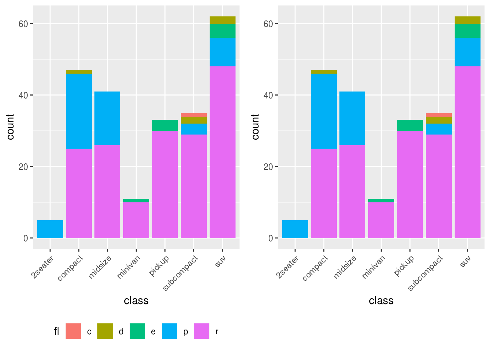


