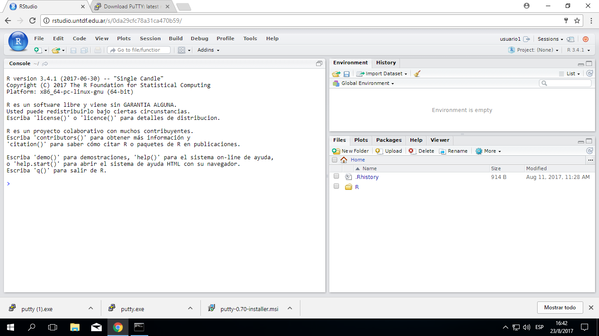
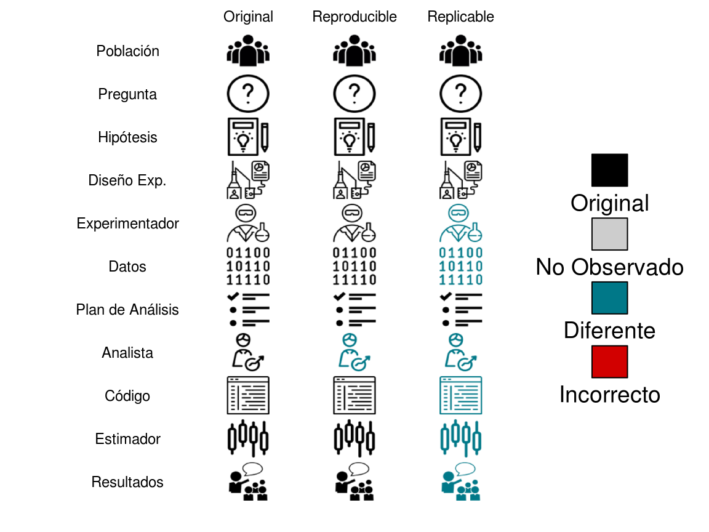

# Introducción a *R* y RStudio

En la materia de Estadística Avanzada para Ciencias Naturales vamos a usar
métodos estadísticos complejos. Por lo que, en muchos casos, es muy poco
práctico realizar los cálculos a mano. Por eso, es necesario usar software
estadístico específico para poder trabajar eficientemente. Existen múltiples
programas, entre los más conocidos podes mencionar Statistica, Stata, SPSS,
SAS, o Infostat, desarrollado en Argentina. Todos ellos son comerciales,
y por lo tanto hay que pagar por las licencias de uso. Por otro lado, *R* es
gratis y es usado ampliamente en el mundo. Otra de las ventajas, es la gran
comunidad de usuarios y desarrolladores que se ha formado. Lo que hace que 
esté siendo constantemente actualizado y que las últimas técnicas estadísticas
estén, muchas veces, implementadas directamente en R. Sin embargo, una de
las dificultades es que hay que escribir comandos para hacer que funcione. Lo
que es una desventaja al aprender pero luego se convierte en una ventaja, ya que
permite automatizar tareas tediosas y además realizar análisis **reproducibles**
de datos.

Otro problema de *R* es su interfaz muy poco amigable. Por eso se han desarrollado
otras interfaces (llamadas entornos de desarrollo integrado o IDE por sus siglas
en inglés) que hacen más fácil trabajar con este programa. Hay varias: RStudio,
Tinn-R, RKward, etc. Nosotros vamos a usar RStudio por ser la más trabajo tiene
encima y está más pulida.

Se puede bajar e instalar ambos programas en cualquier computadora. Hay que 
instalar *R* descargando desde https://cran.r-project.org/ y seguir las 
instrucciones del instalador. Para bajar RStudio hay que ir a
https://www.rstudio.com/products/rstudio/download/#download y también seguir las
instrucciones de instalación.

Para las clases tenemos instalado estos programas en un servidor de la 
Universidad y se puede acceder desde cualquier red (LAN o WiFi) de la sede de
Yrigoyen entrando a https://rstudio.untdf.edu.ar. Verán una pantalla de login.

Una vez que entren verán una pantalla así.


<!-- -->

## RStudio

La interfaz de RStudio está dividida en varios paneles, y cada uno tiene
varias pestañas. Arriba a la derecha está el *espacio de trabajo*
(*Environment*), es donde van a aparecer los objetos que creen a medida
que trabajan en R. La otra pestaña es el *historial* (*History* ), 
donde quedan guardados todos los comandos que hayan ejecutado. Abajo de
estos dos hay un panel con varias pestañas. *Archivos* (*Files*), muestra
los archivos. *Gráficos* (*Plots*) es donde van a aparecer los gráficos
que vayamos haciendo. *Paquetes* (*Packages*) muestra las librerías que
tenemos y sus paquetes instalados y con un tilde los cargados (más
adelante vamos a ver que son los paquetes). La *ayuda* (*Help*) es donde
vamos a poder la ayuda de funciones de **R**.  Y además está las pestaña 
del *Visor* (*Viewer*) que nos muestra una vista de los documentos que
creemos.

Por el lado izquierdo está la *consola*, es donde pasa toda la acción.
Todo lo que hagamos va a ser escrito como un orden o comando ahí y luego
vamos a ver el resultado ahí o si es un gráfico en el panel de gráficos.
Cada vez que iniciemos RStudio va a mostrar la consola con un mensaje que
indica la versión de *R* y otros detalles. Debajo de ese mensaje está el
*prompt*. Aquí es donde *R* espera que se ingresen los comandos. Y para
interactuar con *R* hay que decirle que tiene que hacer. Los comandos y
su sintaxis han evolucionado a lo largo de décadas y ahora proveen a los
usuarios una manera natural de acceder y procesar datos, aplicar
procedimientos estadísticos, etc.

Se puede usar *R* como una calculadora. Podemos poner una cuenta a realizar
en el prompt y *R* nos devolverá el resultado. Por ejemplo, podemos poner:


```r
2 + 2
```

```
## [1] 4
```

Prueben escribirlo en su consola justo después del ">".

También es posible guardar los resultados en un objeto:


```r
x <- 2 + 2
```

Prueben hacerlo en su consola.
En este caso, parece que no pasó nada. No apareció el resultado. Pero si
observan en panel del espacio de trabajo verán que hay un nuevo objeto
llamado `x`.

Prueben que sucede si escriben `x` en la consola.


## Análisis Reproducible

Una ventaja que tiene *R* respecto a otros programas estadísticos es que permite
reproducir el análisis de los datos. Reproducible significa que a partir de los
mismos datos otro analista va a llegar a los mismos resultados. En cambio,
replicable es que otro experimentador al repetir el experimento va a llegar a
resultados diferentes, que pueden ser o no similares (Figura \@ref(fig:reproducible-figura))

<div class="figure" style="text-align: center">

<p class="caption">(\#fig:reproducible-figura)Diferencias entre reproducible y replicable.</p>
</div>


Los programas de interfaz gráfica, que no usan código o no lo proveen, complican
la reproducibilidad de los análisis. Esto se debe a que es más complicado de 
comunicar como se realizó el análisis. La ventaja del código es que queda
todo explícito en él.

Hay varias formas de trabajar con R. Una es de forma interactiva en la consola.
Como cuando pusieron `2 + 2`. Esto es muy útil cuando estamos probando si algo
funciona. Pero no guardamos el código de esta forma. Aunque, en verdad queda
guardado en el orden en que lo ejecutamos en el historial no es útil porque se
va sobreescribiendo y va quedando lo que funcionó y lo no que no. Otra forma de
usar *R* es utilizando *scripts* (archivos con extensión *.R*). Es indispensable
para crear nuevas funciones pero para analizar datos tiene sus desventajas.
Ya que, si bien el código se puede comentar anteponiendo *#* a la línea que
queremos comentar, es límitado el formato que podemos usar en el comentario.
Además, tendremos que volver a correr el script para ver los resultados si no
los guardamos explicitamente en un documento, hoja de cálculo, o imagen. Por
último, tenemos los documentos de programación letrada. La programación letrada
consiste en mezclar código con texto plano, como en un procesador de texto.

En R, hay varias aproximaciones a esto. La que más éxito ha tenido es *knitr*.
*To knit* es tejer en inglés, lo que hace es "tejer" el documento final con
el resultado del código, es decir los análisis que hagamos, y texto explicando
que hicimos, porque, y como. Es decir, podemos escribir un paper o informe 
completo. Para darle formato al texto se usa *markdown* que permite usar marcas
livianas para poner *cursivas*, **negritas** o ~~tachado~~.

### Rmarkdown

Hay muchas opciones para formatear el texto. La idea detrás de markdown es que
se pueda escribir en un procesador de texto sencillo y las marcas sean 
fáciles de poner y no interrumpan la lectura. Algunos ejemplos:

#### Énfasis

```
*cursiva*   **negrita**

_cursiva_   __negrita__
```

#### Títulos

```
# Título 1

## Título 2

### Título 3
```


#### Listas

```
Lista Desordenada
* Item 1
* Item 2
    + Item 2a
    + Item 2b
Lista Ordenada
1. Item 1
2. Item 2
3. Item 3
    + Item 3a
    + Item 3b
```

#### Saltos de línea manuales

Termina una línea con dos o más espacios: 
Las rosas son rojas,   
las violetas son azules.

#### Vínculos

Usa una dirección http simple o agrega un vínculo a una frase:

```
http://example.com

[frase vínculada](http://example.com)
```

#### Imágenes

Imágenes en la web o en el mismo directorio de trabajo:

```


```

\BeginKnitrBlock{exercise}\iffalse{-91-80-114-111-98-97-110-100-111-32-109-97-114-107-100-111-119-110-93-}\fi{}<div class="exercise"><span class="exercise" id="exr:ejercicio-1"><strong>(\#exr:ejercicio-1)  \iffalse (Probando markdown) \fi{} </strong></span>Descarguen un archivo de RMarkdown usando este código en la consola:
  
  `download.file("url", "ejercicio-1.Rmd")`

Una vez descargado, abranlo desde el panel *Files*.</div>\EndKnitrBlock{exercise}

Los prácticos en general se harán en un archivo similar a este. En la parte
superior encontran el encabezado entre guiones. Ahí deberán poner sus nombres
y el nombre del grupo. 

\BeginKnitrBlock{exercise}\iffalse{-91-80-101-114-115-111-110-97-108-105-122-97-110-100-111-93-}\fi{}<div class="exercise"><span class="exercise" id="exr:ejercicio-2"><strong>(\#exr:ejercicio-2)  \iffalse (Personalizando) \fi{} </strong></span>Cambien en encabezado y pongan sus nombres, el nombre del grupo y la fecha de
hoy.</div>\EndKnitrBlock{exercise}

Abajo encontraran espacio para ir contestando la preguntas. Una consideración
que deben tomar en cuenta es que todo el texto que escriban va a ser
considerado como un *único* párrafo a menos que este separado por 
**una línea en blanco**.

Por ejemplo, prueben escribir esto en el documento (pueden copiarlo):

>##Del origen de las especies

>### Por Darwin

>Mucho antes de que el lector haya llegado a esta
parte de mi obra se le habrán ocurrido una multitud
de dificultades. Algunas son tan graves, que aun hoy
dia apenas puedo reflexionar sobre ellas sin vacilar
algo; pero, según mi leal saber y entender, la mayor
parte son solo aparentes, y las que son reales no son,
creo yo, funestas para mi teoria.

>Estas dificultades y objeciones pueden clasificarse
en los siguientes grupos:

>1° Si las especies han descendido de otras especies
por suaves gradaciones, ¿por qué no encontramos
en todas partes innumerables formas de transicion?
¿Por qué no está toda la naturaleza confusa, 
en lugar de estar las especies bien definidas según
las vemos?
>
>2° ¿Es posible que un animal que tiene, por
ejemplo, la conformación y costumbres de un murciélago
pueda haber sido formado por modificación
de otro animal de costumbres y estructura muy
diferentes? ¿Podemos creer que la selecci6n natural
pueda producir, de una parte, un órgano insignificante,
tal como la cola de la jirafa, que sirve de
mosqueador, y, de otra, un órgano tan maravilloso
como el ojo?
>
>3° ¿Pueden los instintos adquirirse y modificarse
por selección natural? ¿Qué diremos del instinto
que lleva a la abeja a hacer celdas y que prácticamente
se ha anticipado a los descubrimientos de
profundos matemáticos?
>
>4° ¿Cómo podemos explicar que cuando se cruzan
las especies son esteriles o producen descendencia esteril,
mientras que cuando se cruzan las variedades su
fecundidad es sin igual? 

Luego, hagan clic en el botón *Knit* que tienen arriba, al lado de un ovillo y
una aguja de tejer. El desafío es mantener el formato con cada párrafo separado.

La misma consideración se debe tener en cuenta para otros formatos como 
títulos o listas. Un consejo para ver como va quedando el documento, es tejerlo
seguido. Así podremos ver cualquier problema pronto.

## Integrando código

En los documentos de RMarkdown se puede integrar bloques de código (de *R* y otros
lenguajes). Para insertar un bloque pueden hacer clic en el botón de "Insert/R"
que hay arriba o por el atajo del teclado "Ctrl+Alt+I". 

    ```{r}

```r
Acá va el código
```

    ```


Es importante mantener las comillas invertidas tal cual están ya que con ellas
se define donde empieza y termina el bloque. Entre las llaves se incluye como
se va a ejecutar el código (con *R* en este caso). También se puede poner nombre
al bloque, cosa que es muy recomendable porque sino van a estar nombrados como
chunk-#, donde # son números consecutivos. Ahora, imaginen que el chunk-34 de
60 falla. Va a ser un poco tedioso buscarlo, con nombre será más sencillo saber
donde estar el fallo. Además se pueden poner otras opciones, como ocultar el
código, cambiar el tamaño de figuras, etc. Luego de las llaves, en *la línea
siguiente*, deben introducir el código que quieran ejecutar, siempre teniendo en
cuenta de dejar la línea con las comillas invertidas tal cual está. También es
buena idea dejar una línea en blanco luego.


\BeginKnitrBlock{exercise}<div class="exercise"><span class="exercise" id="exr:ejercicio-3"><strong>(\#exr:ejercicio-3) </strong></span>Incluyan un bloque de código y pongan un nombre descriptivo.
Luego, escriban una operación matemática simple.
Finalmente, tejan el documento.</div>\EndKnitrBlock{exercise}


