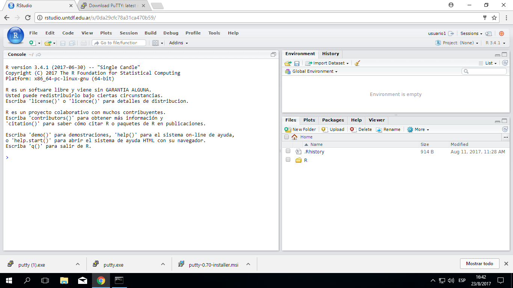

```{r setup}
library(scifigure)
library(dplyr)
library(ggplot2)
source("../src/sci_figure_ES.R", encoding = "UTF-8")
source("../src/knitr_hooks.R", encoding = "UTF-8")
final_knit <- TRUE
solucion <- FALSE
```


# Introducción a *R* y RStudio

En la materia de Estadística Avanzada para Ciencias Naturales vamos a usar
métodos estadísticos complejos. Por lo que, en muchos casos, es muy poco
práctico realizar los cálculos a mano. Por eso, es necesario usar software
estadístico específico para poder trabajar eficientemente. Existen múltiples
programas, entre los más conocidos podes mencionar Statistica, Stata, SPSS,
SAS, o Infostat, desarrollado en Argentina. Todos ellos son comerciales,
y por lo tanto hay que pagar por las licencias de uso. Por otro lado, *R* es
gratis y es usado ampliamente en el mundo. Otra de las ventajas, es la gran
comunidad de usuarios y desarrolladores que se ha formado. Lo que hace que 
esté siendo constantemente actualizado y que las últimas técnicas estadísticas
estén, muchas veces, implementadas directamente en R. Sin embargo, una de
las dificultades es que hay que escribir comandos para hacer que funcione. Lo
que es una desventaja al aprender pero luego se convierte en una ventaja, ya que
permite automatizar tareas tediosas y además realizar análisis **reproducibles**
de datos.

Otro problema de *R* es su interfaz muy poco amigable. Por eso se han desarrollado
otras interfaces (llamadas entornos de desarrollo integrado o IDE por sus siglas
en inglés) que hacen más fácil trabajar con este programa. Hay varias: RStudio,
Tinn-R, RKward, etc. Nosotros vamos a usar RStudio por ser la más trabajo tiene
encima y está más pulida.

Se puede bajar e instalar ambos programas en cualquier computadora. Hay que 
instalar *R* descargando desde https://cran.r-project.org/ y seguir las 
instrucciones del instalador. Para bajar RStudio hay que ir a
https://www.rstudio.com/products/rstudio/download/#download y también seguir las
instrucciones de instalación.

Para las clases tenemos instalado estos programas en un servidor de la 
Universidad y se puede acceder desde cualquier red (LAN o WiFi) de la sede de
Yrigoyen entrando a https://rstudio.untdf.edu.ar. Verán una pantalla de login.

Una vez que entren verán una pantalla así.


```{r rstudio-logo, echo=FALSE}

```

## RStudio

La interfaz de RStudio está dividida en varios paneles, y cada uno tiene
varias pestañas. Arriba a la derecha está el *espacio de trabajo*
(*Environment*), es donde van a aparecer los objetos que creen a medida
que trabajan en R. La otra pestaña es el *historial* (*History* ), 
donde quedan guardados todos los comandos que hayan ejecutado. Abajo de
estos dos hay un panel con varias pestañas. *Archivos* (*Files*), muestra
los archivos. *Gráficos* (*Plots*) es donde van a aparecer los gráficos
que vayamos haciendo. *Paquetes* (*Packages*) muestra las librerías que
tenemos y sus paquetes instalados y con un tilde los cargados (más
adelante vamos a ver que son los paquetes). La *ayuda* (*Help*) es donde
vamos a poder la ayuda de funciones de **R**.  Y además está las pestaña 
del *Visor* (*Viewer*) que nos muestra una vista de los documentos que
creemos.

Por el lado izquierdo está la *consola*, es donde pasa toda la acción.
Todo lo que hagamos va a ser escrito como un orden o comando ahí y luego
vamos a ver el resultado ahí o si es un gráfico en el panel de gráficos.
Cada vez que iniciemos RStudio va a mostrar la consola con un mensaje que
indica la versión de *R* y otros detalles. Debajo de ese mensaje está el
*prompt*. Aquí es donde *R* espera que se ingresen los comandos. Y para
interactuar con *R* hay que decirle que tiene que hacer. Los comandos y
su sintaxis han evolucionado a lo largo de décadas y ahora proveen a los
usuarios una manera natural de acceder y procesar datos, aplicar
procedimientos estadísticos, etc.

Se puede usar *R* como una calculadora. Podemos poner una cuenta a realizar
en el prompt y *R* nos devolverá el resultado. Por ejemplo, podemos poner:

```{r suma}
2 + 2
```

Prueben escribirlo en su consola justo después del ">".

También es posible guardar los resultados en un objeto:

```{r asignacion}
x <- 2 + 2
```

Prueben hacerlo en su consola.
En este caso, parece que no pasó nada. No apareció el resultado. Pero si
observan en panel del espacio de trabajo verán que hay un nuevo objeto
llamado `x`.

Prueben que sucede si escriben `x` en la consola.


## Análisis Reproducible

Una ventaja que tiene *R* respecto a otros programas estadísticos es que permite
reproducir el análisis de los datos. Reproducible significa que a partir de los
mismos datos otro analista va a llegar a los mismos resultados. En cambio,
replicable es que otro experimentador al repetir el experimento va a llegar a
resultados diferentes, que pueden ser o no similares (Figura \@ref(fig:reproducible-figura))

```{r reproducible-figura, echo=FALSE, fig.cap="Diferencias entre reproducible y replicable.", fig.align='center', fig.asp=.75, fig.width=6}
exps <- init_experiments(3, names = c("Original", "Reproducible", "Replicable"))
hide_stages <-  NULL
exps["analyst", 2] <- "different" # Reproducible
exps[c("experimenter", "data", "analyst", "code", "estimate", "claim"), 3] <- "different" # Replicable
sci_figure(exps)    
```


Los programas de interfaz gráfica, que no usan código o no lo proveen, complican
la reproducibilidad de los análisis. Esto se debe a que es más complicado de 
comunicar como se realizó el análisis. La ventaja del código es que queda
todo explícito en él.

Hay varias formas de trabajar con R. Una es de forma interactiva en la consola.
Como cuando pusieron `2 + 2`. Esto es muy útil cuando estamos probando si algo
funciona. Pero no guardamos el código de esta forma. Aunque, en verdad queda
guardado en el orden en que lo ejecutamos en el historial no es útil porque se
va sobreescribiendo y va quedando lo que funcionó y lo no que no. Otra forma de
usar *R* es utilizando *scripts* (archivos con extensión *.R*). Es indispensable
para crear nuevas funciones pero para analizar datos tiene sus desventajas.
Ya que, si bien el código se puede comentar anteponiendo *#* a la línea que
queremos comentar, es límitado el formato que podemos usar en el comentario.
Además, tendremos que volver a correr el script para ver los resultados si no
los guardamos explicitamente en un documento, hoja de cálculo, o imagen. Por
último, tenemos los documentos de programación letrada. La programación letrada
consiste en mezclar código con texto plano, como en un procesador de texto.

En R, hay varias aproximaciones a esto. La que más éxito ha tenido es *knitr*.
*To knit* es tejer en inglés, lo que hace es "tejer" el documento final con
el resultado del código, es decir los análisis que hagamos, y texto explicando
que hicimos, porque, y como. Es decir, podemos escribir un paper o informe 
completo. Para darle formato al texto se usa *markdown* que permite usar marcas
livianas para poner *cursivas*, **negritas** o ~~tachado~~.

### Rmarkdown

Hay muchas opciones para formatear el texto. La idea detrás de markdown es que
se pueda escribir en un procesador de texto sencillo y las marcas sean 
fáciles de poner y no interrumpan la lectura. Algunos ejemplos:

#### Énfasis

```
*cursiva*   **negrita**

_cursiva_   __negrita__
```

#### Títulos

```
# Título 1

## Título 2

### Título 3
```


#### Listas

```
Lista Desordenada
* Item 1
* Item 2
    + Item 2a
    + Item 2b
Lista Ordenada
1. Item 1
2. Item 2
3. Item 3
    + Item 3a
    + Item 3b
```

#### Saltos de línea manuales

Termina una línea con dos o más espacios: 
Las rosas son rojas,   
las violetas son azules.

#### Vínculos

Usa una dirección http simple o agrega un vínculo a una frase:

```
http://example.com

[frase vínculada](http://example.com)
```

#### Imágenes

Imágenes en la web o en el mismo directorio de trabajo:

```


```

```{exercise ejercicio-1, name="Probando markdown"}
Descarguen un archivo de RMarkdown usando este código en la consola:
  
  `download.file("url", "ejercicio-1.Rmd")`

Una vez descargado, abranlo desde el panel *Files*.
```

Los prácticos en general se harán en un archivo similar a este. En la parte
superior encontran el encabezado entre guiones. Ahí deberán poner sus nombres
y el nombre del grupo. 

```{exercise ejercicio-2, name="Personalizando"}
Cambien en encabezado y pongan sus nombres, el nombre del grupo y la fecha de
hoy.
```

Abajo encontraran espacio para ir contestando la preguntas. Una consideración
que deben tomar en cuenta es que todo el texto que escriban va a ser
considerado como un *único* párrafo a menos que este separado por 
**una línea en blanco**.

Por ejemplo, prueben escribir esto en el documento (pueden copiarlo):

>##Del origen de las especies

>### Por Darwin

>Mucho antes de que el lector haya llegado a esta
parte de mi obra se le habrán ocurrido una multitud
de dificultades. Algunas son tan graves, que aun hoy
dia apenas puedo reflexionar sobre ellas sin vacilar
algo; pero, según mi leal saber y entender, la mayor
parte son solo aparentes, y las que son reales no son,
creo yo, funestas para mi teoria.

>Estas dificultades y objeciones pueden clasificarse
en los siguientes grupos:

>1° Si las especies han descendido de otras especies
por suaves gradaciones, ¿por qué no encontramos
en todas partes innumerables formas de transicion?
¿Por qué no está toda la naturaleza confusa, 
en lugar de estar las especies bien definidas según
las vemos?
>
>2° ¿Es posible que un animal que tiene, por
ejemplo, la conformación y costumbres de un murciélago
pueda haber sido formado por modificación
de otro animal de costumbres y estructura muy
diferentes? ¿Podemos creer que la selecci6n natural
pueda producir, de una parte, un órgano insignificante,
tal como la cola de la jirafa, que sirve de
mosqueador, y, de otra, un órgano tan maravilloso
como el ojo?
>
>3° ¿Pueden los instintos adquirirse y modificarse
por selección natural? ¿Qué diremos del instinto
que lleva a la abeja a hacer celdas y que prácticamente
se ha anticipado a los descubrimientos de
profundos matemáticos?
>
>4° ¿Cómo podemos explicar que cuando se cruzan
las especies son esteriles o producen descendencia esteril,
mientras que cuando se cruzan las variedades su
fecundidad es sin igual? 

Luego, hagan clic en el botón *Knit* que tienen arriba, al lado de un ovillo y
una aguja de tejer. El desafío es mantener el formato con cada párrafo separado.

La misma consideración se debe tener en cuenta para otros formatos como 
títulos o listas. Un consejo para ver como va quedando el documento, es tejerlo
seguido. Así podremos ver cualquier problema pronto.

## Integrando código

En los documentos de RMarkdown se puede integrar bloques de código (de *R* y otros
lenguajes). Para insertar un bloque pueden hacer clic en el botón de "Insert/R"
que hay arriba o por el atajo del teclado "Ctrl+Alt+I". 

```{r ejemplo-bloque, wrapper=TRUE, eval=FALSE}
Acá va el código
```


Es importante mantener las comillas invertidas tal cual están ya que con ellas
se define donde empieza y termina el bloque. Entre las llaves se incluye como
se va a ejecutar el código (con *R* en este caso). También se puede poner nombre
al bloque, cosa que es muy recomendable porque sino van a estar nombrados como
chunk-#, donde # son números consecutivos. Ahora, imaginen que el chunk-34 de
60 falla. Va a ser un poco tedioso buscarlo, con nombre será más sencillo saber
donde estar el fallo. Además se pueden poner otras opciones, como ocultar el
código, cambiar el tamaño de figuras, etc. Luego de las llaves, en *la línea
siguiente*, deben introducir el código que quieran ejecutar, siempre teniendo en
cuenta de dejar la línea con las comillas invertidas tal cual está. También es
buena idea dejar una línea en blanco luego.


```{exercise ejercicio-3}
Incluyan un bloque de código y pongan un nombre descriptivo.
Luego, escriban una operación matemática simple.
Finalmente, tejan el documento.
```


## Manejo de datos

Una parte muy importante del análisis de datos, es el manejo de ellos. Como
seleccionar columnas, filtrar datos, y realizar operaciones sobre ellos. Vamos
a usar el paquete `dplyr` para el manejo. Los paquetes 
extienden la funcionalidad de *R* agregando nuevas funciones.

```{r cargar-datos, eval=final_knit}
library("dplyr")

nombres <- readRDS("data/nombres-1980-1999.RDS")

```

Revisemos el código. Con `library("dplyr")` cargamos el paquete dplyr. Luego,
leemos el archivo que contiene los datos y le asignamos el nombre `nombres`.
Si no le asignasemos ningún nombre, se leerían los datos, imprimiendose en la
consola y luego se borrarían de la memoría. 

Para revisar su contenido podemos escribir el nombre del objeto o usar la 
función `glimpse`

```{r ver-datos, eval=FALSE}
glimpse(nombres)
```

```{exercise ejercicio-4}
Escriban el nombre del objeto o usen la función `glimpse` para ver que tiene
dentro el objeto `nombres`.

1. ¿Cuantas columnas tiene y como se llaman?
2. ¿Que tipo de dato tiene cada columna?
```

En *R* existen diversos tipos de dato, en estos datos solo hay 2: entero 
(`integer`) y carácter (`character`). El primero son números enteros y el 
segundo es texto. Con el primero se puede hacer operaciones matemáticas y con
el segundo otro tipo de operaciones, pero no matemáticas. Es importante 
comprobar que los tipos de datos se correspondan con lo que esperamos. Si no
los resultados pueden no ser los correctos o dar errores. Por ejemplo, el
tipo de dato númerico puede ser leído como `chr` y no podremos calcular la 
media.

### Seleccionando datos

Muchas veces solo nos interesa un subconjunto de datos. Una forma de seleccionar
datos es usando la función `filter()`. 

```{r filtrar-luciano, eval=FALSE}
nombres %>% 
  filter(nombre == "Luciano") %>% 
  filter(anio == 1984)
```

Acá empezamos a ver varias cosas nuevas. Primero tenemos el símbolo `%>%` 
conocido en inglés como *pipe*, la traducción más correcta al español es 
tubo. Lo que hace este símbolo es enviar la salida de la operación a la 
izquierda a la función de la derecha. Prueben poner cada comando en orden
y ver cual es la salida. Esto es:

```{r paso-1, eval=FALSE}
nombres
```

Luego,

```{r paso-2, eval=FALSE}
nombres %>% 
  filter(nombre == "Luciano")
```

La función `filter()` filtra un conjunto de datos según los valores de la
columna/s que seleccionemos cuyos valores sean igual a `Luciano` en este caso. Y
luego filtramos la columna `anio` solo los años que sean iguales a 1984.


```{exercise ejercicio-5}
Prueben cambiar el nombre por el suyo y el año por su año de nacimiento. 
```

El operador que usamos para la igualdad es `==`. Este operador, de igualdad,
es parte de la familia de operadores lógicos, o booleanos en terminología
de ciencias de la información. Son lógicos porque van a comparar valores y
dar como resultado **verdadero** (`TRUE`) o **falso** (`FALSE`). En la Tabla
\@ref(tab:tabla-logicos) podemos ver la lista de operadores lógicos.

```{r tabla-logicos, message=FALSE, echo=FALSE}
readr::read_csv2(file = "tablas/logicos.txt") %>% 
  knitr::kable(caption = "Operadores Lógicos en R.")
```

Los primeros cinco son bastante sencillos y los han estado usando desde la 
primaria. Así que vamos a explicar en más profundidad los otros. El símbolo `!=`
va a devolver `TRUE` cuando los valores sean diferentes al que pusimos. Por 
ejemplo:

```{r distinto}
# x una secuencia de 1 a 10
x <- 1:10
# Todos los valores distintos a 5
x != 5
```

Otro operador muy útil es el de negación `!` que invierte las comparaciones,
convierte los falsos en verdaderos y los verdaderos en falsos. Siguiendo nuestro
ejemplo:

```{r negacion}
!x != 5
```

Es un ejemplo trivial, que podría haber sido resuelto más sencillamente usando
`==`. Pero es muy útil cuando queremos seleccionar todos los datos que no cumplan
un conjuto de condiciones. Lo que nos lleva al operador `|` (*O*) y el operador
`&` (*Y*). El primero va a devolver verdadero cuando *al menos uno* de los
valores sea verdadero. Por ejemplo:

```{r o-logico}
TRUE | TRUE
TRUE | FALSE
FALSE | TRUE
FALSE | FALSE
```

Por otro lado, el operador lógico *Y* `&` solo devuelve verdadero cuando *ambos
valores* son verdaderos.

```{r y-logico}
TRUE & TRUE
TRUE & FALSE
FALSE & TRUE
FALSE & FALSE
```

Los operadores se evalúan en el orden que aparecen a menos que haya paréntesis,
entonces se evalúa primero dentro del paréntesis y luego fuera.


```{exercise ejercicio-6}
¿Qué resultado darán las siguientes evaluaciones? Piensen que resultado tendría
que dar y luego comprueben lo que piensan con lo que les devuelve R.

  1. TRUE | FALSE | TRUE
  2. TRUE | FALSE & TRUE
  3. TRUE | (FALSE & TRUE)
  4. TRUE != FALSE & TRUE
  5. !(TRUE | FALSE) & TRUE
  
```

Estos dos últimos operadores son muy importantes porque nos permiten comprobar
distintas condiciones. Por ejemplo, no hay un operador para seleccionar todos
los valores entre *a* y *b* (siendo *a* y *b* dos números cualesquiera). Podemos
hacerlo combinando por un lado, x > a y x < b ¿Y cómo debemos combinar estas 
dos comparaciones? ¿Usando el operador `&` o el `|`? Queremos los valores que
cumplen con ambas condiciones, que sean mayores que a y menores que b, por lo 
tanto debemos usar el operador `&`.

```{r combinar-logicos}
# Si a = 3 y b = 6
( x > 3 ) & ( x < 6)
```

Estos valores corresponden a la posición de los valores que cumplen o no con la 
condición. Usando corchetes `[]` podemos seleccionar solo los verdaderos

```{r extraer-valores-logicos}
x[( x > 3 ) & ( x < 6)]
```

La función `filter()` hace algo similar para conjuntos de datos (`data.frames` o
`tibbles`).

```{exercise ejercicio-7}
Anteriormente usamos dos operaciones de `filter()` para seleccionar el nombre y
el año. Pero es posible usar solo una con los operadores lógicos que vimos. 
Intenten hacerlo.
```

Finalmente está `isTRUE()` que devuelve `TRUE` cuando el objeto es `TRUE`
lo que suena bastante obvio. Pero es parte de una familia que permite comprobar
si un objeto es del tipo esperado. Por ejempo: `is.numeric()` comprueba que el 
objeto es un vector con algún tipo de número. 

### Operaciones por grupos

Muchas veces van a necesitar calcular por grupos: la suma, media, varianza, etc.
Por ejemplo, calcular el número total de personas con cada nombre. Podrían 
hacerlo de esta forma:

```{r filtrado, eval=final_knit}
nombres %>% 
  filter(nombre == "Luciano") %>% 
  summarise(total = sum(cantidad))
```

Y repetirlo cambiando el nombre para cada uno de los nombres. Por su puesto,
esta forma de hacer las cosas es muy incómoda y propensa a errores. Hay una
forma más fácil y es usando `group_by()`. Un ejemplo:

```{r agrupado, eval=final_knit}
# No intenten hacerlo en sus computadoras
# Los datos tienen más de 3 millones de registros y va a tomar un tiempo
nombres %>% 
  group_by(nombre) %>% 
  summarise(total = sum(cantidad))
```

Como pueden ver estos datos distan bastante de estar limpios ya que hay 
muchos errores de entrada de datos, como nombres todo en mayúsculas, versiones
del mismo nombre con tilde y sin tilde, etc. Para evitar todo ese "ruido", 
podríamos filtrar los nombres raros que son mayoría de las entradas.

```{exercise ejercicio-8, label="nombre-comun", name="Nombres comunes"}
¿Cómo filtrarían los nombres raros excluyéndolos del conjunto de datos? 
  
  Guarden el resultado como nombres_comunes y calculen el total por nombre.

Nota: Por coherencia, definamos nombres raros como los que son menos de 100.
```


```{r solucion-suma-nombres, echo=solucion, eval=final_knit}
nombres_comunes <- nombres %>% 
  filter(cantidad > 100)
nombres_comunes %>% 
  group_by(nombre) %>% 
  summarise(total = sum(cantidad))
```

Por defecto esta ordenado alfabeticamente por nombre. Podemos ordenarlo según
algún otro criterio con la función `arrange()`. Esta función ordena de manera
creciente (0-9, a-z) un conjunto de datos. Por ejemplo:

```{r orden, eval=final_knit}
nombres_comunes %>% 
  arrange(cantidad)
```

Si queremos que sea decreciente (9-0, z-a), hay que agregar la función `desc()`.
Por ejemplo:

```{r orden-decreciente, eval=final_knit}
nombres_comunes %>% 
  arrange(desc(cantidad))
```

También se pueden poner varios criterios para que ordene según ellos. Por 
ejemplo, por cantidad y luego por orden alfabético. 

```{r orden-con-dos, eval=final_knit}
nombres_comunes %>% 
  arrange(cantidad, nombre)
```

```{exercise ejercicio-9, name="Orden de totales"}
Ordenen el resultado del total de nombres que calcularon en el ejercicio 
\@ref(exr:nombre-comun)
```

## Gráficos

Una de las formas más útiles de visualizar la información es mediante gráficos
(aunque si son pocos datos es preferible una tabla). De hecho, el primer
paso antes de analizar los datos debe ser hacer un gráfico de los valores que
tienen. Un gráfico de dispersión si es bidimensional o un histograma si solo 
tiene una dimensión.

Aunque hay varios sistemas gráficos (`base`, `lattice`, `ggobi`, `plotly`)
vamos a usar `ggplot2` por su facilidad de uso y potencia para hacer gráficos
complejos a partir de componentes simples.

Este paquete sigue una idea que se llama gramática de gráficos propuesta por
Wilkinson en donde los gráficos pueden dividirse en cuatro partes:

 - Los **datos** y como se **mapea** (**`aes`**) esos datos a las 
 diferentes atributos estéticos. Es decir que columna corresponde al eje
 x, al eje y, forma, color, etc.
 - Las formas geométricas (**`geom`**) que representan como se ven los datos.
 Como puntos, líneas, barras de error, etc.
 - Transformaciones estadísticas de los datos (**`stats`**) resumen los datos
 de forma útil. Por ejemplo, para agregar la media por grupo o una línea
 de regresión sin haberlos calculado antes.
 - Escalas a las que se mapean los datos (**`scale`**). Estas pueden ser 
 escalas de color, forma, etc.
 - Un sistema de coordenadas (**`coord`**), que describe como se proyectan
 estos datos. Por defecto se usa el sistema cartesiano. Pero hay otros 
 disponibles como el polar.
 - Un sistema paneles (**`facet`**) que describe como dividir los datos en
 distintos paneles.
 
 Adicionalmente a la gramática, se agrega un sistema de temas que permite 
 modificar la totalidad de elementos que hacen al gráfico como fuentes, 
 líneas de ejes, etc.
 
 Podemos hacer un gráfico de la siguiente forma:
 
```{r grafico-inicial, eval=final_knit}
nombres_comunes %>% 
  filter(nombre == "Luciano") %>% 
  ggplot(aes(x = anio, y = cantidad)) +
  geom_line()
```

```{exercise nombres, name = "Sus nombres"}
Hagan un gráfico similar al anterior pero con sus nombres

*Pista: Recuerden como se filtran los datos.*
```

Cambiando la forma (i.e. **`geom_`**), por ejemplo:

```{r Graficos-Comunes, echo=FALSE}
tibble("Gráfico" = c("Barras", "Puntos", "Cajas y Barras", "Histograma", 
                     "Lineas", "Barras de Error"),
       geom = c("geom_col", "geom_point", "geom_boxplot", 
                "geom_histogram", "geom_line", "geom_errorbar")) %>% 
  knitr::kable(caption = "Gráficos comunes con ggplot")
```

Pueden ver más en la ayuda de ggplot en R (usando la pestaña de ayuda o 
usando `help(nombre_de_función)` en la consola) o en la documentación online
que tiene la ventaja de tener graficados los ejemplos http://ggplot2.tidyverse.org/reference/ .

```{exercise ejercicio-10}
Cambien el tipo de gráfico usando alguna otra forma. Pueden combinar dos tipos
de formas para hacer gráficos más complejos como de puntos y lineas.
```

Ahora, supongamos que queremos ver varios nombres a la vez en el gráfico. Si
todos los puntos o lineas son iguales no los vamos a poder distinguir.

```{r dos-lineas-iguales, eval=final_knit}
nombres_comunes %>% 
  filter(nombre %in% c("Luciano", "Juan")) %>% 
  ggplot(aes(x = anio, y = cantidad)) +
  geom_line(aes(group = nombre))
```

Se puede añadir diferentes colores, tipos de puntos o líneas según distintas
variables. 


```{r lista-de-aes, echo=FALSE}
tibble(Tipo = c("Transparencia", "Relleno", "Color", "Agrupamiento", "Línea", 
                "Punto", "Tamaño", "Posición"), 
       aes = c("alpha", "fill", "color o colour", "group", "linetype", "shape",
               "size", "x, y, xmin, xmax, ymin, ymax, xend, yend")) %>% 
  knitr::kable(caption = "Capa de estética con ggplot")
```

Para que estas estéticas sean mapeadas a variables de nuestros datos deben ser
definidas dentro de `aes()`. De otra forma esta quedarían definidas de igual
forma para toda los puntos, líneas . Claro que esto es una ventaja si queremos
cambiar la forma de todos lo puntos, por ejemplo de puntos cerrados a puntos
abiertos. O, por ejemplo podemos poner que la transparencia sea mapeado a alguna
variable númerica y entonces los puntos que tenga valor más alto van a ser menos
transparentes, o definir `alpha` por fuera y entonces todos los puntos van a
tener la misma transparencia.

Seguramente se preguntarán cual es la diferencia entre relleno y color.
Algunos *geoms* tienen solo la opción de cambiar el color, como las líneas.
Por otro lado, hay algunos que pueden cambiar el color de los bordes con la
opción `color`o `colour` (la diferencia entre estos es sólo nominal, por la
ortografía entre inlgés estadounidense y británico respectivamente) y el relleno
del *geom*. Un ejemplo de tal caso es el gráfico de barras, realizado con
`geom_col`. Otros ejemplos son el punto, bajo algunos [tipos de puntos][http://
ggplot2.tidyverse.org/reference/scale_shape.html] y el boxplot.

Si queremos diferenciar las líneas según el nombre, podemos cambiar
el color de ellas de la siguiente forma:

```{r dos-lineas-color, eval=final_knit}
nombres_comunes %>% 
  filter(nombre %in% c("Luciano", "Juan")) %>% 
  ggplot(aes(x = anio, y = cantidad)) +
  geom_line(aes(colour = nombre))
```

```{exercise}
Vuelvan a hacer el mismo gráfico de arriba con su nombre y el de dos
compañeros. Además de distinto color para cada uno, añadan distinto
tipo de línea
```


# Por su cuenta

Lean los datos de 

```{r eval=FALSE}
load("inventario.RData")
```

Son datos del inventario de plantaciones forestales. Están dividades en plantaciones
de cortina y de macizo. La unidad de medida son metros cúbicos de madera.

1. ¿Qué columnas hay y cuantos datos encuentran?
2. Calculen una nueva columna `total`con el total de metros cúbicos. 
Pista: pueden usar la función `mutate` que funciona de manera similar a `summarise`
2. Seleccionen los datos de la provincia de Neuquén.
3. Calculen el promedio y la suma total de metros cúbicos por provincia.
4. Ordenen las provincias por el totla de metros cúbicos. 
5. Grafiquen cada uno de los datos de cada provincia, distiguiendo si se trata
de metros cúbicos de cortina o de macizo. 

