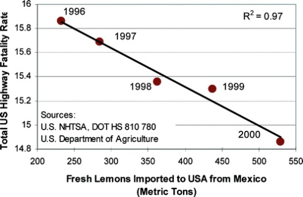

---
output:
  pdf_document: default
  html_document: default
---

# Regresión

```{r setup, include = FALSE}
library(tidyverse)
library(pander)
options(knitr.kable.NA = '')
library(knitr)
```


En las ciencias naturales es usual querer explicar una variable con otras.
Las variables que se quieren explicar son las variables dependientes y las
que se usan para explicar son las llamadas variables explicatorias o también
independientes. A estos modelos se los conoce como modelos de regresión. Aunque
las variables estén relacionadas esto no implica que haya una relación causal
entre ellas. Sin un modelo causal que explique la manera que las variables
se relación se está incurriendo una falacia del tipo *cum hoc ergo propter
hoc*. Por ejemplo, en la Figura \@ref(fig:regresion-espuria) se muestra que
la relación entre los limones frescos importados desde México (ton) y tasa de
mortalidad total en autopistas de EE.UU. Según esta regresión al ¡aumentar la
importación de disminuye la tasa de mortalidad! Este resultado carece de lógica
ya que no hay una forma en que la importación de limones afecte la mortalidad.
Por este motivo hay que ser cuidadoso en cuanto a las conclusiones que se
realizan con los resultados.


(ref:regresion-espuria) Ejemplo de regresión espuria. Limones frescos importados
desde México (ton) y tasa de mortalidad total en autopistas de EE.UU. 

```{r regresion-espuria, fig.cap="(ref:regresion-espuria)", out.width = 6, echo = FALSE}

```

## Regresión Lineal Simple

La regresión lineal simple se da cuando hay una variable aleatoria con 
distribución normal y solo una variable predictora. La varible predictora no
es una variable aleatoria, sino que puede ser modificada por el investigador.
El objetivo de esta técnica es obtener una ecuación lineal que explique 
el cambio de la variable aleatoria según el cambio de la variable predictora:

\begin{equation}
Y_i = \beta_0 + \beta_1 X_i
(\#eq:reg1)
\end{equation}

Por ejemplo, el se tiene la edad y la longitud de alas de gorriones de varias
edades en la Tabla \@ref(tab:gorriones). La edad es la variable independiente y
la longitud de ala es la variable dependiente. Se busca ajustar un modelo como 
en el da la Ecuación \@ref(eq:reg1). En la Figura \@ref(fig:gorriones-grafico) la 
recta que mejor ajusta a esto datos en azul. Sin embargo, el ajuste no es
perfecto. La diferencia entre el valor ajustado o predicho y el valor observado
es el error que se comete. Ese error se simboliza con la letra griega epsilon y
debe ser incluido en el modelo:

\begin{equation}
Y_i = \beta_0 + \beta_1 X_i + \epsilon_i
(\#eq:reg2)
\end{equation}

Se asume que $\epsilon_i\sim N\left ( 0, \sigma^2 \right )$ y por lo tanto
$\sum \epsilon_i = 0$. El método que se usa para encontrar los estimadores de
los $\beta_i$ consiste en minimizar el cuadrado de los errores. Por eso,
el método se lo conoce como mínimos cuadrados o mínimos cuadrados ordinarios.
Afortunadamente se pueden resolver de manera analítica por las siguientes 
ecuaciones:

\begin{equation}
\begin{aligned}
b_1 &= \frac{\sum(X_i-\overline{X})(Y_i-\overline{Y})}{\sum (X_i-\overline{X})^{2}}=\frac{\sum X_iY_i-\frac{\left (\sum X_i\right)\left ( \sum Y_i\right )}{n}}{\sum X_i^2-\frac{\left (\sum X_i \right )^2}{n}}\\
b_0 &= \overline{Y} - b_1\overline{X}
\end{aligned}
(\#eq:betas)
\end{equation}

Para facilitar las formulas y hacerlas más compactas definimos:

\begin{equation}
\begin{aligned}
\sum y^2 &= \sum \left (Y_i - \overline{Y} \right )^2\\
\sum x^2 &= \sum \left (X_i - \overline{X} \right )^2\\
\sum xy &= \sum \left (X_i - \overline{X} \right )\left (Y_i - \overline{Y} \right )
\end{aligned}
\end{equation}


```{r gorriones-datos, echo = FALSE}
gorriones <- tribble(
 ~Edad, ~ Longitud, 
  3,       1.4,    
  4,       1.5,    
  5,       2.2,    
  6,       2.4,    
  8,       3.1,    
  9,       3.2,    
  10,      3.2,    
  11,      3.9,    
  12,      4.1,    
  14,      4.7,    
  15,      4.5,    
  16,      5.2,    
  17,       5     
)

knitr::kable(gorriones, caption = "Edad en días y longitud
                    de ala en centímetros de 13 gorriones.",
            align = "c")
```

(ref:gorriones-grafico) Gráfico de dispersión de edad en días y longitud
                    de ala en centímetros de 13 gorriones. En azul línea de 
                    regresión estimada con mínimos cuadrados ordinarios. En rojo
                    el error cometido por la regresión entre los valores estimados
                    y los valores observados.

```{r gorriones-grafico, echo = FALSE, fig.cap = "(ref:gorriones-grafico)"}

m1 <- lm(Longitud ~ Edad, data = gorriones)
gorriones <- modelr::add_predictions(gorriones, m1)

ggplot(gorriones, aes(Edad, Longitud)) +
  geom_segment(aes(xend = Edad, yend = pred), color = "red") +
  geom_point() +
  geom_smooth(method = "lm", se = FALSE)
```


Una vez que están determinados los $\beta_i$ es necesario determinar si son
signficativos. Es decir, diferentes de cero. El $\beta_1$ puede ser muy grande
(e.g. 100) pero si la varianza asociada a este número es muy grande puede que
no sea significativamente distinto de cero. Existen dos estadísticos que 
permiten probar la significancia de $\beta_1$. 

El primero es un estadístico F que se calcula a partir de una tabla de análisis
de la varianza (ANOVA):

$$
F = \frac{CM_{regresion}}{CM_{residual}}
$$

```{r, echo=FALSE}
tabla_anova_regresion <- tibble(
  "Fuente de Variación"  = c("Regresión", "Residual", "Total"), 
  "GL" = c("$1$", "$n-2$", "$n-1$"), 
  "Suma de Cuadrados (SC)" = c(
    "$\\frac{\\left (\\sum xy \\right )^2}{\\sum x^2}$",
    "$SC_{total}-SC_{regresion}$", "$\\sum y^2$"), 
  "Cuadrados Medios (CM)" = c("$\\frac{SC_{regresion}}{GL_{regresion}}$",
                              "$\\frac{SC_{residual}}{GL_{residual}}$",
                              NA)
  )

knitr::kable(tabla_anova_regresion)
```

Este estadístico *F* bajo la hipótesis nula $H_0: \beta_1 = 0$ se distribuye
como $F_{1;n-2}$. Entonces se compara con esa distribución y si el estadístico
es mayor que el valor crítico al $\alpha$ especificado o si la probabilidad es
de un valor mayor a estadístico es menor a $\alpha$ entonces se rechaza $H_0$.

Por ejemplo, con los datos de la tabla \@ref(tab:gorriones-datos):

```{r, echo=FALSE}
precomputos <- gorriones %>% 
  mutate(y = Longitud - mean(Longitud),
         x = Edad - mean(Edad),
         xy = x * y) %>% 
  summarise(
    y = sum(y^2),
    x = sum(x^2),
    xy = sum(xy),
    n = n()
  )

tabla_anova_regresion <- tibble(
  "Fuente de Variación"  = c("Regresión", "Residual", "Total"), 
  "GL" = c(1, precomputos$n-2, precomputos$n-1), 
  "Suma de Cuadrados (SC)" = c(precomputos$xy^2/precomputos$x, precomputos$y- precomputos$xy^2/precomputos$x, precomputos$y), 
  "Cuadrados Medios (CM)" = c(precomputos$xy^2/precomputos$x, (precomputos$y- precomputos$xy^2/precomputos$x)/(precomputos$n- 2),
                              NA),
  F = c(precomputos$xy^2/precomputos$x/((precomputos$y- precomputos$xy^2/precomputos$x)/(precomputos$n- 2)), NA, NA),
  "P(>F)" = c(pf(precomputos$xy^2/precomputos$x/((precomputos$y- precomputos$xy^2/precomputos$x)/(precomputos$n- 2)), 1, precomputos$n , lower.tail = FALSE), NA, NA)
)

knitr::kable(tabla_anova_regresion)
```

La otra forma de hacer esta prueba es usando el estadístico *t*:

$$
t = \frac{b_1 - \beta_1}{s_{b1}}
(\#eq:test-beta)
$$

En el caso de $H_0: \beta_1 = 0$ es claro que ese el valor que debe tomar
$\beta_1$ en la Ecuación \@ref(eq:test-beta). Por otro lado, esta forma de 
probar la significancia del estimador $b_1$ tiene la ventaja de poder probar
a una cola izquierda o derecha y con distintos valores de $\beta_1$ (e.g. 1, 3.
100, etc.).

La varianza de $b_1$ se calcula como:

$$
s_b^2=\frac{s^2_{YX}}{\sum x^2}
$$

Donde el estimador de $s^2_{YX}$ es el $CM_{residual}$ en la tabla de anovo.


El coeficiente de determinación $r^2$ es igual a la proporción de la varianza
de Y explicada por la regresion:

$$
r^2 = \frac{SC_{regresion}}{SC{total}}
$$

La interpretación de la función de regresión es que $\beta_0$ es el valor que toma
$Y$ cuando $X=0$. No siempre tiene sentido biológico este parámetro.
Por ejemplo, si la variable $X$ es el peso de un animal, **¡no existe un animal
con peso 0!**. Por otro lado, en el caso de los gorriones este valor representa
la longitud media del ala de un gorrión al nacer. 

La interpretación de $\beta_1$ es cuanto aumenta (o disminuye) $Y$ por cada
unidad de $X$.


### Intervalos de confianza

El intervalo de confianza para $b_1$ es:

$$
b_1 \pm t_{\alpha(2);n-2} s_b
$$


El intervalo de confianza para cada $Y$ es distinto que el de para
una media. Debido a que la pendiente $b_1$ tiene varianza hace que los
intervalos de confianza de $Y$ sean mayores en los extremos que en el centro.
Podemos imaginarlo como un subibaja donde el punto donde está sostenido es 
igual a $\overline{X}$. Por lo tanto la varianza de $\hat{Y}$ aumenta a medida
que se aleja de $\overline{X}$


$$
S_{\hat{Y}}= \sqrt{S^2_{YX}\left[ \frac{1}{n} + \frac{\left( X_i - \overline{X} \right)^2}{\sum x^2} \right ]}
$$
Luego se construye normalmente como cualquier otro intervalo de confianza:

$$
\hat Y \pm t_{\alpha(2);n-2}S_{\hat Y}
$$

En cambio, el intervalo de predicción para un nuevo $Y$ depende de la cantidad de
nuevas estimaciones que se quieran predecir:

$$
(S_{\hat{Y}})_m= \sqrt{S^2_{YX}\left[\frac{1}{m} + \frac{1}{n} + \frac{\left( X_i - \overline{X} \right)^2}{\sum x^2} \right ]}
$$

Donde $m$ es el número de nuevas predicciones en en un mismo $X_i$.

## Regresión con Replicación

La regresión lineal simple vista anteriormente es para cuando solo hay una
observación por cada $X_i$. Cuando tenemos varias observaciones por cada
$X_i$ es posible probar la hipótesis sobre la linealidad de los datos. 
Esto es posible de probar porque cada observación proviene de una distribución
normal con media $\beta_0 + \beta_1X$. Por lo tanto, la media de las réplicas
de cada $X_i$ debería coincidir con el valor de $\hat{Y}$ de la regresión.
Por ejemplo, se tienen mediciones de la presión sistólica de hombres de diferentes
edades, con varias mediciones para la misma edad en la Tabla \@ref(tab:presión-sistolica).
En la Figura \@ref(fig:grafico-sistolica) se graficaron estos datos. Además,
se añadió la recta de regresión estimada. 

```{r presión-sistolica, echo=FALSE}
presion <- list("30" = c(108, 110, 106),
                "40" = c(125, 120, 118, 119),
                "50" = c(132, 137, 134),
                "60" = c(148, 151, 146, 147, 144),
                "70" = c(162, 156, 164, 158, 159))

presion_long <- presion %>% 
  unlist() %>%
  enframe() %>%
  unnest() %>% 
  mutate(name = str_remove(name, "\\d$") %>% as.integer()) %>% 
  rename(edad = name, presion = value)
  
presion_long %>% 
  group_by(edad) %>%
  mutate(.id = 1:n()) %>%
  spread(.id, presion) %>%
  unite(presion, 2:6, sep = ", ") %>%
  mutate(presion = str_remove_all(presion, ", NA")) %>% 
  kable(caption = "Presión sistólica (mm Hg) en hombres de varias edades.")

```


```{r grafico-sistotlica, echo = FALSE, fig.cap = ""}
ggplot(presion_long, aes(edad, presion)) +
  geom_point() +
  geom_smooth(method = "lm", se = FALSE) +
  stat_summary(geom = "point", color = "red", fun.y = "mean") +
  labs(x = "Edad (X) en años", y = "Presión sistólica (Y) en mm Hg") 
```

Entonces, si tenemos réplicas por cada X es posible estimar las desviaciones de 
la linealidad. La hipótesis nula es que la población es linear vs la alternativa
que no es linear:

$$ 
H_0 : \text{la población es linear}\\
H_a: \text{la población no es linear}
$$

La forma de poner a prueba esta hipótesis es mediante un estadístico F.

$$
F = \frac{CM_{desviaciones}}{CM_{dentro}}
$$

La varianza total puede ser divididad entre la varianza residual o dentro de 
los grupos, y la varianza entre los grupos que además puede ser divida entre la
que explicada por la regresión linear y la que no explicada por la regresión
linear que se asume que es debida a desviaciones de la linealidad.

```{r tabla-anova-desviaciones, echo=FALSE}
tabla_anova_regresion <- tibble(
  "Fuente de Variación"  = c("Entre grupos", "\tRegresión Lineal", "\tDesviaciones de la linealidad", "Dentro de grupos", "Total"), 
  "GL" = c("$I - 1$",
           "$1$", 
           "$I - 2$", 
           "$N - I $",
           "$N-1$"), 
  "Suma de Cuadrados (SC)" = c(
    "$\\sum\\frac{\\left(\\sum Y_ij\\right)^2}{n_i} - \\frac{\\left (\\sum\\sum Y_ij\\right )}{N}$",
    "$\\frac{\\left (\\sum xy \\right )^2}{\\sum x^2}$",
    "$SC_{entre} - SC{regresion}$",
    "$SC_{total}-SC_{entre}$", 
    "$\\sum y^2$"), 
  "Cuadrados Medios (CM)" = c(
    NA,
    NA,
    "$\\frac{SC_{desviaciones}}{GL_{desviaciones}}$",
                              "$\\frac{SC_{dentro}}{GL_{dentro}}$",
                              NA)
  )

knitr::kable(tabla_anova_regresion)
```

El estadístico F sigue una distribución F con I - 2 grados de libertad en el
numerador y N-I en el denominador si $H_0$ es cierta. 


```{r ejemplo-tabla-anova-desviaciones, echo=FALSE}
tabla_anova_regresion <- tibble(
  "Fuente de Variación"  = c("Entre grupos", "\tRegresión Lineal", "\tDesviaciones de la linealidad", "Dentro de grupos", "Total"), 
  "GL" = c("$4$",
           "$1$", 
           "3", 
           "$14$",
           "$19$"), 
  "Suma de Cuadrados (SC)" = c(
    "$6751.93$",
    "$6750.29$",
    "$1.64$",
    "$117.27$", 
    "$6869.20$"), 
  "Cuadrados Medios (CM)" = c(
    NA,
    NA,
    "$0.55$",
                              "$7.82$",
                              NA)
  )

knitr::kable(tabla_anova_regresion)
```

El valor de $F = \frac{0.55}{7.82} = 0.070 < 1$. Por lo tanto no se rechaza
$H_0$.

Luego podemos proceder y comprobar si la regresión es significativa como se
hizo para una regresión lineal simple sin replicas en la sección anterior.

En *R* es posible poner a prueba la linealidad de forma simple con una prueba 
de anova. La formula general que se debe utilizar es: 

```{r eval=FALSE}
variable_respuesta ~ variable_explicatoria + as.factor(variable_explicatoria)
```

Si no ponemos el segundo término a mano derecha, solo se hará una regresión 
lineal. Por eso, se agrega la función `as.factor()` para que utilice la 
segunda variable explicatoria como variable de agrupamiento y no como variable
continua como ya fue utilizada anteriomente. Por ejemplo, para los datos de
presión sistólica:


```{r}
summary(aov(presion ~ edad + as.factor(edad), data = presion_long))
```

El orden de los factores **altera el producto**. No es lo mismo poner:

```{r eval=FALSE}
variable_respuesta ~  as.factor(variable_explicatoria) + variable_explicatoria
```

Comparase el resultado siguiente con el anterior

```{r}
summary(aov(presion ~ as.factor(edad) + edad, data = presion_long))
```

¡Y llegaremos a conclusiones totalmente opuestas!


Una vez que no rechazamos la hipotesis de que la población es linear podemos 
comprobar que la regresion linear es significativa y estimar los parametros. 

```{r, echo = FALSE}

presion_xy <- presion_long %>% 
  mutate(yy = (presion - mean(presion))^2,
         xx = (edad - mean(edad))^2,
         xy = (presion - mean(presion)) * (edad - mean(edad))
  ) %>% 
  summarise(yy = sum(yy),
            xx = sum(xx),
            xy = sum(xy),
            y_m = mean(presion),
            x_m = mean(edad))

sxx <- presion_xy %>% pull(xx)
sxy <- presion_xy %>% pull(xy)
syy <- presion_xy %>% pull(yy)

y_m <- presion_xy %>% pull(y_m)
x_m <- presion_xy %>% pull(x_m)
```

En el el ejemplo:

$$
b = \frac{\sum xy}{\sum x^2} = \frac{`r sxy`}{`r sxx`} = `r sxy/sxx` \text{mm Hg/año}\\
a = \overline{Y} - b \overline{X} = `r y_m`- `r sxy/sxx` `r x_m` = `r y_m -  sxy/sxx * x_m`
$$
En *R* es posible ajustar un modelo lineal con la función `lm()` que funciona
de forma similar a `aov()` (de hecho son lo mismo con cambios estéticos a 
la forma de presentar los datos). Necesita una fórmula y la ubicación de los 
datos. 

El resultado puedo verse con la función `summary()` y puede verse abajo.

```{r}
summary(lm(presion ~ edad, data = presion_long))
summary.aov(lm(presion ~ edad, data = presion_long))
```

Da casi toda la información necesaria. 

+ `Call` da información de como fue ejecutado `lm()`.
+ `Residuals` un breve resumen de los residuales, mínimo, primer cuartil, 
  mediana, tercer cuartila y máximo.
+ `Coefficients` los coeficientes de los parámetros del modelo. `(Intercept)` es
  la ordenada al origen y los siguientes coeficientes corresponden a la pendiente
  de la variable nombrada. Indica el valor estimado, su error estándar, el valor
  del estadístico *t* y la probabilidad de un valor mayor.
+ Abajo da también información del error estándar del residual. El r^2^ múltiple
  y ajustado. Y el estadístico F con sus grados de libertad y su valor de una 
  probabilidad mayor.
  
## Transformaciones para corregir la falta de linealidad


Muchas veces las relaciones entre $X$ e $Y$ no son lineales. Anteriormente,
vimos que se podía transformar $Y$ para cumplir los supuestos de normalidad y
homocedasticidad. Ahora veremos que también se puede transformar $X$ para 
cumplir con la linealidad. En general, la transformación de $X$ no cambia
la distribución de $Y$ por lo que puede trasnformarse el primero con
impunidad.

Sin embargo, hay que tener cuidado con la transformaciones de $Y$. No deben
hacerse en caso de que sí se cumplan los supuestos ya que se modificaría la
distribución de $Y$ y podrían dejar de cumplir estos supuestos.


```{r, echo=FALSE}
XY <- list(
  "5" = c(10.72, 11.22, 11.75, 12.31),
  "10" = c(14.13, 14.79,15.49, 16.22 ),
  "15" = c(18.61, 19.50, 20.40, 21.37),
  "20" = c(24.55, 25.70, 26.92, 28.18), 
  "25" = c(32.36, 33.88, 35.48, 37.15)
) %>% 
  unlist() %>%
  enframe() %>%
  unnest() %>% 
  mutate(name = str_remove(name, "\\d$") %>% as.integer(),
         logY = log10(value)) %>% 
  rename(X = name, Y = value) %>% 
  group_by(X) %>% 
  mutate(s2Y = var(Y),
         s2logY = var(logY))

XY %>% 
  select(X, Y, s2Y) %>% 
  mutate(.id = 1:n()) %>%
  spread(.id, Y) %>%
  unite(Y, 3:6, sep = ", ") %>%
  select(X, Y, s2Y) %>% 
  kable()

XY %>% 
  select(X, logY, s2logY) %>% 
  mutate(.id = 1:n(),
         logY = round(logY, 5),
         s2logY = round(s2logY, 6)) %>%
  spread(.id, logY) %>%
  unite(Y, 3:6, sep = ", ") %>%
  select(X, Y, s2logY) %>% 
  kable()

```

```{r, echo=FALSE}
p1 <- ggplot(XY, aes(X, Y)) + 
  geom_point()
p2 <- ggplot(XY, aes(X, logY)) + 
  geom_point()
library(patchwork)

p1 + p2
```

## Uso de los Residuales para Comprobar los Supuestos

Incluso si no tenemos réplicas para cada $X$ es posible comprobar los supuestos
mediante el uso de gráficos de residuales. Una de las formas es graficando los
residuos vs los valores ajustados. Si hay homocedasticidad y la
regresión lineal es un buen modelo de ajuste a nuestros datos obtendremos
un gráfico de ajuste como el que se muestra en la Figura \@ref(fig:residuales)a.
En este gráfico, los residuales muestran la misma varianza a lo largo de la 
valores de $X$ y están distribuidos de igual manera alrededor del cero.

Si no se cumple el supuesto de homocedasticidad, es decir que hay
heterocedaticidad, el gráfico de los residuos se verá como en la Figura 
\@ref(fig:residuales)b. En este caso la variabilidad de los residuales aumenta
a medida que aumentan los valores predichos. También podría darse el caso 
inverso, que la varianza disminuya a medida que aumente la media, pero es mucho
más raro. Si ocurre el caso de la Figura \@ref(fig:residuales)c es probable
que falte una variable importante a nuestro modelo. Finalmente, si ocurre


```{r residuales, echo=FALSE, fig.cap="Gráficos de algunos de los posibles patrones que se pueden detectar al gráficar los residuales vs los valores ajustados."}
base <- function(dt){
  ggplot(dt, aes(X, Y)) +
  geom_polygon(alpha = 0.4) +
  geom_hline(yintercept = 0) +
  ylim(-2, 2)+
  labs(x = expression(italic(X)) , y = expression(italic(Y - hat(Y)))) +
  theme(axis.text = element_blank())
}
a <- tribble(
  ~X, ~Y,
  0, -1,
  0, 1,
  1, 1,
  1, -1
)

b <- tribble(
  ~X, ~Y,
  0, -1,
  0, 1,
  1, 1.8,
  1, -1.8
)

c <- tribble(
  ~X, ~Y,
  0, -1,
  0, 0,
  1, 1,
  1, 0
)

d <- tibble(
  X = seq(0, 1, by = 0.01))  %>% 
  mutate(Y = ((-(X - 0.5)^2)+0.25)*4,
         Y2 = ((-(X - 0.5)^2))*4) %>% 
  gather(var2, Y, -X)
d <- d %>% filter(var2 == "Y2") %>% arrange(desc(X)) %>% bind_rows(d %>% filter(var2 == "Y"))

pa <- base(a)
pb <- base(b)
pc <- base(c)
pd <- base(d)

cowplot::plot_grid(pa, pb, pc, pd, ncol = 2, labels = "auto")
```
## Regresiones Múltiples

