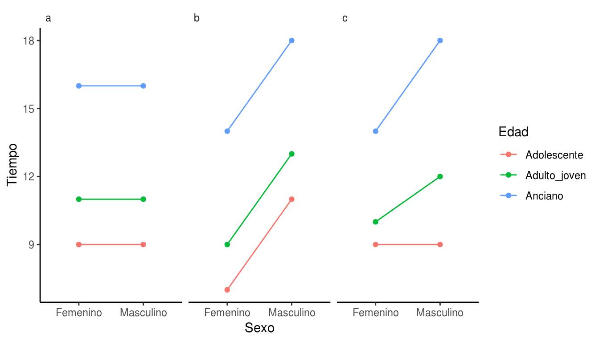
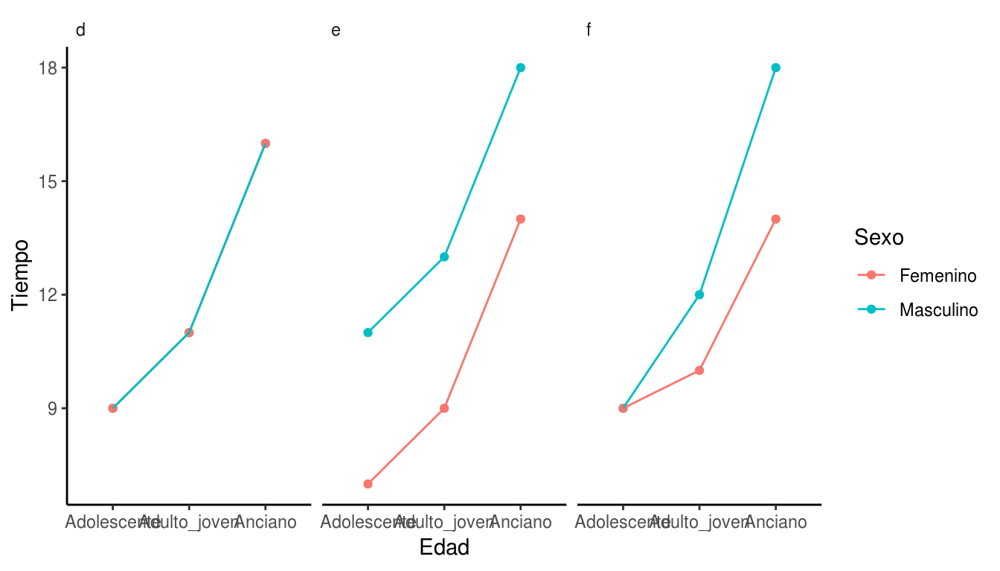
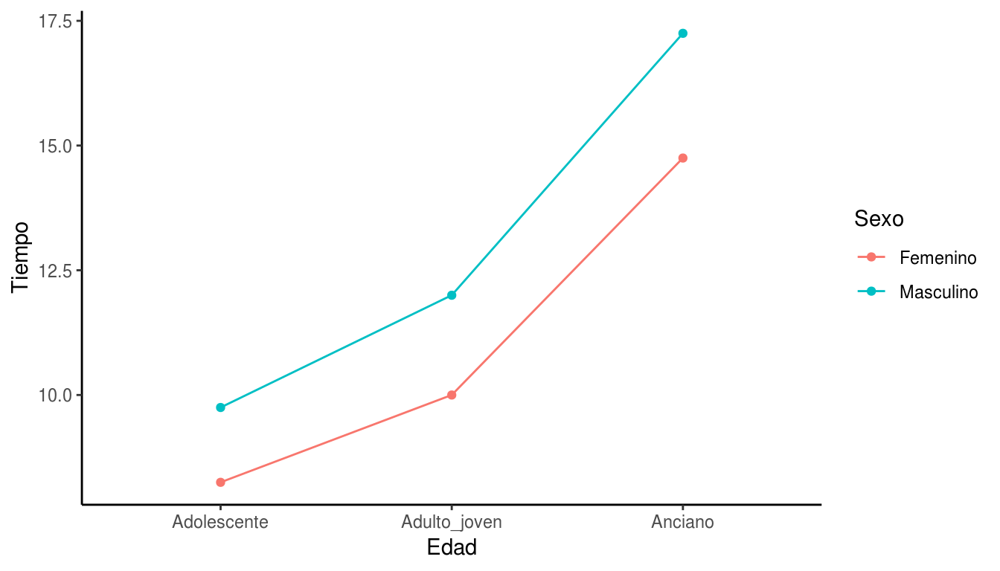
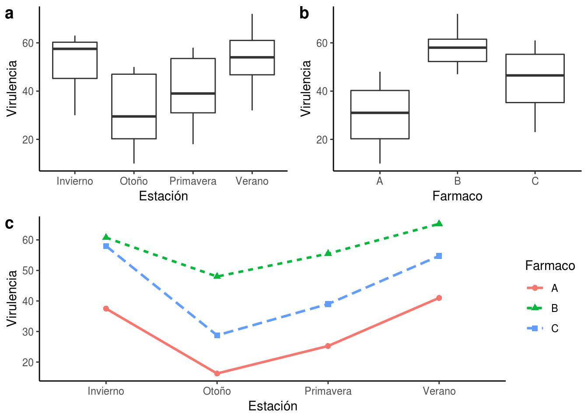
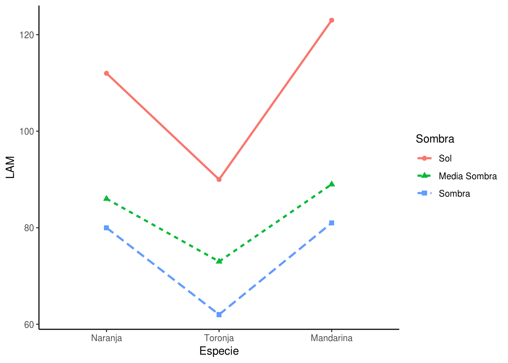

# ANOVA DE DOS FACTORES

## Ventajas de los estudios multifactoriales

### Eficiencia: 

#### Cantidad de Información: Permiten estudiar la *interacción* de los factores.

*Validez de las decisiones*: los experimentos multifactoriales también pueden
robustecer la validez de las decisiones.

*Comentarios*:

1.  Los análisis multifactoriales permiten una evaluación efectiva de los
    efectos de la interacción y economiza el número de casos requeridos para el
    análisis.

2.  Experimentos involucrando muchos factores, cada uno con numerosos niveles,
    se vuelven complejos, costosos e insumen tiempo.

## Elementos del Modelo

*Ejemplo*: Consideremos un estudio de dos factores, en el cual son de interés
los efectos del sexo y la edad en el aprendizaje de una tarea. El factor edad lo
definimos en términos de sólo tres niveles (adolescente, adulto joven, anciano).

La respuesta para un dado tratamiento, en un estudio de dos factores, es
indicada por µij, donde i hace referencia al nivel del factor $A$ ($i =
1,2,\ldots,I$) y j se refiere al nivel del factor $B$ ($j = 1,2,\ldots,J$).

Table: (\#tab:aprendizaje1) Tiempo de aprendizaje (en minutos) en mujeres de y 
hombres de tres edades. Caso sin interacción y sin efecto del factor *Sexo*.

|        SEXO         | EDAD                               |                    |                 |                        |
|---------------------|------------------------------------|--------------------|-----------------|------------------------|
|                     | **Adolescente (j=1)**              | **Adulto joven (j=2)** | **Anciano (j=3) **  | $\mathbf{\mu_{i\bullet}}$       |
| **Masculino ($i = 1$)** | 9 ($\mu_{11}$)                     | 11 ($\mu_{12}$)    | 16 ($\mu_{13}$) | 12 ($\mu_{1\bullet}$)  |
| **Femenino ($i = 2$)**  | 9 ($\mu_{21}$)                     | 11 ($\mu_{22}$)    | 16 ($\mu_{23}$) | 12 ($\mu_{2\bullet}$)  |
| **$\mu_{\bullet j}$**   | 9 ($\mu_{\bullet1}$)               | 11 ($\mu_{\bullet2}$)| 16 ($\mu_{\bullet3}$) | 12 ($\mu_{\bullet\bullet}$) |

Indicamos

$$
\mu_{\bullet j} = \frac{\sum_{i = 1}^{I}\mu_{ij}}{I}
$$

y

$$
\mu_{i \bullet} = \frac{\sum_{j = 1}^{J}\mu_{ij}}{J}
$$

La media general se indica cómo $\mu_{\bullet \bullet}$, y es definida en las
siguientes formas equivalentes:

$$
\begin{aligned}
\mu_{\bullet \bullet} &= \frac{\sum_{i = 1}^{I}{\sum_{j = 1}^{J}\mu_{ij}}}{ij}\\
\mu_{\bullet \bullet} &= \frac{\sum_{i = 1}^{I}\mu_{i \bullet}}{I}\\
\mu_{\bullet \bullet} &= \frac{\sum_{j = 1}^{J}\mu_{\bullet j}}{J}
\end{aligned}
$$

### Efectos principales

Definimos el efecto principal del factor $A$ al i-ésimo nivel, como:

$$
\alpha_{i} = \mu_{i \bullet} - \mu_{\bullet \bullet}
$$

En el ejemplo:

$$
\alpha_{1} = \mu_{1 \bullet} - \mu_{\bullet \bullet} = 912 = - 3
$$

De forma similar, el efecto principal del j-ésimo nivel del facto B se define:

$$
\beta_{j} = \mu_{\bullet j} - \mu_{\bullet \bullet}
$$

En el ejemplo:

$$
\beta_{1} = \mu_{\bullet 1} - \mu_{\bullet \bullet}\bullet \bullet = 1212 = 0
$$

Se sigue que:

$$
\begin{matrix}
\sum_{i}^{}\alpha_{i} = 0 & \sum_{j}^{}\beta_{j} = 0 \\
\end{matrix}
$$

Así, la suma de los efectos principales para cada factor es cero.

#### Aditividad de los efectos de los factores

En general, si los efectos son aditivos se tiene:

$$
\mu_{ij} = \mu_{\bullet \bullet} + \alpha_{i} + \beta_{j}
$$

lo que se puede expresar de forma equivalente, usando la definición de
$\alpha_{i}$ y de $\beta_{j}$, como:

$$
\mu_{ij} = \mu_{\bullet \bullet} + \mu_{i \bullet} + \mu_{\bullet j}
$$

En el ejemplo

$$
\mu_{11} = \mu_{\bullet \bullet} + \alpha_{I} + \beta_{j} = 12 + 0 + ( - 3) = 9
$$

Cuando todos los tratamientos pueden ser expresados en esta forma, se dice que
los factores principales *no interactúan*, o que los efectos de los factores son
*aditivos*.

## Representación gráfica

Una de las mejores formas para representar este tipo de datos es un gráfico de
líneas y puntos. En el eje de las abscisas va una de las variables y en el eje
de las ordenadas la variable de respuesta. Se grafica cada observación o media
como punto y se unen los puntos de los niveles que son iguales para la otra
variable. Este tipo de gráfico permite ver si las lineas son paralelas. Si lo
son indica que los efectos de los factores son aditivos. La falta de paralelismo
puede estar indicando que hay interacción.

(ref:interaccion1) Gráfico de interacción para las medias del tiempo de 
aprendizaje. Los datos graficados corresponden a y d Tabla 
\@ref(tab:aprendizaje1), b y e Tabla \@ref(tab:aprendizaje2), c y f Tabla 
\@ref(tab:aprendizaje3), 

(\#fig:interaccion1)(ref:interaccion1)

Table: (\#tab:aprendizaje2) Tiempo de aprendizaje (en minutos) en mujeres de y 
hombres de tres edades. Caso sin interacción y efecto del factor *Sexo*.

| SEXO                  | EDAD                 |                          |                        |                              |
|-----------------------|-------------------------|--------------------------|------------------------|------------------------------|
|                       | **Adolescente ($j = 1$)** | **Adulto joven ($j = 2$)** | **Anciano ($j = 3$)  **  | **$\mu_{i\bullet}$**  | 
| **Masculino ($i = 1$)**  | 11 ($\mu_{11}$)         | 13 ($\mu_{12}$)          | 18 ($\mu_{13}$)        | 14 ($\mu_{1 \bullet}$)       |
| **Femenino ($i = 2$)**   | 7 ($\mu_{21}$)          | 9 ($\mu_{22}$)           | 14 ($\mu_{23}$)        | 10 ($\mu_{2 \bullet}$)       |
| **$\mu_{\bullet j}$**     | 9 ($\mu_{\bullet 1}$)   | 11 ($\mu_{\bullet 2}$)   | 16 ($\mu_{\bullet 3}$) | 12 ($\mu_{\bullet \bullet}$) |

## Interacción

$$
\mu_{ij} = \mu_{\bullet\bullet} + \alpha_i + \beta_j
$$
Si esto se cumple, los efectos serán aditivos; de lo contrario los factores
interactúan.

Table: (\#tab:aprendizaje3) Tiempo de aprendizaje (en minutos) en mujeres de y 
hombres de tres edades. Caso con interacción.

|  SEXO                   | EDAD                           |                          |                        |                              |                      |
|-----------------------|------------------------------------|--------------------------|------------------------|------------------------------|----------------------|
|                         | **Adolescente ($j = 1$)**  | **Adulto joven ($j = 2$)** | **Anciano ($j = 3$)**    | **$\mu_{i\bullet}$**                   |                      |
| **Masculino ($i = 1$)** | 9 ($\mu_{11}$)             | 12 ($\mu_{12}$)    | 18 ($\mu_{13}$) | 13 ($\mu_{1 \bullet}$)       | 1( $\alpha_{1}$)   |
| **Femenino ($i = 2$)**  | 9 ($\mu_{21}$)             | 10 ($\mu_{22}$)     | 14 ($\mu_{23}$)| 11 ($\mu_{2 \bullet}$)       | -1 ($\alpha_{2}$) |
| **$\mu_{\bullet j}$**     | 9 ($\mu_{\bullet 1}$)  | 11 ($\mu_{\bullet 2}$)| 16 ($\mu_{\bullet 3}$) | 12 ($\mu_{\bullet \bullet}$) |      |
|                       | -3 ($\beta_{1}$)                | -1 ($\beta_{2}$)      | 4 ($\beta_{3}$)      |                |              |

Para el ejemplo de la tabla, es claro que los efectos de los factores
interactúan, por ejemplo:

$$
\mu_{\bullet \bullet} + \alpha_{1} + \beta_{1} = 12 + 1 + ( - 3) = 10
$$

mientras que $\mu_{11} = 9$.

La diferencia entre la media del tratamiento $\mu_{ij}$ y el valor
($\mu_{\bullet \bullet} + \alpha_{i} + \beta_{j}$) es llamada la *interacción*
del i-ésimo nivel del factor $A$ con el j-ésimo nivel del factor $B$, se simboliza
$\left( \alpha\beta \right)_{ij}$ y la definimos como:

$$
\left( \alpha\beta \right)_{ij} = \mu_{ij} - (\mu_{\bullet \bullet} + \alpha_{i} + \beta_{j})
$$

Reemplazando $\alpha_{i}$ y $\beta_{j}$ por su definición, se obtiene la
siguiente expresión alternativa:

$$
\left( \alpha\beta \right)_{ij} = \mu_{ij} - \mu_{I \bullet} - \mu_{\bullet j} + \mu_{\bullet \bullet}
$$

Por ejemplo, la interacción para:

$$
\begin{aligned}
\left( \alpha\beta \right)_{13}& = \mu_{13}\left( \mu_{\bullet \bullet} + \alpha_{1} + \beta_{3} \right) \\
& = 18\left( 12 + 1 + 4 \right) \\
& = 1 \\
\end{aligned}
$$

Table: (\#tab:efectos) Efectos de $\alpha \beta_{ij}$.

|          | $j = 1$ | $j = 2$ | $j = 3$ | Promedio |
|----------|---------|---------|-------|----------|
| $i = 1$  | -1       | 0       | 1     | 0        |
| $i = 2$  | 1       | 0       | -1     | 0        |
| Promedio | 0       | 0       | 0     | 0        |

### Interacciones no importantes

Muchas veces se detectan interacciones pero estas son pequeñas y no cambian
las conclusiones que se pueden sacar sobre el efecto de los factores 
principales.

Table: (\#tab:aprendizaje4) Tiempo de aprendizaje (en minutos) en mujeres de y 
hombres de tres edades. Caso con interacción no importante.

| SEXO                  | EDAD                 |                          |                        |                              |
|-----------------------|-------------------------|--------------------------|------------------------|------------------------------|
|                       | **Adolescente ($j = 1$)** | **Adulto joven ($j = 2$)** | **Anciano ($j = 3$)  **  | **$\mu_{i\bullet}$**  | 
| **Masculino ($i = 1$)**  | 9.75 ($\mu_{11}$)         | 12 ($\mu_{12}$)          | 17.25 ($\mu_{13}$)        | 14 ($\mu_{1 \bullet}$)       |
| **Femenino ($i = 2$)**   | 8.25 ($\mu_{21}$)          | 10 ($\mu_{22}$)           | 14.75 ($\mu_{23}$)        | 10 ($\mu_{2 \bullet}$)       |
| **$\mu_{\bullet j}$**     | 9 ($\mu_{\bullet 1}$)   | 11 ($\mu_{\bullet 2}$)   | 16 ($\mu_{\bullet 3}$) | 12 ($\mu_{\bullet \bullet}$) |

(ref:interaccion-no-importante) Gráfico de interacción para las medias del tiempo de 
aprendizaje. Los datos graficados corresponden a la Tabla \@ref(tab:aprendizaje4)

(\#fig:interaccion-no-importante)(ref:interaccion-no-importante)

#### Interacciones transformables y no transformables

*Efectos de los factores multiplicativos*

Consideremos el caso donde los efectos de los factores son multiplicativos, en
lugar de aditivos:

$\mu_{ij} = \mu_{\bullet \bullet}\alpha_{i}\beta_{j}$ 

Estas interacciones pueden ser eliminadas aplicando la transformación
logarítmica:

$$
\log(\mu_{ij}) = \log(\mu_{\bullet \bullet}) + \log(\alpha_{i}) + \log(\beta_{j})
$$

o sea

$$
{u'}_{ij} = {u'}_{\bullet \bullet} + \alpha_{i}^{'} + \beta_{j}^{'}
$$

$$
\begin{matrix}
\mu_{ij}^{'} = log \mu_{ij} & \mu_{\bullet \bullet}^{'} = log \mu_{\bullet \bullet} & \alpha_{i}^{'} = \log\alpha_{i} & \beta_{j}^{'} = \log\beta_{j}
\end{matrix}
$$

Entonces se usa la variable $Y' = \log Y$

Cuando una simple transformación de Y remueve los efectos de la interacción o
los hace poco importantes, decimos que la interacción es *transformable*.

*Interacciones multiplicativas*

Otro ejemplo de interacciones transformables aparece cuando cada efecto de
interacción es igual al producto de funciones de los efectos principales.

$$
\mu_{ij} = \alpha_{i} + \beta_{j} + 2\sqrt{\alpha_{i}}\sqrt{\beta_{j}}
$$

o lo que es lo mismo

$$
\mu_{ij} = \left( \sqrt{\alpha_{i}}\sqrt{\beta_{j}} \right)^{2}
$$

Si se aplica la transformación raíz cuadrada, se obtiene:

$$
\mu_{ij}^{'} = \alpha_{i}^{'} + \beta_{j}^{'}
$$

donde:

$$
\begin{matrix}
{u^{'}}_{ij} = \sqrt{\mu_{ij}} & \alpha_{i}^{'} = \sqrt{\alpha_{i}} & \beta_{j}^{'} = \sqrt{\beta_{i}} \\
\end{matrix}
$$

Las transformaciones que convierten las interacciones importantes en no
importantes son: cuadrado, raíz cuadrada, logaritmo y recíproca.

Table: (#tab:ejemplo-transformaciones) Ejemplo de transformacion de medias
de tratamientos: a) Medias de tratamientos escala original b) Medias de tratamientos después de la transformación $\sqrt{}$

|  factor $A$             | factor $B$ |       |
|-----------------------|----------|-------|
|                       | $j = 1$    | $j = 2$ |
| $i = 1$               | 16       | 64    |
| $i = 2$               | 49       | 121   |
| $i = 3$               | 64       | 144   |

|  factor $A$             | factor $B$ |       |
|-----------------------|----------|-------|
|                       | $j = 1$    | $j = 2$ |
| $i = 1$               | 4        | 8     |
| $i = 2$               | 7        | 11    |
| $i = 3$               | 8        | 12    |

## MODELO I PARA ESTUDIOS DE DOS FACTORES

El factor $A$ es estudiado en $I$ niveles, y estos no representan una muestra
aleatoria de todos los niveles posibles de $A$. De manera equivalente el factor
$B$ se estudia sobre $J$ niveles. Todas las $IJ$ combinaciones de los niveles de
los factores son incluidas en el análisis. El número de casos para cada uno de
los $IJ$ tratamientos es el mismo, lo indicamos con $n$, y es necesario que $n >
1$. Entonces el número total de casos es:

$$
N  =  IJn
$$

### Modelo de las medias de celdas

Se puede expresar el modelo de niveles del factor fijos en términos de las
medias de los tratamientos.

$$
Y_{\text{ijk}} = \mu_{ij} + \varepsilon_{\text{ijk}}
$$

$$
i = 1,2,\ldots,I;j = 1,2,\ldots,J;k = 1,2,\ldots,n
$$

#### Características importantes del Modelo

1.  $E(Y_{\text{ijk}}) = \mu_{ij}$

2.  $Var(Y_{\text{ijk}}) = Var(\varepsilon_{\text{ijk}}) = \sigma^{2}$

3.  $Y_ijk$ son independientes y se distribuyen $N\left( 0,\sigma^{2} \right)$

4.  El modelo de ANOVA es un modelo lineal.

5.  El modelo de ANOVA de dos factores es similar al de un factor. Normalidad,
    independencia de los términos del error y constancia de la varianza para los
    términos del error son propiedades de ambos modelos.

### Modelo de los efectos de los factores

Una forma equivalente de enunciar el modelo se obtiene de la definición de
interacción:

$$
\left( \alpha\beta \right)_{ij} = \mu_{ij}(\mu_{\bullet \bullet} + \alpha_{i} + \beta_{j})
$$

Reordenando términos se obtiene:

$$
\mu_{ij} = \mu_{\bullet \bullet} + \alpha_{i} + \beta_{j} + \left( \alpha\beta \right)_{ij}
$$

donde:

$$
\mu_{\bullet \bullet} = \frac{\sum_{i = 1}^{I}{\sum_{j = 1}^{J}\mu_{ij}}}{IJ}
$$

$$
\alpha_{i} = \mu_{i \bullet} - \mu_{\bullet \bullet}
$$

$$
\beta_{j} = \mu_{\bullet j} - \mu_{\bullet \bullet}
$$

$$
\left( \alpha\beta \right)_{ij} = \mu_{ij} - \mu_{i \bullet} - \mu_{\bullet j} - \mu_{\bullet \bullet}
$$

La media de la celda µij para cualquier tratamiento puede ser vista como la suma
de cuatro componentes de los efectos de los factores. Específicamente:

1.  Una constante general $\mu_{\bullet \bullet}$.

2.  El efecto principal $\alpha_{i}$ del factor $A$ en el i-ésimo nivel.

3.  El efecto principal $\beta_{j}$ del factor $B$ en el j-ésimo nivel.

4.  El efecto de la interacción $\left( \alpha\beta \right)_{ij}$

Reemplazando $\mu_{ij}$ en el modelo de las medias de las celdas, se
obtiene:

$$
Y_{\text{ijk}} = \mu_{\bullet \bullet} + \alpha_{i} + \beta_{j} + \left( \alpha\beta \right)_{ij} + \varepsilon_{\text{ijk}}
$$

donde:

$\mu_{\bullet \bullet}$ es una constante  
$\alpha_{i}$ son constantes sujetas a la restricción $\sum\alpha_{i} = 0$  
$\beta_{j}$ son constantes sujetas a la restricción $\sum\beta_{j} = 0$  
$\left( \alpha\beta \right)_{ij}$ son constantes sujetas a las
restricciones

$$
\begin{matrix}
\sum_{i}^{I}\left( \alpha\beta \right)_{ij} = 0 & \sum_{j}^{J}\left( \alpha\beta \right)_{ij} = 0 \\
\end{matrix}
$$

$\varepsilon_{\text{ijk}}$ son independientes y se distribuyen $N(0,\
\sigma^{2})$

### ANOVA (MODELO I)

#### Notación

$$
{\overline{Y}_{ij \bullet} = \frac{\sum_{k = 1}^{n}Y_{\text{ijk}}}{n}
$$

$$
{\overline{Y}_{i \bullet \bullet} = \frac{\sum_{j}^{J}{\sum_{k = 1}^{n}Y_{\text{ijk}}}}{\text{Jn}}
$$

$$
{\overline{Y}_{\bullet j \bullet} = \frac{\sum_{i}^{I}{\sum_{k = 1}^{n}Y_{\text{ijk}}}}{\text{In}}
$$

$$
{\overline{Y}_{\bullet \bullet \bullet} = \frac{\sum_{i}^{I}{\sum_{j}^{J}{\sum_{k = 1}^{n}Y_{\text{ijk}}}}}{\text{IJn}}
$$

#### Ajuste del modelo

##### Modelo de las medias de celda

El cuadrado a minimizar es el siguiente:

$$
\sum\sum\sum\left( Y_{\text{ijk}} - \mu_{ij} \right)^{2}
$$

Minimizando se obtiene:

$$
{\hat{\mu}}_{ij} = {\overline{Y}_{ij \bullet}
$$

Los residuos se definen como la diferencia entre los valores observados y los
estimados:

$$
\varepsilon_{\text{ijk}} = Y_{\text{ijk}} - {\overline{Y}_{ij \bullet}
$$

##### Modelo de los efectos del factor

El cuadrado a minimizar es el siguiente:

$$
\sum\sum\sum\left( Y_{\text{ijk}} - \mu_{\bullet \bullet} - \alpha_{i} - \beta_{j} - \left( \alpha\beta \right)_{ij} \right)^{2}
$$

sujeto a las restricciones:

$$
\begin{matrix}
\sum_{i}^{I}\alpha_{i} = 0 & \sum_{j}^{J}\beta_{j} = 0 & \sum_{i}^{I}\left( \alpha\beta \right)_{ij} = 0 & \sum_{j}^{J}\left( \alpha\beta \right)_{ij} = 0 \\
\end{matrix}
$$

Cuando se minimiza se obtienen los siguientes estimadores de mínimos cuadrados:

| Parámetro   | Estimador            |
|-------------|----------------------|
| $\mu_{\bullet \bullet}$ | ${\overline{Y}_{\bullet \bullet \bullet}}$ |
| $\alpha_{i} = \mu_{i \bullet} - \mu_{\bullet \bullet}$ | $\overline{Y}_{i \bullet \bullet} - \overline{Y}_{\bullet \bullet \bullet}$ |
| $\beta_{j} = \mu_{\bullet j} - \mu_{\bullet \bullet}$   | $\overline{Y}_{\bullet j \bullet} - \overline{Y}_{\bullet \bullet \bullet}$  |
| $\left( \alpha\beta \right)_{ij} = \mu_{ij} - \mu_{i \bullet} - \mu_{\bullet j} + \mu_{\bullet \bullet}$ | $\overline{Y}_{ij \bullet} - \overline{Y}_{i \bullet \bullet} - \overline{Y}_{\bullet j \bullet} + \overline{Y}_{\bullet \bullet \bullet}$ |

##### Descomposición de la suma de cuadrados total

Para una observación, se puede descomponer la desviación con respecto a la media
total, en dos partes:

$$
\begin{matrix}
\underbrace{\left ( Y_{ijk}-\overline{Y}_{\bullet\bullet\bullet} \right )} & = & \underbrace{\left ( \overline{Y}_{ij\bullet}-\overline{Y}_{\bullet\bullet\bullet} \right )}& + & \underbrace{\left ( Y_{ijk}-\overline{Y}_{ij\bullet} \right )}\\
\text{Desviacion Total} & & \text{Desviacion de los tratamientos} & & \text{Desviacion de las observaciones}  \\
\end{matrix}
$$

También se puede descomponer la desviación estimada de la media de los
tratamientos en:

$$
\begin{matrix}
  \underbrace{\overline{Y}_{ij\bullet} - \overline{Y}_{\bullet \bullet \bullet}}& = & \underbrace{\overline{Y}_{i\bullet\bullet} - \overline{Y}_{\bullet \bullet \bullet}} & + & \underbrace{\overline{Y}_{\bullet j \bullet} - \overline{Y}_{\bullet \bullet \bullet}} & + & \underbrace{\overline{Y}_{ij \bullet} - \overline{Y}_{i \bullet \bullet} - \overline{Y}_{\bullet j \bullet} + \overline{Y}_{\bullet \bullet \bullet}} \\
\text{Desviacion de} & & \text{Efecto principal} & & \text{Efecto principal} & & \text{Efecto de}  \\
\text{ los tratamientos} & & \text{A} & & \text{B} & & \text{ la interaccion}
\end{matrix}
$$

###TABLA DE ANOVA PARA DOS FACTORES. MODELO I

*Más de una observación por celda*

| Fuente de variación | SC                                                                                                                                                | GL       | CM                                                                 | E(CM)                                                                                                                                                                                      |
|---------------------|---------------------------------------------------------------------------------------------------------------------------------------------------|----------|--------------------------------------------------------------------|--------------------------------------------------------------------------------------------------------------------------------------------------------------------------------------------|
| Entre tratamientos  | $SC_{E} = n\sum_{ij}^{}\overline{Y}_{ij \bullet}^{2} - N\overline{Y}_{\bullet \bullet \bullet}^{2}$ | $IJ-1$      | $\frac{SC_{E}}{IJ-1}$                                                | $\sigma^{2} + \frac{n}{IJ - 1}\sum\sum\left( \mu_{ij} - \mu_{\bullet \bullet} \right)^{2}$                                                                               |
| A                   | $SC_{A} = Jn\sum_{i}^{}\overline{Y}_{i \bullet \bullet}^{2} - N\overline{Y}_{\bullet \bullet \bullet}^{2}$ | $I-1$       | $\frac{SC_{A}}{I-1}$                                                 | $\sigma^{2} + \frac{\text{Jn}}{I - 1}\sum\left( \mu_{i \bullet} - \mu_{\bullet \bullet} \right)^{2}$                                                                            |
| B                   | $SC_{B} = In\sum_{j}^{}\overline{Y}_{\bullet j \bullet}^{2} - N\overline{Y}_{\bullet \bullet \bullet}^{2}$ | $J-1$       | $\frac{SC_{B}}{J-1}$                                                 | $\sigma^{2} + \frac{\text{In}}{J - 1}\sum\left( \mu_{\bullet j} - \mu_{\bullet \bullet} \right)^{2}$                                                                            |
| AB (Interacción)    | $SC_{E}-SC_{A} - SC_{B}$                                                                                                                             | $(I-1)(J-1)$ | $\frac{SC_{AB}}{\left( I1 \right)\left( J - 1 \right)}$ | $\sigma^{2} + \frac{n}{\left( I - 1 \right)\left( J - 1 \right)}\sum\sum\left( \mu_{ij} - \mu_{i \bullet} - \mu_{\bullet j} + \mu_{\bullet \bullet} \right)^{2}$ |
| Error               | $SC_{T} - SC_{E}$                                                                                                                                   | $N-IJ$      | $\frac{SC_{D}}{N - IJ}$                                             | $\sigma^{2}$                                                                                                                                                                               |
| Total               | $\sum_{i}^{}{\sum_{j}^{}{\sum_{k}^{}Y_{ijk}^{2}}} - N\overline{Y}_{\bullet \bullet \bullet}^{2}$                 | $N-1$       |                                                                    |                                                                                                                                                                                            |

## Prueba de F

#### Prueba para la interacción

$$
\begin{aligned}
H_{0}&:\mu_{ij} - \mu_{i \bullet} - \mu_{\bullet j} + \mu_{\bullet \bullet} = 0\ \forall\ i,j\\
H_{a}&:\mu_{ij} - \mu_{i \bullet} - \mu_{\bullet j} + \mu_{\bullet \bullet} \neq 0\ para\ algun\ i,j
\end{aligned}
$$

o

$$
\begin{aligned}
H_{0}&: \text{todos los } \left( \alpha\beta \right)_{ij}  =  0\\
H_{a}&:\text{no todos los } \left( \alpha\beta \right)_{ij}  =  0
\end{aligned}
$$

La prueba estadística apropiada es:

$$
F^{*} = \frac{CM_{AB}}{CM_{D}}
$$

Recordamos que bajo $H_{0}$ $F^{*}$ se distribuye según una $F_{1 -
\alpha;\left( I-1 \right)\left( J-1 \right),\left( N-IJ \right)}.$

Entonces:

* Sí $F^{*} \leq F_{1 - \alpha;\left( I-1 \right)\left( J-1 \right),\left( N-IJ
\right)}$, no se rechaza $H_{0}$

* Sí $F^{*} > F_{1 - \alpha;\left( I-1 \right)\left( J-1 \right),\left( N-IJ
\right)}$, se rechaza $H_{0}$

#### Prueba para los efectos principales

Estas pruebas se realizan cuando no existe interacción.

Para el factor $A$:

$$
\begin{aligned}
H_{0}&:\mu_{1 \bullet} = \mu_{2 \bullet} = \ldots = \mu_{I \bullet}\\
H_{a}&:No\ todos\ los\ \mu_{i \bullet}\ \text{son iguales}
\end{aligned}
$$

o

$$
\begin{aligned}
H_{0}:\alpha_{1} = \alpha_{2} = \ldots = \alpha_{I} = 0\\
H_{a}: \text{No todos los } \alpha_{i}\ \text{iguales a cero}
\end{aligned}
$$

Se usa el estadístico

$$
F^{*} = \frac{CM_{A}}{CM_{D}}
$$

Dado que $F^{*}$, bajo $H_{0}$, se distribuye según una $F_{1 -
\alpha;\left( I-1 \right)\left( J-1 \right),\left( N-IJ \right)}.$

Entonces:

* Sí $F^{*} \leq F_{1 - \alpha;\left( I-1 \right),\left( N-IJ
\right)}$, no se rechaza $H_{0}$

* Sí $F^{*} > F_{1 - \alpha;\left( I-1 \right),\left( N-IJ
\right)}$, se rechaza $H_{0}$

Para el factor $B$:

$$
\begin{aligned}
H_{0}&:\mu_{\bullet 1} = \mu_{\bullet 2} = \ldots = \mu_{\bullet J}\\
H_{a}&: \text{No todos los } \mu_{\bullet j}\ \text{son iguales}
\end{aligned}
$$

o

$$
\begin{aligned}
H_{0}&:\beta_{1} = \beta_{2} = \ldots = \beta_{J} = 0\\
H_{a}&:\text{No todos los } \beta_{j}\ \text{iguales a cero}
\end{aligned}
$$

El estadístico es

$$
F^{*} = \frac{CM_{B}}{CM_{D}}
$$

y la regla de decisión es:

* Sí $F^{*} \leq F_{1 - \alpha;\left( J-1 \right),\left( N- IJ\right)}$, 
no se rechaza $H_{0}$

* Sí $F^{*} > F_{1 - \alpha;\left( J-1 \right),\left( N- IJ\right)}$, 
se rechaza $H_{0}$

*Ejemplo*: El asma bronquial es una enfermedad alérgica cuya virulencia depende
de la estación. Se desea comparar tres fármacos antihistamínicos A, B y C, en
las cuatro estaciones del año. Se toma una muestra de 48 personas con asma
crónico de intensidad análoga, que se divide en 12 grupos, uno para cada fármaco
y estación, a razón de 4 enfermos por grupo. Los resultados se evaluaron en una
escala objetiva que iba de 100, y fueron los siguientes:

| Estación  | Fármaco A      | Fármaco B      | Fármaco C      |
|-----------|----------------|----------------|----------------|
| Primavera | 23, 28, 32, 18 | 56, 58, 53, 55 | 42, 41, 36, 37 |
| Verano    | 32, 41, 43, 48 | 64, 58, 67, 72 | 51, 53, 55, 60 |
| Otoño     | 18, 16, 21, 10 | 48, 50, 47, 47 | 28, 31, 23, 33 |
| Invierno  | 30, 40, 33, 47 | 60, 61, 63, 59 | 56, 60, 61, 55 |

a) Determinar si existen diferencias entre los fármacos A, B y C y entre las
estaciones.

b) ¿Es significativa la interacción?

Table: (#tab:resumen-asma) Resumen de los datos de tres fármacos contra el 
asma en las cuatro estaciones del año.

| Estación  | Fármaco | n  | Suma | Media  | Varianza   |
|-----------|---------|----|------|--------|------------|
| Invierno  | A       | 4  | 150  | 37.500 | 57.666667  |
| Invierno  | B       | 4  | 243  | 60.750 | 2.916667   |
| Invierno  | C       | 4  | 232  | 58.000 | 8.666667   |
| Otoño     | A       | 4  | 65   | 16.250 | 21.583333  |
| Otoño     | B       | 4  | 192  | 48.000 | 2.000000   |
| Otoño     | C       | 4  | 115  | 28.750 | 18.916667  |
| Primavera | A       | 4  | 101  | 25.250 | 36.916667  |
| Primavera | B       | 4  | 222  | 55.500 | 4.333333   |
| Primavera | C       | 4  | 156  | 39.000 | 8.666667   |
| Verano    | A       | 4  | 164  | 41.000 | 44.666667  |
| Verano    | B       | 4  | 261  | 65.250 | 34.250000  |
| Verano    | C       | 4  | 219  | 54.750 | 14.916667  |
| Total     | A       | 16 | 480  | 30.000 | 135.866667 |
| Total     | B       | 16 | 918  | 57.375 | 52.650000  |
| Total     | C       | 16 | 722  | 45.125 | 160.650000 |

(ref:grafico-asma) Efecto de tres fármacos contra el asma en las cuatro
estaciones del año. a -- gráfico de cajas y barras para las 4 estaciones, n =
12. b -- gráfico de cajas y barras para los 3 fármacos, n = 16. c -- gráfico de
interacción fármaco x estación, n = 4.

(\#fig:graficos-asma)(ref:grafico-asma)

(#tab:anova-asma) Tabla de ANOVA.

## Contrastes

### Entre Filas

$$
\hat{f} = \sum c_{i}{\overline{Y}_{i \bullet \bullet}}
$$

**Bonferroni y Scheffé**

$$
\varepsilon = \frac{\left| \hat{f} \right|}{\sqrt{CM_{D}\left. \ \frac{\sum c_{i}^{2}}{\text{Jn}} \right.\ }\ }
$$

#### Planeados:

##### Bonferroni

$$
VC = t_{1 - \frac{\alpha}{2m};GL_{D}}
$$

#### No Planeados: 

##### Scheffé

$$
VC = S = \sqrt{\left( I - 1 \right)F_{\left( I - 1 \right);GL_{D};1 - \alpha}}
$$

##### Tukey

$$
\frac{\overline{Y}_{i \bullet \max } - \overline{Y}_{i \bullet \min }}{S_{\overline{Y}}}\sim q_{I;N - IJ}
$$

$$
S_{\overline{y}} = \sqrt{\frac{CM_{D}}{\text{Jn}}}
$$

##### Ortogonales

$$
SC = \frac{{\hat{f}}^{2}}{\frac{\sum c_{i}^{2}}{\text{Jn}}}\ 
$$

### Entre columnas

$$
\hat{f} = \sum c_{j}{\overline{Y}_{\bullet j \bullet}}
$$

**Bonferroni y Scheffé**

$$
\varepsilon = \frac{\left| \hat{f} \right|}{\sqrt{CM_{D}\left. \ \frac{\sum c_{j}^{2}}{\text{In}} \right.\ }\ }
$$

#### Planeados:

##### Bonferroni

$$
VC = t_{1 - \frac{\alpha}{2m};GL_{D}}
$$

#### No Planeados: 

##### Scheffé

$$
VC = S = \sqrt{\left( J - 1 \right)F_{\left( J - 1 \right);GL_{D};1 - \alpha}}
$$

##### Tukey

$$
\frac{\overline{Y}_{\bullet j\ \max } - \overline{Y}_{\bullet j\ \min }}{S_{\overline{Y}}}\sim q_{j;N - IJ}
$$

$$
S_{\overline{Y} = \sqrt{\frac{CM_{D}}{In}}}
$$

##### Ortogonales

$$
SC = \frac{{\hat{f}}^{2}}{\frac{\sum c_{j}^{2}}{\text{In}}}\ 
$$

### Interacción

$$
\hat{f} = \sum c_{ij}{\overline{Y}_{ij \bullet}}
$$

Bonferroni y Scheffé

$$
\varepsilon = \frac{\left| \hat{f} \right|}{\sqrt{CM_{D}\left. \ \frac{\sum c_{ij}^{2}}{n} \right.\ }\ }
$$

#### Planeados:

##### Bonferroni

$$
VC = t_{1 - \frac{\alpha}{2m};GL_{D}}
$$

#### No Planeados: 

##### Scheffé

$$
VC = S = \sqrt{\left( IJ - 1 \right)F_{\left( IJ - 1 \right);N - IJ;1 - \alpha}}
$$

##### Tukey

$$
\frac{\overline{Y}_{ij \max} - \overline{Y}_{ij\min}}{S_{\overline{Y}}}
\sim q_{ij;N - IJ}
$$

$$
S_{\overline{Y}} = \sqrt{\frac{CM_{D}}{n}}
$$

##### Ortogonales

$$
SC = \frac{{\hat{f}}^{2}}{\frac{\sum c_{ij}^{2}}{n}}\ 
$$

$$
\begin{matrix}
f = \sum c_{ij}\mu_{ij} & \hat{f} = \sum c_{ij}\overline{Y}_{ij} \\
\end{matrix}
$$

*Ejemplo* (continuación del anterior)

Expansión de los contrastes ortogonales

Analysis of Variance Model

|                                                  | Df | Sum Sq | Mean Sq | F value | Pr(\>F)   |
|--------------------------------------------------|----|--------|---------|---------|-----------|
| **Estación**                                     | 3  | 4132   | 1377    | 64.69   | 1.425e-14 |
| **Estación: Invierno vs Verano**                 | 1  | 15.04  | 15.04   | 0.7065  | 0.4062    |
| **Estación: Otoño vs Verano**                    | 1  | 3828   | 3828    | 179.8   | 1.442e-15 |
| **Estación: Primavera vs Verano**                | 1  | 289    | 289     | 13.57   | 0.0007492 |
| **Farmaco**                                      | 2  | 6017   | 3009    | 141.3   | 9.013e-18 |
| **Farmaco: A vs B**                              | 1  | 1830   | 1830    | 85.95   | 4.507e-11 |
| **Farmaco: B vs C**                              | 1  | 4187   | 4187    | 196.7   | 3.698e-16 |
| **Estación:Farmaco**                             | 6  | 338.8  | 56.47   | 2.652   | 0.03106   |
| **Estación:Farmaco: Invierno vs Verano.A vs B**  | 1  | 45.56  | 45.56   | 2.14    | 0.1522    |
| **Estación:Farmaco: Otoño vs Verano.A vs B**     | 1  | 28.52  | 28.52   | 1.34    | 0.2547    |
| **Estación:Farmaco: Primavera vs Verano.A vs B** | 1  | 5.042  | 5.042   | 0.2368  | 0.6295    |
| **Estación:Farmaco: Invierno vs Verano.B vs C**  | 1  | 25.52  | 25.52   | 1.199   | 0.2809    |
| **Estación:Farmaco: Otoño vs Verano.B vs C**     | 1  | 189.1  | 189.1   | 8.88    | 0.005141  |
| **Estación:Farmaco: Primavera vs Verano.B vs C** | 1  | 45.12  | 45.12   | 2.119   | 0.1541    |
| **Residuals**                                    | 36 | 766.5  | 21.29   | NA      | NA        |

Contrastes planeados:

Invierno vs Verano

|                                  | Df | Sum Sq | Mean Sq | F value | Pr(\>F)   |
|----------------------------------|----|--------|---------|---------|-----------|
| **Estación**                     | 3  | 4132   | 1377    | 64.69   | 1.425e-14 |
| **Estación: Invierno vs Verano** | 1  | 15.04  | 15.04   | 0.7065  | 0.4062    |
| **Farmaco**                      | 2  | 6017   | 3009    | 141.3   | 9.013e-18 |
| **Estación:Farmaco**             | 6  | 338.8  | 56.47   | 2.652   | 0.03106   |
| **Residuals**                    | 36 | 766.5  | 21.29   | NA      | NA        |

B vs A-C

|                       | Df | Sum Sq | Mean Sq | F value | Pr(\>F)   |
|-----------------------|----|--------|---------|---------|-----------|
| **Estación**          | 3  | 4132   | 1377    | 64.69   | 1.425e-14 |
| **Farmaco**           | 2  | 6017   | 3009    | 141.3   | 9.013e-18 |
| **Farmaco: B vs A-C** | 1  | 4187   | 4187    | 196.7   | 3.698e-16 |
| **Estación:Farmaco**  | 6  | 338.8  | 56.47   | 2.652   | 0.03106   |
| **Residuals**         | 36 | 766.5  | 21.29   | NA      | NA        |

C Otoño vs C Otros

|                             | Df | Sum Sq | Mean Sq | F value | Pr(\>F)   |
|-----------------------------|----|--------|---------|---------|-----------|
| **FxE**                     | 11 | 10488  | 953.5   | 44.78   | 1.178e-17 |
| **FxE: C Otoño vs C Otros** | 1  | 1430   | 1430    | 67.17   | 9.502e-10 |
| **Residuals**               | 36 | 766.5  | 21.29   | NA      | NA        |

Contrastes no planeados: LSD vs Tukey

| contrast                  | estimate | SE    | df | t.ratio  | p.value.lsd | p.value.tukey |
|---------------------------|----------|-------|----|----------|-------------|---------------|
| Invierno,A - Otoño,A      | 21.25    | 3.263 | 36 | 6.513    | 1.442e-07   | 8.598e-06     |
| Invierno,A - Primavera,A  | 12.25    | 3.263 | 36 | 3.754    | 0.0006132   | 0.02591       |
| Invierno,A - Verano,A     | -3.5    | 3.263 | 36 | -1.073  | 0.2905      | 0.9941        |
| Invierno,A - Invierno,B   | -23.25  | 3.263 | 36 | -7.126  | 2.247e-08   | 1.368e-06     |
| Invierno,A - Otoño,B      | -10.5   | 3.263 | 36 | -3.218  | 0.002731    | 0.09413       |
| Invierno,A - Primavera,B  | -18     | 3.263 | 36 | -5.517  | 3.076e-06   | 0.0001732     |
| Invierno,A - Verano,B     | -27.75  | 3.263 | 36 | -8.505  | 3.896e-10   | 2.439e-08     |
| Invierno,A - Invierno,C   | -20.5   | 3.263 | 36 | -6.283  | 2.914e-07   | 1.72e-05      |
| Invierno,A - Otoño,C      | 8.75     | 3.263 | 36 | 2.682    | 0.01099     | 0.2755        |
| Invierno,A - Primavera,C  | -1.5    | 3.263 | 36 | -0.4597 | 0.6485      | 1             |
| Invierno,A - Verano,C     | -17.25  | 3.263 | 36 | -5.287  | 6.237e-06   | 0.0003443     |
| Otoño,A - Primavera,A     | -9      | 3.263 | 36 | -2.758  | 0.009071    | 0.2402        |
| Otoño,A - Verano,A        | -24.75  | 3.263 | 36 | -7.586  | 5.687e-09   | 3.503e-07     |
| Otoño,A - Invierno,B      | -44.5   | 3.263 | 36 | -13.64  | 8.623e-16   | 0             |
| Otoño,A - Otoño,B         | -31.75  | 3.263 | 36 | -9.731  | 1.281e-11   | 8.121e-10     |
| Otoño,A - Primavera,B     | -39.25  | 3.263 | 36 | -12.03  | 3.581e-14   | 2.068e-12     |
| Otoño,A - Verano,B        | -49     | 3.263 | 36 | -15.02  | 4.457e-17   | 0             |
| Otoño,A - Invierno,C      | -41.75  | 3.263 | 36 | -12.8   | 5.846e-15   | 1.286e-13     |
| Otoño,A - Otoño,C         | -12.5   | 3.263 | 36 | -3.831  | 0.0004921   | 0.02126       |
| Otoño,A - Primavera,C     | -22.75  | 3.263 | 36 | -6.973  | 3.567e-08   | 2.162e-06     |
| Otoño,A - Verano,C        | -38.5   | 3.263 | 36 | -11.8   | 6.254e-14   | 3.79e-12      |
| Primavera,A - Verano,A    | -15.75  | 3.263 | 36 | -4.827  | 2.545e-05   | 0.001336      |
| Primavera,A - Invierno,B  | -35.5   | 3.263 | 36 | -10.88  | 6.221e-13   | 3.958e-11     |
| Primavera,A - Otoño,B     | -22.75  | 3.263 | 36 | -6.973  | 3.567e-08   | 2.162e-06     |
| Primavera,A - Primavera,B | -30.25  | 3.263 | 36 | -9.271  | 4.507e-11   | 2.846e-09     |
| Primavera,A - Verano,B    | -40     | 3.263 | 36 | -12.26  | 2.063e-14   | 1.089e-12     |
| Primavera,A - Invierno,C  | -32.75  | 3.263 | 36 | -10.04  | 5.622e-12   | 3.572e-10     |
| Primavera,A - Otoño,C     | -3.5    | 3.263 | 36 | -1.073  | 0.2905      | 0.9941        |
| Primavera,A - Primavera,C | -13.75  | 3.263 | 36 | -4.214  | 0.0001606   | 0.007619      |
| Primavera,A - Verano,C    | -29.5   | 3.263 | 36 | -9.041  | 8.542e-11   | 5.382e-09     |
| Verano,A - Invierno,B     | -19.75  | 3.263 | 36 | -6.053  | 5.903e-07   | 3.443e-05     |
| Verano,A - Otoño,B        | -7      | 3.263 | 36 | -2.145  | 0.03874     | 0.596         |
| Verano,A - Primavera,B    | -14.5   | 3.263 | 36 | -4.444  | 8.097e-05   | 0.004013      |
| Verano,A - Verano,B       | -24.25  | 3.263 | 36 | -7.432  | 8.97e-09    | 5.505e-07     |
| Verano,A - Invierno,C     | -17     | 3.263 | 36 | -5.21   | 7.891e-06   | 0.0004325     |
| Verano,A - Otoño,C        | 12.25    | 3.263 | 36 | 3.754    | 0.0006132   | 0.02591       |
| Verano,A - Primavera,C    | 2        | 3.263 | 36 | 0.613    | 0.5437      | 1             |
| Verano,A - Verano,C       | -13.75  | 3.263 | 36 | -4.214  | 0.0001606   | 0.007619      |
| Invierno,B - Otoño,B      | 12.75    | 3.263 | 36 | 3.908    | 0.0003943   | 0.0174        |
| Invierno,B - Primavera,B  | 5.25     | 3.263 | 36 | 1.609    | 0.1163      | 0.8945        |
| Invierno,B - Verano,B     | -4.5    | 3.263 | 36 | -1.379  | 0.1763      | 0.9603        |
| Invierno,B - Invierno,C   | 2.75     | 3.263 | 36 | 0.8428   | 0.4049      | 0.9993        |
| Invierno,B - Otoño,C      | 32       | 3.263 | 36 | 9.808    | 1.041e-11   | 6.606e-10     |
| Invierno,B - Primavera,C  | 21.75    | 3.263 | 36 | 6.666    | 9.038e-08   | 5.421e-06     |
| Invierno,B - Verano,C     | 6        | 3.263 | 36 | 1.839    | 0.07419     | 0.7864        |
| Otoño,B - Primavera,B     | -7.5    | 3.263 | 36 | -2.299  | 0.02744     | 0.4955        |
| Otoño,B - Verano,B        | -17.25  | 3.263 | 36 | -5.287  | 6.237e-06   | 0.0003443     |
| Otoño,B - Invierno,C      | -10     | 3.263 | 36 | -3.065  | 0.004112    | 0.1312        |
| Otoño,B - Otoño,C         | 19.25    | 3.263 | 36 | 5.9      | 9.457e-07   | 5.468e-05     |
| Otoño,B - Primavera,C     | 9        | 3.263 | 36 | 2.758    | 0.009071    | 0.2402        |
| Otoño,B - Verano,C        | -6.75   | 3.263 | 36 | -2.069  | 0.04581     | 0.6463        |
| Primavera,B - Verano,B    | -9.75   | 3.263 | 36 | -2.988  | 0.00503     | 0.1539        |
| Primavera,B - Invierno,C  | -2.5    | 3.263 | 36 | -0.7662 | 0.4485      | 0.9997        |
| Primavera,B - Otoño,C     | 26.75    | 3.263 | 36 | 8.198    | 9.42e-10    | 5.869e-08     |
| Primavera,B - Primavera,C | 16.5     | 3.263 | 36 | 5.057    | 1.262e-05   | 0.0006808     |
| Primavera,B - Verano,C    | 0.75     | 3.263 | 36 | 0.2299   | 0.8195      | 1             |
| Verano,B - Invierno,C     | 7.25     | 3.263 | 36 | 2.222    | 0.03266     | 0.5455        |
| Verano,B - Otoño,C        | 36.5     | 3.263 | 36 | 11.19    | 2.858e-13   | 1.81e-11      |
| Verano,B - Primavera,C    | 26.25    | 3.263 | 36 | 8.045    | 1.471e-09   | 9.141e-08     |
| Verano,B - Verano,C       | 10.5     | 3.263 | 36 | 3.218    | 0.002731    | 0.09413       |
| Invierno,C - Otoño,C      | 29.25    | 3.263 | 36 | 8.965    | 1.059e-10   | 6.664e-09     |
| Invierno,C - Primavera,C  | 19       | 3.263 | 36 | 5.823    | 1.197e-06   | 6.889e-05     |
| Invierno,C - Verano,C     | 3.25     | 3.263 | 36 | 0.9961   | 0.3259      | 0.9968        |
| Otoño,C - Primavera,C     | -10.25  | 3.263 | 36 | -3.141  | 0.003355    | 0.1114        |
| Otoño,C - Verano,C        | -26     | 3.263 | 36 | -7.969  | 1.84e-09    | 1.142e-07     |
| Primavera,C - Verano,C    | -15.75  | 3.263 | 36 | -4.827  | 2.545e-05   | 0.001336      |

*Tabla comparaciones múltiples LSD (triángulo superior), Tukey (triángulo
inferior) y medias (diagonal)*

|                 | **Invierno.A** | **Otoño.A**   | **Primavera.A** | **Verano.A**  | **Invierno.B** | **Otoño.B**   | **Primavera.B** | **Verano.B**  | **Invierno.C** | **Otoño.C**   | **Primavera.C** | **Verano.C**  |
|-----------------|----------------|---------------|-----------------|---------------|----------------|---------------|-----------------|---------------|----------------|---------------|-----------------|---------------|
| **Invierno.A**  | *37.5*         | **1.442e-07** | **0.0006132**   | 0.2905        | **2.247e-08**  | **0.002731**  | **3.076e-06**   | **3.896e-10** | **2.914e-07**  | **0.01099**   | 0.6485          | **6.237e-06** |
| **Otoño.A**     | **8.598e-06**  | *16.25*       | **0.009071**    | **5.687e-09** | **8.623e-16**  | **1.281e-11** | **3.581e-14**   | **4.457e-17** | **5.846e-15**  | **0.0004921** | **3.567e-08**   | **6.254e-14** |
| **Primavera.A** | **0.02591**    | **8.121e-10** | *25.25*         | **2.545e-05** | **6.221e-13**  | **3.567e-08** | **4.507e-11**   | **2.063e-14** | **5.622e-12**  | 0.2905        | **0.0001606**   | **8.542e-11** |
| **Verano.A**    | 0.2402         | **2.162e-06** | **2.439e-08**   | *41*          | **5.903e-07**  | **0.03874**   | **8.097e-05**   | **8.97e-09**  | **7.891e-06**  | **0.0006132** | 0.5437          | **0.0001606** |
| **Invierno.B**  | 0.9941         | 0.596         | **0**           | **3.572e-10** | *60.75*        | **0.0003943** | 0.1163          | 0.1763        | 0.4049         | **1.041e-11** | **9.038e-08**   | 0.07419       |
| **Otoño.B**     | **3.503e-07**  | **0.0174**    | **1.089e-12**   | **0.0004325** | 0.9941         | *48*          | **0.02744**     | **6.237e-06** | **0.004112**   | **9.457e-07** | **0.009071**    | **0.04581**   |
| **Primavera.B** | **0.001336**   | **0.0001732** | **5.505e-07**   | 0.9993        | **0.02591**    | 1             | *55.5*          | **0.00503**   | 0.4485         | **9.42e-10**  | **1.262e-05**   | 0.8195        |
| **Verano.B**    | **1.368e-06**  | **2.068e-12** | 0.9603          | 0.1312        | **6.606e-10**  | **2.162e-06** | **0.0006808**   | *65.25*       | **0.03266**    | **2.858e-13** | **1.471e-09**   | **0.002731**  |
| **Invierno.C**  | **0**          | **2.846e-09** | **0.0003443**   | 0.9997        | **5.468e-05**  | **0.007619**  | **9.141e-08**   | **3.79e-12**  | *58*           | **1.059e-10** | **1.197e-06**   | 0.3259        |
| **Otoño.C**     | **3.958e-11**  | **0.004013**  | 0.1539          | 0.5455        | **5.869e-08**  | 1             | **6.889e-05**   | **5.382e-09** | 0.6463         | *28.75*       | **0.003355**    | **1.84e-09**  |
| **Primavera.C** | **3.443e-05**  | 0.8945        | **1.72e-05**    | 0.2755        | **1.81e-11**   | **5.421e-06** | 0.1114          | **0.007619**  | 1              | 0.9968        | *39*            | **2.545e-05** |
| **Verano.C**    | 0.09413        | 0.4955        | **1.286e-13**   | **0.02126**   | **6.664e-09**  | 0.2402        | **0.0003443**   | 0.7864        | 0.09413        | **1.142e-07** | **0.001336**    | *54.75*       |

## Potencia de la prueba F

La potencia de la prueba F para la interacción, los efectos del factor principal
A y los efectos del factor principal B puede ser evaluada de manera similar al
caso del análisis de un solo factor $A$ través de los gráficos de Pearson-Hartley.
El parámetro de no centralidad Φ y los grados de libertad, para cada uno de
estos casos son los siguientes:

### Interacción

$$
\Phi = \frac{1}{\sigma}\sqrt{\frac{n\sum\sum\left(\alpha \beta \right)_{ij}^{2}}{\left( I - 1 \right)\left( J - 1 \right) + 1}} = \frac{1}{\sigma}\sqrt{\frac{n\sum\sum\left( \mu_{ij} - \mu_{i \bullet} - \mu_{\bullet j} + \mu_{\bullet \bullet} \right)^{2}}{\left( I - 1 \right)\left( J - 1 \right) + 1}}
$$

$$
\begin{matrix}
\nu_{1} = \left( I - 1 \right)\left( J - 1 \right) & \nu_{2} = N - IJ \\
\end{matrix}
$$

### Prueba para el factor principal A:

$$
\Phi = \frac{1}{\sigma}\sqrt{\frac{nJ\sum\left( \alpha \right)_{i}^{2}}{I}} = \frac{1}{\sigma}\sqrt{\frac{nJ\sum\left( \mu_{i \bullet} - \mu_{\bullet \bullet} \right)^{2}}{I}}
$$

$$
\begin{matrix}
\nu_{1} = I - 1 & \nu_{2} = N - IJ \\
\end{matrix}
$$

### Prueba para el factor principal B:

$$
\Phi = \frac{1}{\sigma}\sqrt{\frac{nI\sum\left( \beta \right)_{j}^{2}}{J}} = \frac{1}{\sigma}\sqrt{\frac{nI\sum\left( \mu_{\bullet j} - \mu_{\bullet \bullet} \right)^{2}}{J}}
$$

$$
\begin{matrix}
\nu_{1} = J - 1 & \nu_{2} = N - IJ \\
\end{matrix}
$$

Ejemplo: Cálculo de para la interacción:

$$
\Phi = 1.50778432
$$

$$
\nu_{1} = 6
$$

$$
\nu_{2} = 36
$$

$$
P = 0.8
$$

## CASO DE UNA OBSERVACIÓN POR TRATAMIENTO

### Modelo sin interacción

El modelo de ANOVA con niveles del factor fijos y sin interacción, para el caso
en que n=1, es:

$$
Y_{ij} = \mu_{\bullet \bullet} + \alpha_{i} + \beta_{j} + \varepsilon_{ij}
$$

Dado que el valor esperado del $CM_{AB}$ es σ2, en la prueba
estadística $F^{*}$ para ver la significación de los efectos principales se
utiliza ahora el $CM_{AB}$ en el denominador, en lugar del $CM_{D}$:

Efectos del factor principal A: $F^{*} = \frac{CM_{A}}{CM_{AB}}$

Efectos del factor principal B: $F^{*} = \frac{CM_{B}}{CM_{AB}}$

De manera similar para realizar contrastes, se reemplaza el $CM_{D}$ por el
$CM_{AB}$ y se modifican los grados de libertad.

*Tabla de ANOVA para el Modelo con Niveles Fijos del Factor sin Interacción, n =
1*

| Fte. de Variación | SC                                                                                                                                                                                        | GL             | CM                                                                    | E(CM)                                                                                                  |
|-------------------|-------------------------------------------------------------------------------------------------------------------------------------------------------------------------------------------|----------------|-----------------------------------------------------------------------|--------------------------------------------------------------------------------------------------------|
| factor $A$          | $J\sum\left( \overline{Y}_{i \bullet} - \overline{Y}_{\bullet \bullet} \right)^{2}$                                                                | $I - 1$          | $\frac{SC_{A}}{I - 1}$                                                 | $\sigma^{2} + \frac{J}{I - 1}\sum\left( \mu_{i \bullet} - \mu_{\bullet \bullet} \right)^{2}$ |
| factor $B$          | $I\sum\left( \overline{Y}_{\bullet j} - \overline{Y}_{\bullet \bullet} \right)^{2}$                                                                  | $J - 1$          | $\frac{SC_{B}}{J - 1}$                                                 | $\sigma^{2} + \frac{I}{J - 1}\sum\left( \mu_{\bullet j} - \mu_{\bullet \bullet} \right)^{2}$ |
| Error             | $\sum\sum{\left( Y_{ij} - \overline{Y}_{i\bullet} - \overline{Y}_{\bullet j}  + \overline{Y}_{\bullet\bullet} \right)}^{2}$ | $(I - 1)(J - 1)$ | $\frac{SC_{{AB}}}{\left( I - 1 \right)\left( J - 1 \right)}$ | $\sigma^{2}$                                                                                           |
| Total             | $\sum\sum\left( Y_{ij} - \overline{Y}_{\bullet \bullet} \right)^{2}$                                                                                         | $N - 1$          |                                                                       |                                                                                                        |

### Prueba de Tukey (Aditividad)

Supongamos que se asume que:

$$
\left( \alpha\beta \right)_{ij} = D\alpha_{i}\beta_{j}
$$

donde $D$ es alguna constante.

Usando la expresión del modelo de ANOVA con interacciones para el caso de n = 1,
se tiene:

$$
Y_{ij} = \mu_{\bullet \bullet} + \alpha_{i} + \beta_{j} + D\alpha_{i}\beta_{j} + \varepsilon_{ij}
$$

Asumiendo que los otros parámetros son conocidos, el estimador de mínimos
cuadrados de D es:

$$
\hat{D} = \frac{\sum_{i}^{}{\sum_{j}^{}{\alpha_{i}\beta_{j}Y_{ij}}}}{\sum_{i}^{}\alpha_{i}^{2}\ \sum_{j}^{}\beta_{j}^{2}}
$$

El estimador de $\alpha_{i}$ es $\overline{Y}_{i \bullet} - 
\overline{Y}_{\bullet \bullet}$, y de $\beta_{j}$ es $\overline{Y}_{\bullet j} -
\overline{Y}_{\bullet\bullet}$ . Reemplazando los parámetros en $\hat{D}$ por 
sus estimadores, se obtiene:

$$
\hat{D} = \frac{\sum_{i}^{}{\sum_{j}^{}{\left( {\overline{Y}_{i \bullet}} - {\overline{Y}_{\bullet \bullet}} \right)\left( {\overline{Y}_{\bullet j}} - {\overline{Y}_{\bullet \bullet}} \right)Y_{ij}}}}{\sum_{i}{\left ({\overline{Y}_{i \bullet}} - \overline{Y}_{\bullet \bullet} \right )}^2\sum_{j}{\left ({\overline{Y}_{j \bullet}} - \overline{Y}_{\bullet \bullet} \right )}^2}
$$

Sustituyendo las estimaciones en $\sum\sum D^{2}\alpha_{i}^{2}\beta_{j}^{2}$,
se obtiene la suma de cuadrados de la interacción:

$$
\begin{aligned}
SC_{AB}^{*} & = \sum_{i}^{}{\sum_{j}^{}{{{\hat{D}}^{2}\left( \overline{Y}_{i \bullet} - \overline{Y}_{\bullet \bullet} \right)}^{2}\left( \overline{Y}_{\bullet j} - \overline{Y}_{\bullet \bullet} \right)^{2}}} \\
& =  \frac{{\left\lbrack\sum_i\sum_j\left(\overline{Y}_{i\bullet} -\overline{Y}_{\bullet\bullet} \right ) \left ( \overline{Y}_{\bullet j} -\overline{Y}_{\bullet\bullet} \right )Y_{ij}\right\rbrack }^{2}}{\sum_i\left ( \overline{Y}_{i\bullet} -\overline{Y}_{\bullet\bullet}\right )^2\sum_j\left ( \overline{Y}_{\bullet j} -\overline{Y}_{\bullet\bullet}\right )^2}
\end{aligned}
$$

La descomposición de la SCT para este caso especial de interacción es:

$$
SC_{T} = SC_{A} + SC_{B} + SC_{AB}^{*} + SC_{R}^{*}
$$

donde $SC_{R}^{*}$ es la suma de cuadrados residual:

$$
SC_{R}^{*} = SC_{T} - SC_{A} - SC_{B} - SC_{AB}^{*}
$$

si $D = 0$, la prueba estadística:

$$
F^{*} = \frac{\text{SC}_{AB}^{*}}{1} \div \frac{\text{SC}_{R}^{*}}{IJ - I - J}\sim F_{1;IJ - I - J}
$$

Las hipótesis a poner a prueba son, entonces:

$H_{0}:D = 0$ (no hay interacción)

$H_{a}:D \neq 0$ (hay interacción)

La regla de decisión es:

* Si $F^{*} \leq F_{1 - \alpha;1;IJ - I - J}$, no se rechaza $H_{0}$.

* Si $F^{*} > F_{1 - \alpha;1;IJ - I - J}$, se rechaza $H_{0}$.

*Ejemplo:* Se estudió la razón de la superficie a peso seco, para tres
condiciones de sombra y tres especies de cítricos. Los resultados se presentan
en la tabla:

|              | Naranja | Toronja | Mandarina |
|--------------|---------|---------|-----------|
| Sol          | 112     | 90      | 123       |
| Media sombra | 86      | 73      | 89        |
| Sombra       | 80      | 62      | 81        |

Se desea saber si hay diferencias entre las especies y entre las condiciones de
iluminación.

*Prueba de Tukey*

Se calculan las medias de los niveles de cada factor

|                            | Naranja    | Toronja | Mandarina  | $\overline{Y}_{i \bullet}$       |
|----------------------------|------------|---------|------------|:----------------------------------|
| Sol                        | 112        | 90      | 123        | 108.333333                       |
| Media sombra               | 86         | 73      | 89         | 82.6666667                       |
| Sombra                     | 80         | 62      | 81         | 74.3333333                       |
| $\overline{Y}_{\bullet j}$ | 92.6666667 | 75      | 97.6666667 | $\overline{Y}_{\bullet \bullet} = 88.4444444$ |

Se calcula la $SC_{AB}^{*}$

|                             | Naranja    | Toronja      | Mandarina  | $\overline{Y}_{i \bullet} - \overline{Y}_{\bullet \bullet}$ |
|-----------------------------------|------------|--------------|------------|:----------------------------------------------------------------------------------------------|
| Sol                   | 112        | 90           | 123        | 19.8888889               |
| Media sombra                                                                                 | 86         | 73           | 89         | -5.77777778                                                                                 |
| Sombra                                                                                       | 80         | 62           | 81         | -14.1111111                                                                                 |
| $\overline{Y}_{\bullet j} - \overline{Y}_{\bullet \bullet}$ | 4.22222222 | -13.4444444 | 9.22222222 |                                                                                              |

$\left( \overline{Y}_{i \bullet} - \overline{Y}_{\bullet \bullet} \right)\left( \overline{Y}_{\bullet j} - \overline{Y}_{\bullet \bullet} \right)Y_{ij}$ |              |             |
|------------------------------------------------------------------------------------------------------------------------------------------------------------------------------------------------------------------------------------------|--------------|-------------|
| 9405.23457                                                                                                                                                                                                                               | \-24065.5556 | 22560.6296  |
| \-2097.97531                                                                                                                                                                                                                             | 5670.5679    | \-4742.2716 |
| \-4766.41975                                                                                                                                                                                                                             | 11762.3951   | \-10541     | 

$$
\begin{aligned}
\sum_{i}^{}\left( \overline{Y}_{i \bullet} - \overline{Y}_{\bullet \bullet} \right)^{2} &= 628.074074\\
\sum_{j}^{}{\left( \overline{Y}_{\bullet j} - \overline{Y}_{\bullet \bullet} \right)^{2} &=283.62963\\
SC_{AB}^{*}  &=  56.96674
\end{aligned}
$$

*Cálculo de $SC_R^{*}$*

$$
\begin{aligned}
SC_{R}^{*}& = SC_{T}-SC_{A}-SC_{B}-SC_{AB}^{*} \\
& = 2822.2222-1884.22217-850.888916-56.96674 \\
& = 30.1443745 \\
\end{aligned}
$$

Cálculo de $F^{*}$, para poner a prueba la hipótesis de no interacción

$$
F^{*} = \frac{SC_{AB}^{*}}{1} \div \frac{SC_{R}^{*}}{IJ - I - J} = 56.96674 \div \frac{30.1443745}{3 \times 3 - 3 - 3} = 5.66939016
$$

El valor obtenido se compara con $F_{0.05;1,3} = 10.1279625$; con lo cual no
se rechaza la hipótesis nula. El valor de $p$ es $0.09752552$.

En un gráfico de perfiles se observa:

(ref:citricos) Graficos de perfiles de la razón de área foliar a peso de hoja 
para tres especies de citrícos bajo tres condiciones de luz.

(\#fig:citricos)(ref:citricos)

Analysis of Variance Model

|               | Df | Sum Sq | Mean Sq | F value | Pr(\>F)  |
|---------------|----|--------|---------|---------|----------|
| **Especie**   | 2  | 850.9  | 425.4   | 19.54   | 0.008625 |
| **Sombra**    | 2  | 1884   | 942.1   | 43.26   | 0.001953 |
| **Residuals** | 4  | 87.11  | 21.78   | NA      | NA       |

 Análisis de varianza de dos factores con una sola muestra por grupo 
 
| *RESUMEN*    | *Cuenta* | *Suma* | *Promedio* | *Varianza* |
|--------------|----------|--------|------------|------------|
| Sol          | 3        | 325    | 108.333333 | 282.333333 |
| media sombra | 3        | 248    | 82.6666667 | 72.3333333 |
| sombra       | 3        | 223    | 74.3333333 | 114.333333 |
|              |          |        |            |            |
| Naranja      | 3        | 278    | 92.6666667 | 289.333333 |
| Toronja      | 3        | 225    | 75         | 199        |
| Mandarina    | 3        | 293    | 97.6666667 | 497.333333 |

 ANÁLISIS DE VARIANZA
 
| *Origen de las variaciones* | *Suma de cuadrados* | *Grados de libertad* | *Promedio de los cuadrados* | *F*        | *Probabilidad* | *Valor crítico para F* |
|-----------------------------|---------------------|----------------------|-----------------------------|------------|----------------|------------------------|
| Filas                       | 1884.222222         | 2                    | 942.111111                  | 43.2602041 | 0.00195266     | 6.944276265            |
| Columnas                    | 850.8888889         | 2                    | 425.444444                  | 19.5357143 | 0.00862465     | 6.944276265            |
| Error                       | 87.11111111         | 4                    | 21.7777778                  |            |                |                        |
|                             |                     |                      |                             |            |                |                        |
| Total                       | 2822.222222         | 8                    |                             |            |                |                        |

## MODELO II Y MODELO III PARA ESTUDIOS DE DOS FACTORES

### Modelo aleatorio (Modelo II)

El modelo aleatorio para estudios de dos factores con igual tamaño muestral, n,
es:

$$
Y_{\text{ijk}} = \mu_{\bullet \bullet} + \alpha_{i} + \beta_{j} + \left( \alpha\beta \right)_{ij} + \varepsilon_{\text{ijk}}
$$

donde:

$\mu_{\bullet \bullet}$ es una constante

$\alpha_{i}$, $\beta_{j}$ , $\left( \alpha\beta \right)_{ij}$ son
variables aleatorias independientes con distribución normal con media cero y
varianzas $\sigma_{\alpha}^{2},\ \sigma_{\beta}^{2},\ \sigma_{\alpha\beta}^{2}$
respectivamente.

$\varepsilon_{ijk}$ son independientes $N(0,\sigma^{2})$

$\alpha_{i}$, $\beta_{j}$ , $\left( \alpha\beta \right)_{ij},\
\varepsilon_{ijk}$ son independientes de a pares

$$
i = 1,\ \ldots,\ I;\ j = 1,\ \ldots,\ J;\ k = 1,\ \ldots,\ n
$$

Para este modelo de ANOVA el valor esperado de los $Y_{\text{ijk}}$ es:

$$
E\left( Y_{ijk} \right) = \mu_{\bullet \bullet}
$$

y la varianza de los $Y_{\text{ijk}}$, indicada como $\sigma_{Y}^{2}$,
es:

$$
\text{Var}\left( Y_{\text{ijk}} \right) = \sigma_{Y}^{2} = \sigma_{\alpha}^{2} + \sigma_{\beta}^{2} + \sigma_{\alpha\beta}^{2} + \sigma^{2}
$$

### Modelo Mixto (Modelo III)

Para este caso, con igual tamaño muestral, el modelo de ANOVA es:

$$
Y_{\text{ijk}} = \mu_{\bullet \bullet} + \alpha_{i} + \beta_{j} + \left( \alpha\beta \right)_{ij} + \varepsilon_{\text{ijk}}
$$

donde:

$\mu_{\bullet \bullet}$ es una constante

$\alpha_{i}$ son constantes sujetas a la restricción $\sum\alpha_{i} = 0$

$\beta_{j}$ son independientes $N(0,\sigma_{\beta}^{2})$

$\left( \alpha\beta \right)_{ij}$ son $N\left( 0,\frac{I -
1}{I}\sigma_{\alpha\beta}^{2} \right)$, sujetas a las restricciones:  
a) $\sum\left( \alpha\beta \right)_{ij} = 0\ \forall\ j$; b)
$\text{Cov}\left\lbrack \left( \alpha\beta \right)_{ij};\left( \alpha\beta
\right)_{i^{'}j} \right\rbrack = - \frac{1}{I}\sigma_{\alpha\beta}^{2}\ \forall\ \
i \neq i^{'}$

$\varepsilon_{\text{ijk}}$ son independientes y se distribuyen $N\left(
0,\sigma^{2} \right)$

$\beta_{j}$, $\left( \alpha\beta \right)_{ij}$ y
$\varepsilon_{\text{ijk}}$ son independientes de a pares

$$
i = 1,\ \ldots,\ I;\ j = 1,\ \ldots,\ J;\ k = 1,\ \ldots,\ n
$$

Para el modelo mixto, el valor esperado de $Y_{ijk}$ es:

$$
E(Y_{\text{ijk}}) = \mu_{\bullet \bullet} + \alpha_{i}
$$

y la varianza de $Y_{\text{ijk}}$ es:

$$
\text{Var}\left( Y_{\text{ijk}} \right) = \sigma_{Y}^{2} = \sigma_{\beta}^{2} + \frac{I - 1}{I}\sigma_{\alpha\beta}^{2} + \sigma^{2}
$$

### Pruebas estadísticas

Table: (#tab:mixto-aleatorio) Pruebas estadísticas para los Modelos Aleatorios y Mixto

| Prueba para presencia de efectos de ... | Modelo Fijo (A y B fijos) | Modelo Aleatorio (A y B aleatorio) | Modelo Mixto (A fijo y B aleatorio) |
|-----------------------------------------|---------------------------|------------------------------------|-------------------------------------|
| factor $A$                                                 | $CM_{A}/CM_{D}$             | $CM_{A}/CM_{AB}$             | $CM_{A}/CM_{AB}$              |
| factor $B$                                                 | $CM_{B}/CM_{D}$             | $CM_{B}/CM_{AB}$             | $CM_{B}/CM_{D}$                       |
| Interacción $AB$                                           | $CM_{AB}/CM_{D}$    | $CM_{AB}/CM_{D}$             | $CM_{AB}/CM_{D}$              |

### Estimación de los componentes de la varianza

Con un modelo aleatorio, por ejemplo $\sigma_{\alpha}^{2}$ puede ser estimado
por:

$$
E\left( CM_{A} \right) - E\left( CM_{AB} \right) = \sigma^{2} + nJ\sigma_{\alpha}^{2} + n\sigma_{\alpha\beta}^{2} - \left( \sigma^{2} + n\sigma_{\alpha\beta}^{2} \right) = nJ\sigma_{\alpha}^{2}
$$

De esta forma un estimador insesgado de $\sigma_{\alpha}^{2}$ es:

$$
S_{\alpha}^{2} = \frac{CM_{A} - CM_{AB}}{\text{nJ}}
$$

En un modelo mixto con el factor $A$ fijo y el factor $B$ aleatorio, se obtendrá:

$$
S_{I}^{2} = \frac{CM_{B} - CM_{D}}{\text{nI}}
$$

 Table: (#tab:esperanza-CM) Esperanza de los cuadrados medios en estudios de dos factores

| CM      | GL             | Niveles del Factor Fijos (A y B fijos)                                                                                           | Niveles del factor Aleatorios (A y B aleatorios)                     | Niveles del Factor Mixtos (A fijo, B aleatorio)                                                |
|-----------------------------------------------------------------|----------------|----------------------------------------------------------------------------------------------------------------------------------|----------------------------------------------------------------------|------------------------------------------------------------------------------------------------|
| $CM_{A}$    | $I - 1$          | $\sigma^{2} + nJ\frac{\sum_{}^{}\alpha_{i}^{2}}{I - 1}$                                                                     | $\sigma^{2} + nJ\sigma_{\alpha}^{2} + n\sigma_{\alpha\beta}^{2}$ | ${\sigma^{2} + nJ\frac{\sum_{}^{}\alpha_{i}^{2}}{I - 1} + n\sigma}_{\alpha\beta}^{2}$ |
| $CM_{B}$  | $J - 1$          | $\sigma^{2} + nI\frac{\sum_{}^{}\beta_{j}^{2}}{J - 1}$                                                                      | $\sigma^{2} + nI\sigma_{\beta}^{2} + n\sigma_{\alpha\beta}^{2}$  | $\sigma^{2} + nI\sigma_{\beta}^{2}$                                                         |
| $CM_{AB}$  | $(I - 1)(J - 1)$ | $\sigma^{2} + nJ\frac{\sum_{}^{}\left( \alpha\beta \right)_{ij}^{2}}{\left( I - 1 \right)\left( J - 1 \right)}$ | $\sigma^{2} + n\sigma_{\alpha\beta}^{2}$                            | $\sigma^{2} + n\sigma_{\alpha\beta}^{2}$                                                      |
| $CM_{D}$                                                          | $N - IJ$         | $\sigma^{2}$                                                                                                                     | $\sigma^{2}$                                                         | $\sigma^{2}$                                                                                   |

*Ejemplos*: 1) Se quiere estudiar el efecto de diferentes longitudes de onda
(tratamiento) sobre la fertilidad en *D. Melanogaster*. Para ello se eligieron
al azar 25 cepas y se sometieron a cuatro longitudes de onda diferentes elegidas
también al azar. Para combinación longitud de onda-cepa se seleccionaron 12
hembras al azar y se registró la cantidad total de huevos puestos al cabo del
cuarto día de postura, con los siguientes resultados:

|                      | GL   | CM      | E(CM) |
|----------------------|------|---------|-------|
| Entre cepas A        | 24   | 3243.00 |       |
| Entre tratamientos B | 3    | 466.59  |       |
| Interacción AB       | 72   | 459.00  |       |
| Dentro (Error)       | 1100 | 231.00  |       |

1.  Completar el cuadro con la columna de las E(CM)

2.  Hacer las pruebas de hipótesis correspondientes.

3.  Calcular los estimadores de los componentes de la varianza.

a) y c)

| CM      | **Varianzas** | E(CM)                                         | % de la Varianza |
|---------|---------------|-----------------------------------------------|------------------|
| 3243.00 | 58.0000       | 3243 = 231 + 12 \* 4 \* 58 + 12 \* 19         | 18.82962211      |
| 466.59  | 0.0253        | 466.59 = 231 + 12 \* 25 \* 0.0253 \* 12 \* 19 | 0.00821361       |
| 459.00  | 19.0000       | 459 = 231 + 12 \* 19                          | 6.16832448       |
| 231.00  | 231.0000      | 231                                           | 74. 99383979     |

b)

| Fte. de Variación    | **GL** | **CM**  | F\*        | p           |
|----------------------|--------|---------|------------|-------------|
| Entre cepas A        | 24     | 3243.00 | 7.06535948 | 4.8134E -11 |
| Entre tratamientos B | 3      | 466.59  | 1.01653595 | 0.39049455  |
| Interacción AB       | 72     | 459.00  | 1.98701299 | 3.9506E-06  |
| Dentro (Error)       | 1100   | 231.00  |            |             |

2) Para comparar la calidad periodística de tres periódicos A, B y C de ámbito
nacional, se eligieron al azar 15 ciudades grandes del país. De cada ciudad se
tomó una muestra de 10 lectores de A, 10 lectores de B y 10 lectores de C. A
cada lector se le formularon una serie de preguntas cuyo resultado era una
puntuación que indicaba la calidad del periódico. Tratados los datos mediante un
análisis de la varianza, se obtuvo la siguiente tabla:

| Fuente de Variación | GL  | SC     |
|---------------------|-----|--------|
| Entre periódicos    | 2   | 14682  |
| Entre ciudades      | 14  | 32712  |
| Interacción         | 28  | 52570  |
| Error (Dentro)      | 405 | 480308 |
  
1.  Indicar que tipo de diseño se utilizó para realizar el análisis.

2.  Estudiar si existe diferencia entre periódicos, entre ciudades y la
    significación de la interacción.

Es un diseño mixto de dos factores con interacción. El factor periódico es fijo,
mientras que el factor ciudad es de efectos aleatorios (las ciudades han sido
elegidas al azar).

| Fuente de Variación | **GL** | **SC** | **CM**      | **F\***  | **p**   |
|---------------------|--------|--------|-------------|----------|---------|
| Entre periódicos    | 2      | 14682  | 7341.000000 | 3.909987 | 0.03180 |
| Entre ciudades      | 14     | 32712  | 2336.571429 | 0.068106 | 0.99999 |
| Interacción         | 28     | 52570  | 1877.500000 | 1.583125 | 0.03119 |
| Error (Dentro)      | 405    | 480308 | 1185.945679 |          |         |

Un estimador de la varianza del factor ciudades es:

$$
S_{\beta}^{2} = \frac{\left. \ CM_{B} - CM_{D} \right.\ }{nI} = \frac{2336.571429 - 1185.945679}{10 \times 3} = 38.35419165
$$
