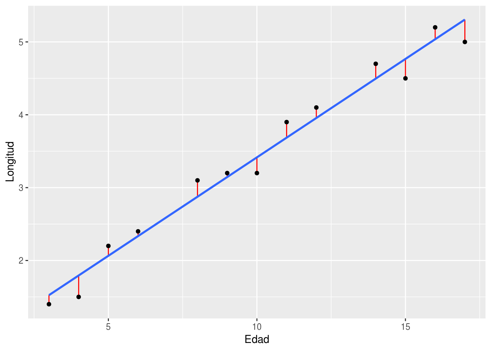

# Regresión


En las ciencias naturales es usual querer explicar una variable con otras.
Las variables que se quieren explicar son las variables dependientes y las
que se usan para explicar son las llamadas variables explicatorias o también
independientes. A estos modelos se los conoce como modelos de regresión. Aunque
las variables estén relacionadas esto no implica que haya una relación causal
entre ellas. Sin un modelo causal que explique la manera que las variables
se relación se está incurriendo una falacia del tipo *cum hoc ergo propter
hoc*. Por ejemplo, en la Figura \@ref(fig:regresion-espuria) se muestra que
la relación entre los limones frescos importados desde México (ton) y tasa de
mortalidad total en autopistas de EE.UU. Según esta regresión al ¡aumentar la
importación de disminuye la tasa de mortalidad! Este resultado carece de lógica
ya que no hay una forma en que la importación de limones afecte la mortalidad.
Por este motivo hay que ser cuidadoso en cuanto a las conclusiones que se
realizan con los resultados.


(ref:regresion-espuria) Ejemplo de regresión espuria. Limones frescos importados
desde México (ton) y tasa de mortalidad total en autopistas de EE.UU. 


```r
knitr::include_graphics("img\regresion-espuria.jpg")
```

<div class="figure">

<p class="caption">(\#fig:unnamed-chunk-1)(ref:regresion-espuria</p>
</div>

## Regresión Lineal Simple

La regresión lineal simple se da cuando hay una variable aleatoria con 
distribución normal y solo una variable predictora. La varible predictora no
es una variable aleatoria, sino que puede ser modificada por el investigador.
El objetivo de esta técnica es obtener una ecuación lineal que explique 
el cambio de la variable aleatoria según el cambio de la variable predictora:

$$
Y_i = \beta_0 + \beta_1 X_i
(\#eq:reg1)
$$

Por ejemplo, el se tiene la edad y la longitud de alas de gorriones de varias
edades en la Tabla \@ref(tab:gorriones). La edad es la variable independiente y
la longitud de ala es la variable dependiente. Se busca ajustar un modelo como 
en el da la Ecuación \@ref(eq:reg1). En la Figura \@ref(fig:gorriones-reg) la 
recta que mejor ajusta a esto datos en azul. Sin embargo, el ajuste no es
perfecto. La diferencia entre el valor ajustado o predicho y el valor observado
es el error que se comete. Ese error se simboliza con la letra griega epsilon y
debe ser incluido en el modelo:

$$
Y_i = \beta_0 + \beta_1 X_i + \epsilon_i
(\#eq:reg2)
$$

Se asume que $\epsilon_i\sim N\left ( 0, \sigma^2 \right )$ y por lo tanto
$\sum \epsilon_i = 0$. El método que se usa para encontrar los estimadores de
los $\beta_i$ consiste en minimizar el cuadrado de los errores. Por eso,
el método se lo conoce como mínimos cuadrados o mínimos cuadrados ordinarios.
Afortunadamente se pueden resolver de manera analítica por las siguientes 
ecuaciones

$$
\begin{aligned}
b_1 &= \frac{\sum(X_i-\bar X)(Y_i-\bar Y)}{\sum (X_i-\bar X)^{2}}=
\frac{\sum X_iY_i-\frac{\left (\sum X_i\right)\left ( \sum Y_i\right )}{n}}{\sum X_i^2-\frac{\left (\sum X_i \right )^2}{n}}\\

b_0 &= \bar Y - b_1\bar X
\end{aligned}
$$


-----------------
 Edad   Longitud 
------ ----------
  3       1.4    

  4       1.5    

  5       2.2    

  6       2.4    

  8       3.1    

  9       3.2    

  10      3.2    

  11      3.9    

  12      4.1    

  14      4.7    

  15      4.5    

  16      5.2    

  17       5     
-----------------

Table: (#tab:gorriones) Edad en días y longitud
                    de ala en centímetros de 13 gorriones.

(ref:gorriones-grafico) Gráfico de dispersión de edad en días y longitud
                    de ala en centímetros de 13 gorriones. En azul línea de 
                    regresión estimada con mínimos cuadrados ordinarios. En rojo
                    el error cometido por la regresión entre los valores estimados
                    y los valores observados.

<div class="figure">

<p class="caption">(\#fig:gorriones-grafico)(ref:gorriones-grafico)</p>
</div>


